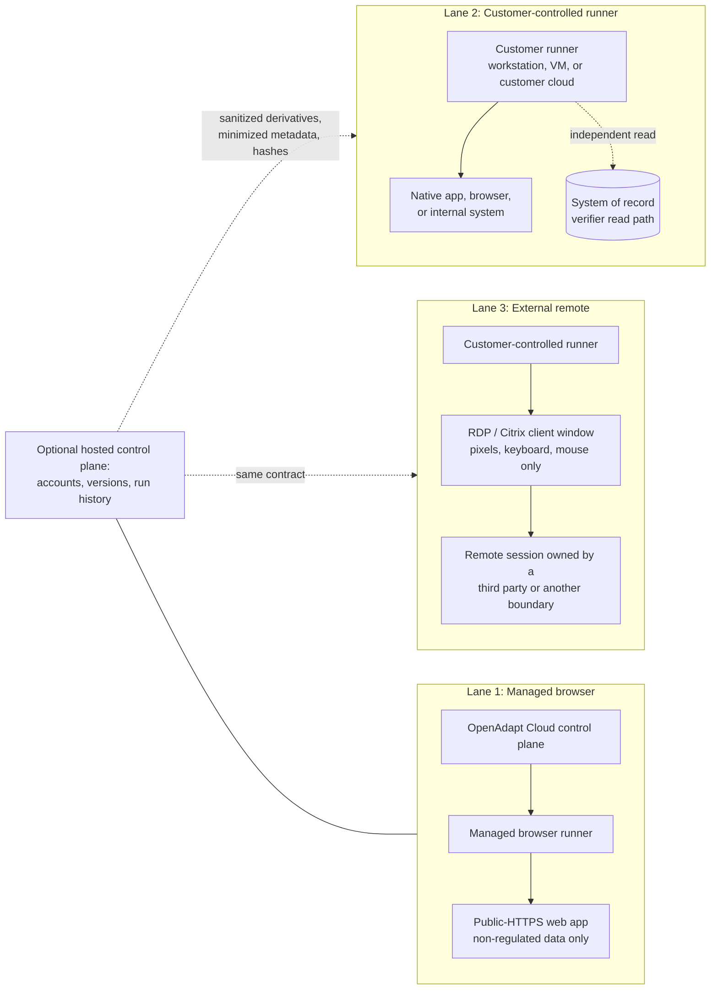

# Deployment boundaries

Where execution runs and where sensitive data lives, per lane. The engineering
source of truth is the
[deployment and data-boundary matrix](../concepts/deployment-matrix.md); this
page is the buyer-facing summary and diagram.

Every lane runs the same engine, the same safety gates, and produces the same
report schema. The lanes differ in **data handling**, not in what is enforced.

## The three lanes

### Lane 1: Managed browser

- **What runs where:** OpenAdapt operates the control plane and the browser
  runner. The public $500/month subscription covers approved browser
  workflows, up to 10,000 runs/month.
- **Where sensitive data lives:** this lane is for explicitly initiated,
  public-HTTPS, **non-regulated** targets. PHI/PII-bearing workloads do not
  belong in this lane and are not silently admitted to it.
- **What crosses to OpenAdapt:** the approved workflow artifacts and the
  managed run evidence, inside the declared hosted boundary.

### Lane 2: Customer-controlled runner

- **What runs where:** execution runs on infrastructure the customer controls
  (workstation, server, VM, or customer cloud account). This is the standard
  lane for regulated or sensitive workflows, including the published RVU audit
  case study deployment shape.
- **Where sensitive data lives:** live frames, OCR text, injected parameters,
  and verifier values stay inside the customer boundary. If PHI appears on
  screen at run time, it never leaves.
- **What crosses to OpenAdapt (optional):** if the hosted control plane is
  connected, only reviewed sanitized derivatives, minimized halt descriptors,
  and hash-bound attestations cross, verified against published schemas. A
  fully local or air-gapped deployment sends nothing at all, and that posture
  is operator-verifiable with an active probe.

### Lane 3: External remote

- **What runs where:** the runner is customer-controlled (as in Lane 2), but
  the target application lives in a session someone else controls: RDP,
  Citrix Workspace, or VDI. OpenAdapt drives it externally through pixels,
  keyboard, and mouse. **No software installs inside the remote session.**
- **Where sensitive data lives:** the remote session's data stays in the
  remote boundary; what the runner sees is the rendered frame, handled under
  the runner's local sensitive-data policy. Verification prefers an
  independent read path; where only the screen is available, that is labeled
  same-surface confirmation and high-risk workflows may not qualify on it.
- **Status:** see the honest status statement in the
  [external Citrix brief](citrix-external-brief.md).

## Rules that hold in every lane

- Secrets are referenced, injected at run time, and never stored in artifacts.
- Raw authoring artifacts do not cross a boundary; only sanitized, manifested,
  hash-bound derivatives do, after operator review.
- Native, RDP, and Citrix jobs never route to the managed browser runner.
- The [acceptance matrix](acceptance-matrix.md) target of zero silent
  incorrect successes applies identically in every lane.
