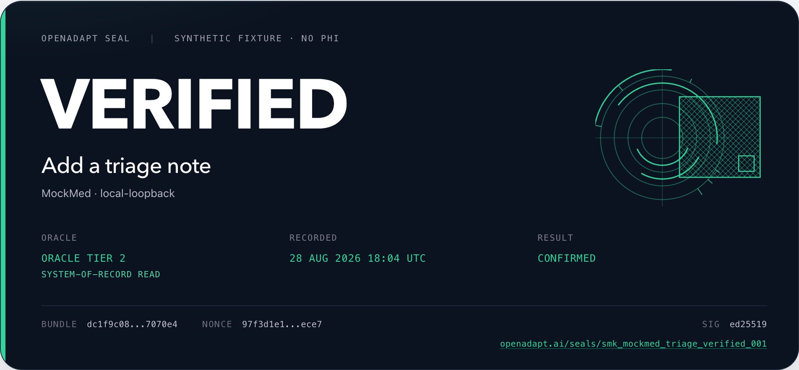
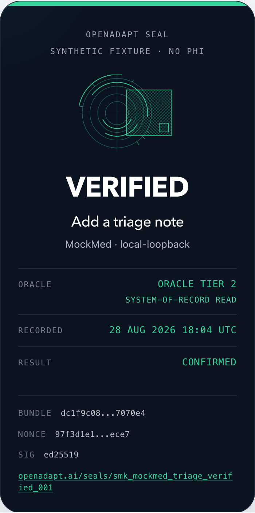

# The Seal

A Seal is a signed attestation that this program version, this identity, this
environment, and this independent effect produced a terminal outcome. The
portable object is `ExecuteEvidenceReceiptV1`. Execute issues it. Execute is
the invoke path, not a separate product.

<figure markdown="span">
  { width="900" }
  <figcaption>A VERIFIED Seal, desktop</figcaption>
</figure>

<figure markdown="span">
  { width="390" }
  <figcaption>The same instrument, mobile</figcaption>
</figure>

`POST /api/v1/executions` is the partner invoke. The terminal receipt is the
Seal. Local unsigned `openadapt-flow replay` stays free. Unsigned success is
failure: if a consequential tool returns done without a Seal, treat the call as
failed.

The compiler stays MIT. Record, compile, replay, halt, teach, `openadapt-types`,
local MCP, and Agent Skills stay inspectable. Settlement is the Seal.

Public verify pages list synthetic and non-PHI Seals. They do not list
healthcare production. Bundles are bound to one app build, one farm, one
resolution, one custom screen. Do not publish a public healthcare procedure
npm.

## Oracle tiers

Charge tiers 2 and 3. Tiers 0 and 1 never mint a production Seal.

| Tier | What it reads | Production Seal |
|---|---|---|
| 0 | Visual / OCR of the same screen that acted | Never. Dev only. |
| 1 | Second session or independent UI read | Never. |
| 2 | System-of-record read (API, database, file, ack) | Yes. |
| 3 | Counterparty artifact (payer status, legal export) | Yes. |

`oracle_tier` on the receipt must match `contracts.observed_effect_strength`.
`independent_system_of_record` maps to 2. `independent_session` maps to 1.
Screen confirmation and persisted-state reacquisition map to 0. Tier 3 has no
`EffectStrengthV1` member yet; it is a stronger independent artifact, not a
banner on the acting screen.

`--break-it` on `openadapt-flow qualify` is the fail-closed test. A fake success
banner must halt. The store must stay unchanged.

A Seal that points at a screenshot hash is a liability. Do not mint production
`verified` below tier 2.

## Two sales motions

Attended and unattended are two motions. Do not mix them in one pitch.

**Attended.** A person is already in session. The runner uses that session. A
consequential write pauses at `decision_required`. The operator answers from
the local console or the authenticated phone surface. The runner then
reacquires focus, a fresh observation, identity, and the target before it
continues. This is the product you can sell now. The human remains the legal
actor. A Seal is not a physician signature.

**Unattended.** Needs a dedicated agent identity, PAM, and session recording.
It does not type a physician password, stuff a physician login, or share a
service account. Treat that as a later motion with its own identity design.

Halt UX is the commercial product. Who gets the 2 a.m. push, what they see, how
they teach one step without invalidating the bundle, and how "click continue"
is refused: that is renewal.

## CLI story

On a qualified synthetic bundle with a tier-2 oracle, the intended command is:

```bash
openadapt-flow replay bundle --seal
```

A sealed verified run prints `VERIFIED`, a seal id, and the public verify URL:

```text
VERIFIED
seal_id  receipt_12345678
verify   https://openadapt.ai/seals/receipt_12345678
```

`--seal` on replay issues that proof. `openadapt flow seal` encrypts a bundle
for deployment.

The same verb is available as `openadapt flow replay bundle --seal`. Use the
standalone `openadapt-flow` form when you installed the engine package.

The verify route is `https://openadapt.ai/seals/{id}`. Synthetic fixtures only
on that page.

## Receipt fields are Seal fields

`ExecuteEvidenceReceiptV1` is the Seal. Map the receipt 1:1.

| Receipt field | Seal field | What it binds |
|---|---|---|
| `receipt_id` | Seal id | Public verify at `https://openadapt.ai/seals/{receipt_id}` |
| `execution_id` | execution | The `POST /v1/executions` that produced this Seal |
| `workflow_digest` | program digest | SHA-256 of the admitted compiled program |
| `workflow_version` | program version | Qualified version id |
| `qualification_id` | admission | The qualification pack that authorized the run |
| `environment_id` | environment | The qualified environment |
| `runner_id` | runner | The customer-controlled runner |
| `nonce` | nonce | Per-Seal uniqueness so a consumer does not need the original request |
| `oracle_tier` | oracle | 0 visual, 1 second-session, 2 SoR, 3 counterparty |
| `outcome` | outcome | `verified`, `halted_before_effect`, `reconciliation_required`, `rejected_policy`, `failed_platform`, or `rolled_back_verified` |
| `contracts` | contracts | Authorization, identity, postcondition, effect, required and observed strength, `model_used`, `external_network_used` |
| `delivery_uncertain` | delivery | True when a write may have landed |
| `compensation_effect_verified` | compensation | True only for `rolled_back_verified` |
| `evidence_digest` | evidence | Pointer to retained evidence. Bytes stay in the declared boundary. |
| `issued_at` | issued | When the Seal was issued |
| `schema_version` | schema | Always `openadapt.execute-evidence-receipt/v1` |

`verified` requires every contract, an observed strength at or above the
minimum, and `oracle_tier` 2 or 3. Store the full object with the partner
transaction. HTTP `202` is not a Seal.

## `requires_seal`

Consequential MCP tools advertise `requires_seal: true`. Skill text: if the
tool returns unsigned success, treat it as failure.

```json
{
  "name": "replay_program",
  "requires_seal": true
}
```

Emit a local MCP server with `openadapt flow emit-mcp bundle --out server.py`.
The partner still validates the Seal the same way: `receipt_id`,
`workflow_digest`, `oracle_tier`, and `outcome`.

## How it ships

The buyer is the technical owner at an RCM vendor, BPO, vertical SaaS, or
agent platform that already finishes last-mile work in someone else's GUI.
Health-system IT is a downstream environment. IDN RFPs are not the growth
engine.

Embed through Execute and MCP. One partner is many environments. A hospital
procurement cycle is 12 to 18 months.

If Copilot, Power Automate, or another actuator already clicked, OpenAdapt
can still emit the Seal when asked. We do not need to win the chat box. Until
a counterparty demands the Seal, the incumbent keeps distribution. Coexist.

Compile-once is a cache when the job is stable. If a computer-use agent gets
cheap, the run still has to prove identity and effect, or halt.

Partner API contract: [Integrate OpenAdapt Execute](execute-api.md).
OEM embedding: [OpenAdapt Execute private-pilot guide](oem-brief.md).
