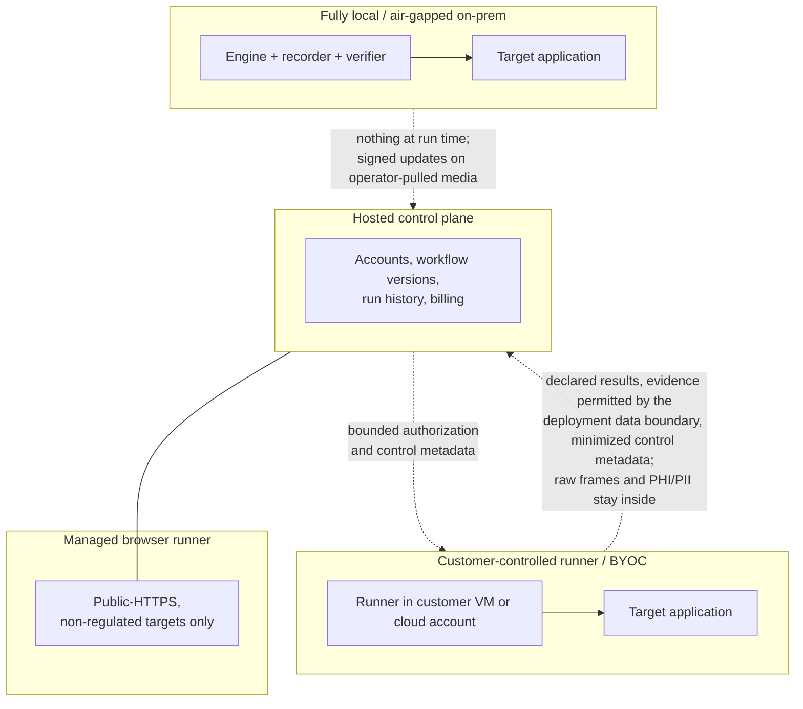

# Security packet

The honest current state of OpenAdapt's security posture, written for a
security or vendor-risk reviewer. Deeper technical detail:
[Security and data handling](../guides/security-and-data-handling.md) and the
reviewer-oriented
[Security and deployment review](../guides/security-review.md). Companion
pages: [Subprocessors and hosted data retention](subprocessors.md),
[Vulnerability disclosure](vulnerability-disclosure.md), and
[PHI handling in one page](phi-handling.md). Nothing on
this page is a compliance determination.

## Architecture in one paragraph

OpenAdapt is local-first. The engine records a demonstrated GUI workflow,
compiles it into a deterministic bundle, and replays it with no generative-model
API calls on the healthy path. Consequential actions are guarded by pre-action
identity checks, and writes are verified out of band against the system of
record (API, database, or document hash), not the pixels. Any non-confirmed
verdict halts the run. Every run produces an audit trail; on-prem deployments
add an append-only, hash-chained audit log.

## Core security properties

- **Local-first execution.** A fully local deployment makes zero outbound
  calls on a healthy replay, and the no-egress posture is operator-verifiable
  with an active probe (`verify-airgap.sh`).
- **Out-of-band verification.** Effect contracts are checked by an independent
  read of the system of record. REFUTED and INDETERMINATE verdicts both halt;
  an unreachable verifier is never treated as success
  ([effect verification](../concepts/effect-verification.md)).
- **Fail-closed regulated path.** The `run` verb refuses to start without
  certification, identity coverage, effect contracts or explicit approval, and
  encrypted, integrity-sealed bundles
  ([regulated execution](../concepts/regulated-execution.md)).
- **Evidence sealing and binding.** Bundles seal with AES-256-GCM (opt-in at
  authoring time); run authorization is single-use and bound to the bundle
  content digest, parameter digest, policy, and effect-contract hashes; run
  reports record effect contracts as one-way SHA-256 digests.
- **Auditable open runtime.** The engine is MIT-licensed and directly
  reviewable; the safety mechanisms described here are inspectable source, not
  a black box. The hosted control plane is proprietary but exposes its public
  contracts and live readiness state.
- **Secrets never enter artifacts.** Secret fields are excluded from
  recordings, bundles, and frames, and injected at run time from the
  customer's environment or OS keychain.

## Attestation status

| Item | Status |
|---|---|
| SOC 2 | **Not attested.** OpenAdapt does not hold a SOC 2 report and does not claim certification. Request the current security-controls packet for implementation evidence and remaining gaps. |
| HIPAA / BAA | No standing BAA offering. Deployments that touch PHI use a customer-controlled boundary; BAA and counsel review are engagement-specific. |
| Penetration test | Request current status directly; do not infer from documentation. |
| Vulnerability disclosure | Coordinated disclosure: private GitHub advisories for the open-source packages, `hello@openadapt.ai` for hosted surfaces; acknowledgment target within 5 business days. Full channel and scope: [vulnerability disclosure](vulnerability-disclosure.md). |
| Subprocessors | Hosted surfaces only; current provider list and roles: [subprocessors and hosted data retention](subprocessors.md). Local and on-prem deployments use none at run time. |
| Supply chain | GitHub Actions pinned by commit SHA; Dependabot; public Desktop releases ship `SHA256SUMS`, a CycloneDX SBOM, and build-provenance attestations. Windows/Linux installers are currently unsigned and macOS is ad-hoc signed; verify checksums and provenance. |

If a security questionnaire needs a signed answer on any row, request the
current artifact directly rather than citing this page.

## Encryption posture

- **In transit:** the PHI/PII-bearing desktop control channel is TLS with
  per-run certificate pinning, fail-closed. Hosted APIs are HTTPS.
- **At rest:** opt-in AES-256-GCM sealing for the bundle, screenshot crops,
  and checkpoints, layered on operator full-disk encryption. The regulated
  `run` path refuses unencrypted bundles by default.
- **Key management:** remains the customer's (KMS, rotation, escrow).
  OpenAdapt supplies the AEAD substrate, not a KMS.

## Data-boundary options

Full detail and diagram: [deployment boundaries](deployment-boundaries.md).

| Option | Where execution runs | What crosses the customer boundary |
|---|---|---|
| Fully local / air-gapped on-prem | Customer workstation or server | Nothing at run time; signed updates enter on operator-pulled media. |
| Customer-controlled runner (BYOC) | Customer VM or cloud account | Sanitized, manifested artifact derivatives and minimized control metadata only; raw frames and PHI/PII stay inside the boundary. |
| Hosted control plane + local execution | Execution local; accounts, versions, and history managed | Operator-approved sanitized derivatives, minimized halt descriptors, hash-bound attestations. |
| Managed browser runner (Cloud, $500/month) | OpenAdapt's cloud | For explicitly initiated, public-HTTPS, **non-regulated** workloads only. Not a lane for PHI/PII. |

Sensitive live observations never route into the shared managed boundary; a
recording that was sanitized for upload does not make runtime data sanitized,
and the documentation says so explicitly rather than implying otherwise.

What crosses each boundary, per shape:

The PHI-specific narrative — scrubbing, the operator review gate, and the
allow-list receipt — is one page: [PHI handling](phi-handling.md).

## What we will not claim

- Architecture documentation is not a HIPAA, PHIPA, SOC 2, or other
  compliance determination.
- A green qualification for one workflow is not a general application-support
  or safety claim.
- Identity coverage applies to armed steps; screen-only read-back on a no-API
  surface is labeled same-surface confirmation, not independent verification.
- The engine's known limits are published and maintained in
  [LIMITS.md](https://github.com/OpenAdaptAI/openadapt-flow/blob/main/docs/LIMITS.md).
