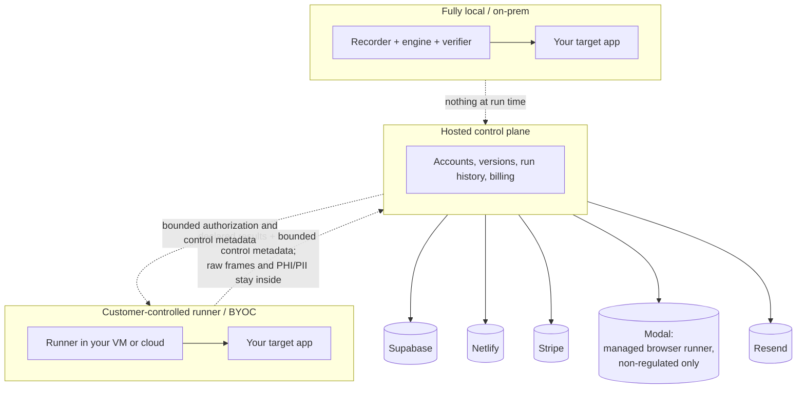

# Subprocessors and hosted data retention

This page lists the third-party service providers the **hosted** OpenAdapt
surfaces use, and the current hosted retention and deletion behavior. It is
informational documentation for a vendor-risk reviewer, not a contractual
subprocessor notice; request the current signed artifact for anything a
contract must reference.

**Scope.** Fully local and on-prem deployments use none of these providers at
run time: a healthy local replay makes zero outbound calls, and the no-egress
posture is operator-verifiable. This page describes the hosted control plane
(`app.openadapt.ai`), the managed browser runner, and the public web
properties.

## Service providers in use

As read from the hosted control plane's deployment configuration:

| Provider | Role | What it can process |
|---|---|---|
| Netlify | Hosting for the `app.openadapt.ai` control plane | Application traffic to the control plane: account and session data in transit, and the metadata/digest surfaces described in the [security packet](security-packet.md). |
| Supabase | Database, authentication, and object storage for the control plane | Accounts, organizations, workflow versions, run metadata, sanitized artifact derivatives, retention/erasure receipts. |
| Modal | Compute for the managed browser runner | Managed browser execution for explicitly initiated, public-HTTPS, non-regulated workloads only — not a lane for PHI/PII. |
| Stripe | Payments and billing | Payment and subscription data. Card data is entered on Stripe's surfaces, not OpenAdapt's. |
| Resend | Transactional email (organization invites, purchase alerts) | Recipient email addresses and the fixed-template message content. Purchase alerts carry purchase metadata only, never workflow evidence. |
| GitHub | Source hosting, CI, release distribution | Public source, build artifacts, and CI logs. No customer workload data. |
| PostHog | Product analytics on the public web properties and control plane (when enabled) | Usage events on OpenAdapt's own pages. Not wired into the local engine or run path. |
| GlitchTip | Error monitoring for the control plane (when enabled) | Control-plane error reports. |
| Google Analytics | Web analytics on the public website and docs | Page-view analytics on public pages only. |

The local engine has no telemetry, analytics, license check, or update ping in
the run path; analytics providers above apply to OpenAdapt's own hosted pages,
not to your workflows.

## Hosted retention and deletion

The hosted service applies a **versioned, explicitly configured retention
policy** — there is no implicit retention duration. The policy names its
version and sets explicit windows for recordings, reports, and run metadata
(run metadata is never retained shorter than reports), plus a backup recovery
window and a maximum restore-drill age.

Current behavior:

- **Scheduled deletion is fail-closed.** Destructive scheduled retention
  refuses to run without a recent receipt proving a complete database **and**
  private object storage restore into an isolated scratch environment.
- **Legal holds pause eligible deletion** for the held organization.
- **Tenant erasure is organization-scoped** and produces an append-only,
  PHI/PII-free receipt with identifiers, counts, and digests — never deleted
  payloads.
- The public [readiness endpoint](https://app.openadapt.ai/api/health/ready)
  reports the configured retention component separately from the
  destructive-operation gate.

The concrete day windows are deployment configuration, reviewed with the
policy version; request the current policy version and its windows directly
rather than citing this page.

## Data-flow summary

What crosses each boundary, by deployment shape (full narrative:
[Security packet](security-packet.md) and
[deployment boundaries](deployment-boundaries.md)):

## Related pages

- [Security packet](security-packet.md) — posture summary for reviewers.
- [Vulnerability disclosure](vulnerability-disclosure.md) — how to report.
- [PHI handling](phi-handling.md) — the end-to-end PHI narrative.
- [Security and data handling](../guides/security-and-data-handling.md) — the
  full technical dossier, including hosted retention detail.
