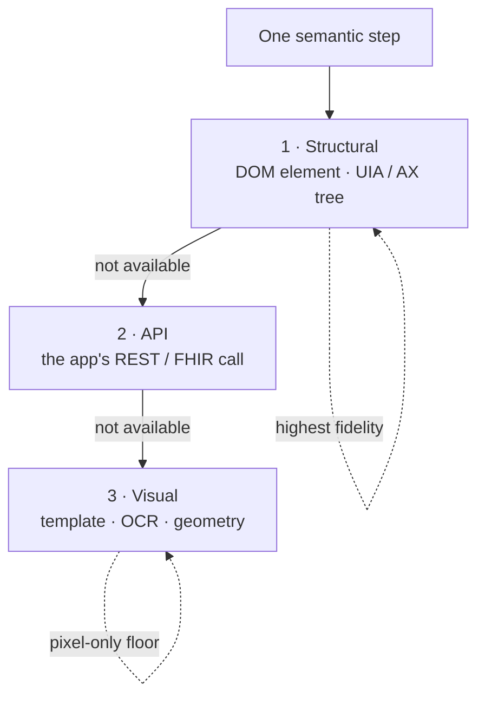

# The capability ladder

One semantic step (open this patient, save this note) can run different ways
depending on what the app exposes. The capability ladder separates **what** a
step means from **how** the app lets you do it: one compiled step, several
implementations, the highest-fidelity viable one wins.

## The rungs

1. **Structural**: the DOM element under the point in a browser, or the
   accessibility tree on native desktop (Windows UI Automation `Name` / `Value`
   / text, macOS AX). Structured text is invariant across fonts, themes, and
   resolution, so identity verification prefers it.
2. **API**: where the app exposes a real API, a step can act or, more often,
   **verify** against it directly. This is how [effect
   verification](effect-verification.md) reads the system of record instead of
   the screen.
3. **Visual**: template match, OCR, and landmark geometry on the raw pixels.
   Always available (if a person can see it, the compiler can anchor to it), and
   the floor for pure-pixel substrates like Citrix, RDP, and VDI.

The first rung that can judge the current app wins, and its verdict is
authoritative for that step. A structural match is never overridden by a weaker
visual guess.

## Why fidelity matters for safety

The rung you land on changes what the system can guarantee. Identity is the
clearest example. Two different patients with the same name and date of birth,
distinguished only by a medical record number differing by a single `O` versus
`0` glyph, render to a byte-identical OCR band. On the **visual** rung, OCR
cannot separate them, so OpenAdapt refuses rather than guesses. On the
**structural** rung, the two rows are different strings in the tree, so the same
case verifies with no availability cost.

The principle: push each decision to the highest rung the app supports, and fail
safe below it. See [The identity gate](identity-gate.md) for how this plays out.

## Capability-adaptive compilation

The ladder is also the roadmap for portability. A workflow authored against a
browser can, in principle, retarget to a desktop or RDP backend by recompiling
the same semantic transitions to whatever rung that surface supports, each
satisfying the same contract. The [workflow-program IR](workflow-ir.md) is the
schema that makes one meaning, many implementations, expressible.
