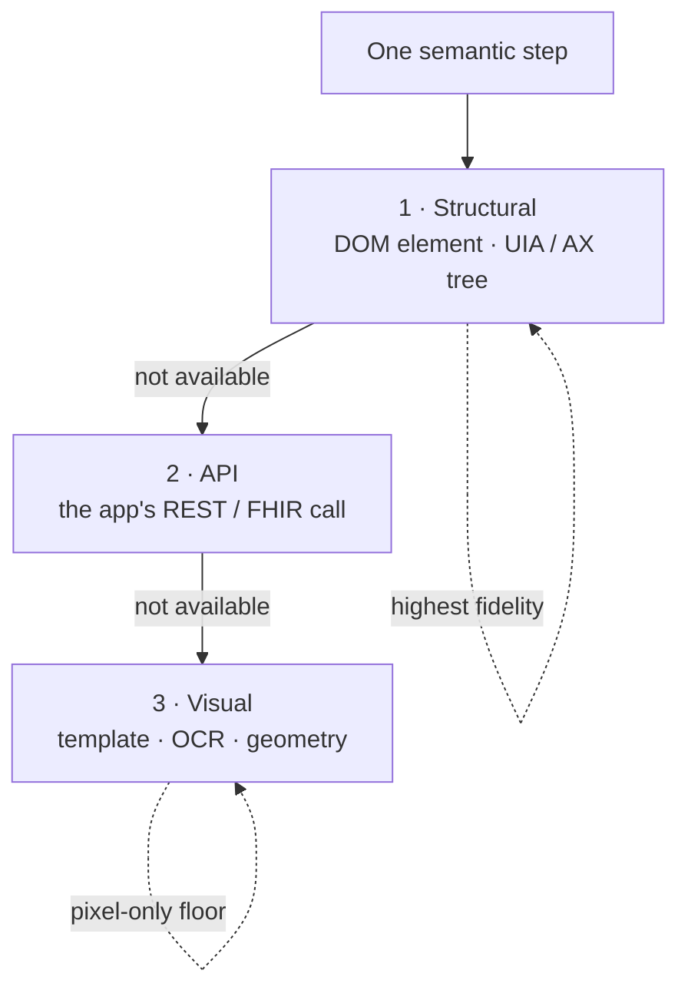

# The capability ladder

The same semantic step (open this patient, save this note) can be carried out in
different ways depending on what the app exposes. The capability ladder
separates **what** a step means from **how** the current app lets you do it. One
compiled step, several possible implementations, the highest-fidelity viable one
wins.

## The rungs

1. **Structural**: read the DOM element under the point in a browser, or the
   accessibility tree on native desktop (Windows UI Automation `Name` / `Value`
   / text, macOS AX). Structured text is invariant across fonts, themes, and
   resolution, which is why identity verification prefers it.
2. **API**: where the app exposes a real API, a step can act or, more often,
   **verify** against it directly. This is how [effect
   verification](effect-verification.md) reads the system of record instead of
   the screen.
3. **Visual**: template match, OCR, and landmark geometry on the raw pixels.
   This rung always exists (if a person can see it, the compiler can anchor to
   it) and is the floor for pure-pixel substrates like Citrix, RDP, and VDI.

The first rung that can actually judge the current app is used, and its result
is authoritative for that step. A structural match is never overridden by a
weaker visual guess.

## Why fidelity matters for safety

The rung you land on changes what the system can guarantee. The clearest example
is identity. Two different patients who share a name and date of birth, whose
only distinguishing field is a medical record number differing by a single
`O` versus `0` glyph, render to a byte-identical OCR band. On the **visual** rung
alone, OCR cannot separate them, so OpenAdapt refuses rather than guesses. On
the **structural** rung, the two rows are simply different strings in the DOM or
accessibility tree, so the same case verifies correctly with no availability
cost.

This is the whole argument for the ladder: push each decision to the highest
rung the app supports, and fail safe when only a lower rung is available. See
[The identity gate](identity-gate.md) for how this plays out in practice.

## Capability-adaptive compilation

The ladder is also the roadmap for portability. A workflow authored against a
browser can, in principle, retarget its steps to a desktop or RDP backend by
recompiling the same semantic transitions to whatever rung that surface
supports, each satisfying the same contract. The
[workflow-program IR](workflow-ir.md) is the schema that makes one meaning,
many implementations, expressible.
