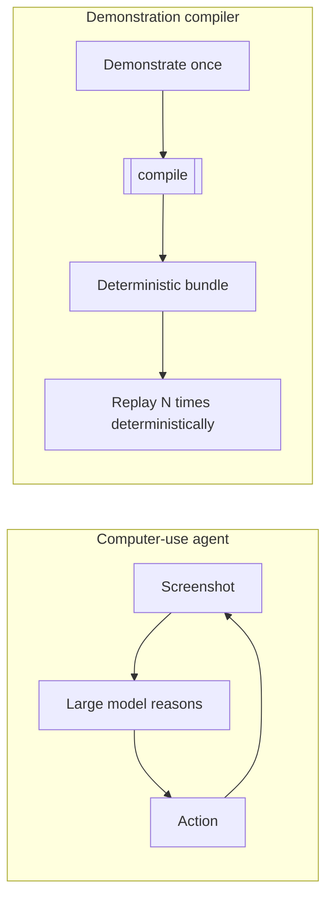

# The demonstration compiler

A computer-use agent re-reasons through your task with a large model on every
run. That is the right shape for a task nobody has automated before, and the
wrong one for the 500th referral this month. OpenAdapt compiles the
demonstration instead.

## Compile, don't re-reason

The idea comes from programming languages. A demonstration is a source program.
Compiling it once produces an artifact that runs many times without paying the
cost of understanding it again.



An agent pays model latency and API cost selecting actions on each run. The
compiler needs no model to author or execute the healthy path. An explicitly
configured model can propose a repair when deterministic evidence is
insufficient; that proposal stays governed and is counted in the report.

## What a compiled step carries

Compilation does not record raw coordinates and replay them blindly. Each step
carries redundant evidence, so the target can be re-found even when the pixels
move:

- a **template crop** of the target,
- an **OCR label** read from it,
- **geometry landmarks** relative to stable nearby anchors,
- **postconditions** derived from what the demonstration actually changed on
  screen after the action.

At replay, a [resolution ladder](self-healing.md) tries these in order. A
healthy script resolves every step on the first rung, a local template match, in
milliseconds.

## The record, compile, replay loop

```bash
openadapt flow record  --url https://your.app --out rec   # demonstrate once (web)
openadapt flow compile rec --out bundle --name my-task    # compile
openadapt flow replay  bundle --url https://your.app      # replay, local, $0
```

On the web substrate shown here, `record` opens a headed browser on your own app
and captures what you do; the same loop records a native Windows desktop or a
pixel-only Citrix/RDP session by choosing a [backend](backends.md) instead of a
`--url`. `compile` turns the recording into a bundle. `replay` runs the bundle
deterministically on the same substrate and writes an illustrated report.

## Vision-first behind a small backend

The runtime is **vision-first, not vision-only**. It can always operate a pure
pixel surface (PNG in, clicks and keys out) behind a small `Backend` protocol,
which is why the whole loop runs in CI with no OS permissions. Where a backend
exposes more than pixels (a browser DOM, a native accessibility tree, an API),
OpenAdapt uses that higher-fidelity signal via
[the capability ladder](capability-ladder.md). The web (Playwright), desktop
(Windows/UIA), native macOS, RDP, and Citrix/VDI [backends](backends.md) are all
adapters to the same protocol, not rewrites.

## An API compiler for the API-less long tail

Most enterprise software has no usable API for the workflow you actually run.
The demonstration is the only interface that always exists: if a person can do
it, it can be demonstrated. OpenAdapt treats that demonstration as the spec and
compiles a durable, auditable, $0 replay from it. That is the wedge: API-less
work too specific to buy an integration for and too repetitive to keep paying a
person or an agent to redo.

## Where it goes next

A single demonstration is evidence of intent, not a complete specification. It
cannot express conditionals, loops, or the failure branch it never took. The
[workflow-program IR](workflow-ir.md) and
[multi-trace induction](multi-trace-induction.md) are how OpenAdapt recovers the
intended program from more than one trace.
