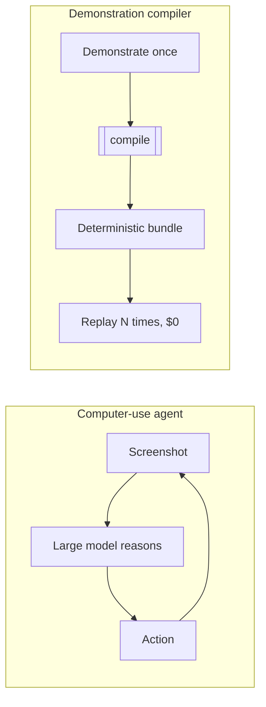

# The demonstration compiler

A computer-use agent re-reasons through your task with a large model on every
run. That is the right shape for a task nobody has automated before, and the
wrong one for the 500th referral this month. OpenAdapt compiles the
demonstration instead.

## Compile, don't re-reason

The core idea is borrowed from programming languages. A demonstration is a
source program. Compiling it once produces an artifact that runs many times
without paying the cost of understanding it again.



The agent pays a model call, latency, and API cost on every step of every run,
forever. The compiler pays the model only once, at authoring time, and only to
help repair the script when the UI changes. The healthy replay path makes zero
model calls.

## What a compiled step carries

Compilation does not record raw coordinates and replay them blindly. Each step
carries redundant evidence about the moment it was recorded, so the target can
be re-found even when the pixels move:

- a **template crop** of the target,
- an **OCR label** read from it,
- **geometry landmarks** relative to stable nearby anchors,
- **postconditions** derived from what the demonstration actually changed on
  screen after the action.

At replay, a [resolution ladder](self-healing.md) tries these in order. A
healthy script resolves every step on the first rung (a local template match)
in milliseconds.

## The record, compile, replay loop

```bash
openadapt flow record  --url https://your.app --out rec   # demonstrate once
openadapt flow compile rec --out bundle --name my-task    # compile
openadapt flow replay  bundle --url https://your.app      # replay, local, $0
```

`record` opens a headed browser on your own app and captures what you do.
`compile` turns the recording into a bundle. `replay` runs the bundle
deterministically and writes an illustrated report.

## Vision-first behind a small backend

The runtime is **vision-first, not vision-only**: it can always operate a pure
pixel surface (PNG in, clicks and keys out) behind a small `Backend` protocol,
which is why the whole loop runs in CI with no OS permissions. But where a
backend exposes more than pixels — a browser DOM, a native accessibility tree,
an API — OpenAdapt uses that higher-fidelity signal via
[the capability ladder](capability-ladder.md). The reference backend is a
headless browser; the [desktop (Windows/UIA) and RDP backends](backends.md) are
adapters to the same protocol, not rewrites.

## An API compiler for the API-less long tail

Most enterprise software has no usable API for the workflow you actually run.
The demonstration is the only interface that always exists: if a person can do
it, it can be demonstrated. OpenAdapt treats that demonstration as the spec and
compiles a durable, auditable, $0 replay from it. That is the wedge: the long
tail of API-less work that is too specific to buy an integration for and too
repetitive to keep paying a person or an agent to redo.

## Where it goes next

A single demonstration is evidence of intent, not a complete specification. It
cannot express conditionals, loops, or the failure branch it never took. The
[workflow-program IR](workflow-ir.md) and
[multi-trace induction](multi-trace-induction.md) are how OpenAdapt recovers the
intended program from more than one trace.
