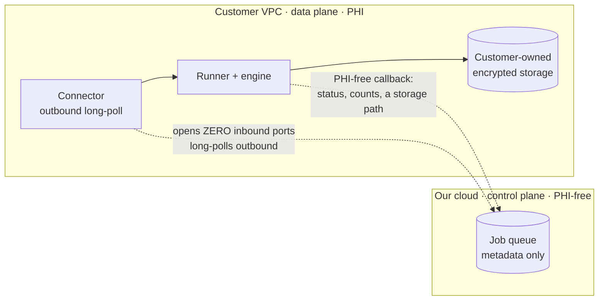

<!--
TARGET-STATE SPEC — HELD, NOT YET SHIPPED.
This page describes the deployment matrix as it will exist once the BYOC
Connector and the hosted runner land. Today the only lanes with a live caller
are self-hosted/on-prem (PARTIAL) and a non-PHI web runner (PARTIAL, waitlist).
Everything else is designed, demand-gated, and unbuilt. Do not publish until true.
-->

# The deployment matrix

OpenAdapt separates *what surface it drives* (the [substrate](substrate-model.md))
from *where the run executes and who owns the data* (the deployment). This page
is about the second axis. The same engine, bundle format, CLI, and PHI-free
control/data boundary run in every deployment; what changes is who operates the
data plane and where regulated data lives.

The guiding principle is a **deployment-choice spectrum**, not one security
promise: *you choose where the data lives.* We do not make a company-wide "never
leaves your network" claim — the guarantee is scoped to the tier you pick.

## The three deployments

-   __Our cloud — non-PHI__

    ---

    A managed, multi-tenant runner for **non-regulated** work. The data plane
    runs in our infrastructure. Suitable for public or non-sensitive apps where
    convenience beats data residency. **Not for PHI.**

-   __BYOC — regulated (customer VPC)__

    ---

    The PHI-touching data plane runs **inside the customer's own VPC**; we
    manage the control plane only. **PHI never enters our infrastructure** — we
    see PHI-free run metadata. The highest-value regulated lane.

-   __Self-hosted / on-prem (air-gapped)__

    ---

    The entire stack runs in the customer's environment with **no egress**.
    Deterministic replay is 100% local. The lane a fully air-gapped clinic or an
    on-prem pilot runs on today.

## The matrix at a glance

Deployment × substrate. Each cell notes the honest status.

| Deployment ↓ / Substrate → | **Web (browser)** | **Windows-desktop / Citrix** |
|---|---|---|
| **Our cloud — non-PHI** | Managed multi-tenant runner. *Preview — join the waitlist.* | Hosted Windows-in-QEMU desktop runner. *Target-state, not yet wired.* |
| **BYOC — regulated (customer VPC)** | Connector + pull queue + customer-owned storage. *Target-state.* | Connector + engine beside the customer's Citrix Workspace; **pixels never leave**. *Target-state — the highest-value lane.* |
| **Self-hosted / on-prem** | On-prem run-queue package; web engine runs locally, no managed UX. *Partial today.* | Same package + Windows/RDP backend; Citrix-pixel mechanism proven live at small N. *Partial today — the lane a pilot runs on.* |

!!! warning "This table is a target, not a shipped product"
    The bottom row (self-hosted) is the region that is real today, at pilot
    maturity. Everything marked *target-state* is designed and demand-gated — do
    not read it as committed-this-quarter. A managed lane stays a **waitlist**
    until it actually runs; we do not take recurring money for a runner we can't
    yet operate.

## BYOC: how PHI stays home

BYOC is the smallest honest delta from where the product is and the highest-value
regulated lane. It keeps the managed control plane but moves the PHI-touching
data plane inside the customer perimeter, bridged by **one new component: an
outbound-only Connector** that flips job delivery from push to pull.

The customer opens **zero inbound ports**; the Connector long-polls a held-open
outbound socket, exactly like a Citrix Cloud Connector or a self-hosted CI
runner. BYOC swaps only three things from the hosted lane:

1. **Transport** — push enqueue becomes an outbound pull.
2. **Storage owner** — our signed URLs become the customer's own S3/Blob/disk;
   the control plane keeps only an opaque *path*.
3. **The Connector** — the one genuinely new piece.

The engine, run-report schema, halt/teach contract, and callback body are
**unchanged**.

## The PHI-free control/data boundary

Across every deployment, the split between what the control plane may see and
what it must never see is **architectural, not policy**:

| Control plane MAY see | Control plane MUST NEVER see |
|---|---|
| Run status + timestamps | Screenshots / step frames |
| Aggregate metrics (steps, halts, heals, model calls, duration, cost) | OCR text, resolved field values |
| A halt descriptor authored **PHI-free** (`step_intent` / `reason`) | Patient identifiers, PHI-bearing params |
| An opaque storage **path** | `report.json` **bodies** |
| Connector health, engine/bundle version, billing counters | Injected secrets / EMR credentials |

The callback body is **PHI-free by construction** — a status enum, timings,
counts, and a storage path. Egress is enforced by a fail-closed allow-list at the
network boundary, not just in-guest. After a run that touched PHI, the VM is
destroyed, never returned to a shared pool.

## Honest claims per tier

The wording matters, and it is scoped deliberately (see the July-13 honesty
ethos):

- **BYOC / self-hosted →** *"PHI never enters our infrastructure."* (We see
  PHI-free metadata only.)
- **We do not say** *"we're blind"* or *"we literally cannot see your PHI"* —
  that would not survive a skeptical security review.
- **There is no company-wide "never leaves your network" tagline.** The claim is
  scoped to the tier, framed as a choice of where the data lives.
- **A BAA and a current HIPAA risk analysis are required even for encrypted PHI
  we cannot read.** The documented risk analysis is the single
  highest-leverage compliance artifact.

## What is real today, and the compliance gate

- **Self-hosted / on-prem** is the region with a live caller today, at pilot
  maturity: an on-prem run-queue package with a PHI-free hash-chained audit log,
  and the Citrix-pixel mechanism proven live on a VM at small N.
- **A non-PHI web runner** exists but is waitlist-only; billing and self-serve
  are not shipped.
- **BYOC and the hosted desktop runner are target-state** — designed, and
  gated on validating one real deployment first.

!!! danger "No lane carries real PHI until the compliance gate closes"
    The 2026 HIPAA Security Rule makes encryption of ePHI **mandatory** at rest
    and in transit (no longer merely "addressable"). This applies to the
    self-hosted lane too — a local plaintext-PHI-at-rest exposure still violates
    the rule even when replay is 100% local. Encryption at rest **and** in
    transit for the PHI-bearing wires, plus a signed BAA and a current risk
    analysis, must be in place before any lane carries real PHI. Remediation is
    in flight; until it lands, these lanes are for non-PHI validation only.

## A note on future tiers

A single-tenant **confidential-compute hosted** lane (SEV-SNP/TDX CVM, headless
framebuffer inside encrypted RAM, attestation-gated key release) is the correct
architecture for "you run it" with regulated data — but it is **deferred**: built
only when a named contract funds the SOC 2 / HITRUST + BAA lift, never
speculatively. Multi-tenant HIPAA SaaS for PHI is **not planned**; multi-tenant
stays for the non-PHI tier only.
