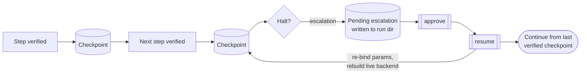

# Durable runtime: checkpoint, resume, approve

A halt is the safety design working: the run stopped rather than guessing. But a
halt in the middle of a long workflow should not mean starting over, and it
must never mean re-performing a write that already landed. The durable runtime
turns a halt into a **durable pause** the operator can approve and resume from
the last verified checkpoint.

!!! note "Off by default"
    The durable runtime is Tier-3 and opt-in. Enable it with `runtime.durable`
    in a [deployment config](../reference/deployment-config.md) or the
    `--durable` flag. Unconfigured, a run behaves exactly as before: a halt
    stops the process with a report.

## What "durable" adds

With durability on, the replayer **checkpoints each verified step**. A step is
checkpointed only after its postconditions passed and, where declared, its
[effect was CONFIRMED](effect-verification.md) against the system of record. So
the checkpoint marks real, verified progress, not merely "the click fired."

When the run halts (an unhandled screen, a refuted write, an escalation), it
writes a **pending escalation** into the run directory and stops. The work
already done is durably recorded; nothing after the checkpoint was performed.



## Resume never re-runs a confirmed write

A GUI automation cannot be resumed from a serialized state alone: it needs a
live backend and live vision. So `resume` rebuilds a fresh live backend (from
the deployment config's `backend.url` or `--url`), re-binds the run's parameters
from the run manifest, and **continues from the last verified checkpoint**. The
steps before the checkpoint are not re-performed — which is the whole point on an
irreversible write.

```bash
openadapt flow resume runs/replay-20260712-140233
```

## Approval: an authenticated pause for a human

A durable pause is where a human decides whether the automation should continue.
`approve` marks a pending escalation approved, and `resume --require-approval`
refuses to continue until it is:

```bash
openadapt flow approve runs/replay-20260712-140233        # a human signs off
openadapt flow resume  runs/replay-20260712-140233 --require-approval
```

!!! note "Honest scope of approval today"
    Approval is recorded as **auditable metadata** on the pending escalation,
    and `resume --require-approval` gates on it. A full approval store (who,
    when, a signature) is on the durable roadmap and is deliberately not
    synthesized ad hoc. The safety property that holds today: a run that
    requires approval will not resume until an explicit `approve` step marks it
    so.

## The bounded-recovery posture

Durable resume is the third tier of a deliberately bounded runtime:

1. a **deterministic fast path** (the resolution ladder, $0);
2. a **bounded model recovery** of at most one local transition, when
   configured and permitted;
3. a **durable pause, approve, resume** from the last verified checkpoint.

It is explicitly **not** "hand the rest of the workflow to a free-form agent
after a halt." Recovery is scoped, and the checkpoint is where a human takes
over when it cannot be. This is the runtime face of the same posture the
[identity gate](identity-gate.md) and [effect verification](effect-verification.md)
take: when the right action is not determined, stop — and here, stop *resumably*.

See the [Run a deployment](../guides/run-a-deployment.md) guide for a worked
durable run, and the [CLI reference](../reference/cli.md#resume) for `resume` /
`approve` exit codes.
