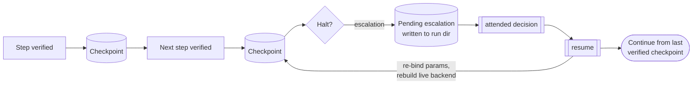

# Durable runtime: checkpoint, attended decision, resume

A halt means the run stopped instead of guessing. A halt mid-workflow should
not mean starting over, and must never re-perform a write that already landed.
The durable runtime turns a halt into a **durable pause**. An authorized
operator can make a bounded attended decision, and the runtime resumes only
from the last verified checkpoint.

!!! note "Off by default"
    The durable runtime is Tier-3 and opt-in. Enable it with `runtime.durable`
    in a [deployment config](../reference/deployment-config.md) or the
    `--durable` flag. Unconfigured, a run behaves exactly as before: a halt
    stops the process with a report.

## What "durable" adds

With durability on, the replayer **checkpoints each verified step**, only after
its postconditions passed and, where declared, its
[effect was CONFIRMED](effect-verification.md) against the system of record. The
checkpoint marks verified progress, not merely "the click fired."

When the run halts (an unhandled screen, a refuted write, an escalation), it
writes a **pending escalation** into the run directory and stops. Everything up
to the last checkpoint is durably recorded and verified.

The halting step itself is **not** checkpointed, and the runtime does not claim
it did nothing. Several halts happen *after* the action was delivered, because
that is when the evidence arrives: a screen postcondition is read after the
click, and a refuted write is a write that was sent and then read back absent
from the system of record. **A halt is not a rollback.**

What the halting step may already have done is stated in the run's terminal
`transaction_outcome`, and is never inferred from the checkpoint:

- **`HALTED_BEFORE_EFFECT`**: absence was positively established for every
  consequential step. There is nothing to reconcile.
- **`RECONCILIATION_REQUIRED`**: delivery or persistence is uncertain,
  conflicting, or unverifiable. Reconcile the current state before resuming; the
  runtime will not blind-retry.

The runtime never returns the first outcome to spare you the second. An empty
evidence list means verification never ran, not that nothing happened.



## Resume never re-runs a confirmed write

A GUI automation cannot resume from serialized state alone: it needs a live
backend and live vision. So `resume` rebuilds a fresh live backend through the
same [backend selector](../reference/cli.md#backend) as `replay` and `run` (from
the deployment config's `backend` section, or a `--backend` / `--url` /
`--rdp-host` override), re-binds the run's parameters from the run manifest, and
**continues from the last verified checkpoint**.
Steps before the checkpoint are not re-performed, which is the whole point on an
irreversible write.

```bash
openadapt flow resume runs/replay-20260712-140233
```

## Attended decision: an authenticated pause for a human

A durable pause is where a human decides whether the automation should continue.
The local `approve` and `resume --require-approval` path remains available:

```bash
openadapt flow approve runs/replay-20260712-140233        # a human signs off
openadapt flow resume  runs/replay-20260712-140233 --require-approval
```

For attended runs, Flow also emits a signed, bounded decision task. An operator
can use the local console or an enabled hosted phone queue to Continue, Skip
when the declared policy permits it, Teach, Reject, or Escalate. The task is
bound to the exact pause, permitted operation, transition, expiry, and
idempotency scope. A decision does not authorize a blind retry. Before a run
continues, the runtime reacquires live state and re-proves the required
postcondition, identity, and effect evidence.

The hosted phone lane uses outbound runner HTTPS and an encrypted Web Push
notification. It projects a closed context only; screenshots, OCR, values, and
free-text application data stay on the customer-controlled runner. See
[Attended decisions and the halt-learn loop](halt-learn-loop.md).

## Bounded recovery

Durable resume is the third tier of a bounded runtime:

1. a **deterministic fast path** (the resolution ladder, $0);
2. a **bounded model recovery** of at most one local transition, when
   configured and permitted;
3. a **durable pause, approve, resume** from the last verified checkpoint.

Recovery is scoped. After a halt, OpenAdapt does not hand the rest of the
workflow to a free-form agent. The checkpoint is where a human takes over when
the next action is not determined. [Identity](identity-gate.md) and
[effect verification](effect-verification.md) stop the same way; here the stop
is resumable.

How that handover reaches a person, what an answer authorizes, and why the
engine re-verifies live state, is the
[attended decision path](halt-learn-loop.md#where-a-halt-goes-the-attended-decision).

See the [Run a deployment](../guides/run-a-deployment.md) guide for a worked
durable run, and the [CLI reference](../reference/cli.md#resume) for `resume` /
`approve` exit codes.
