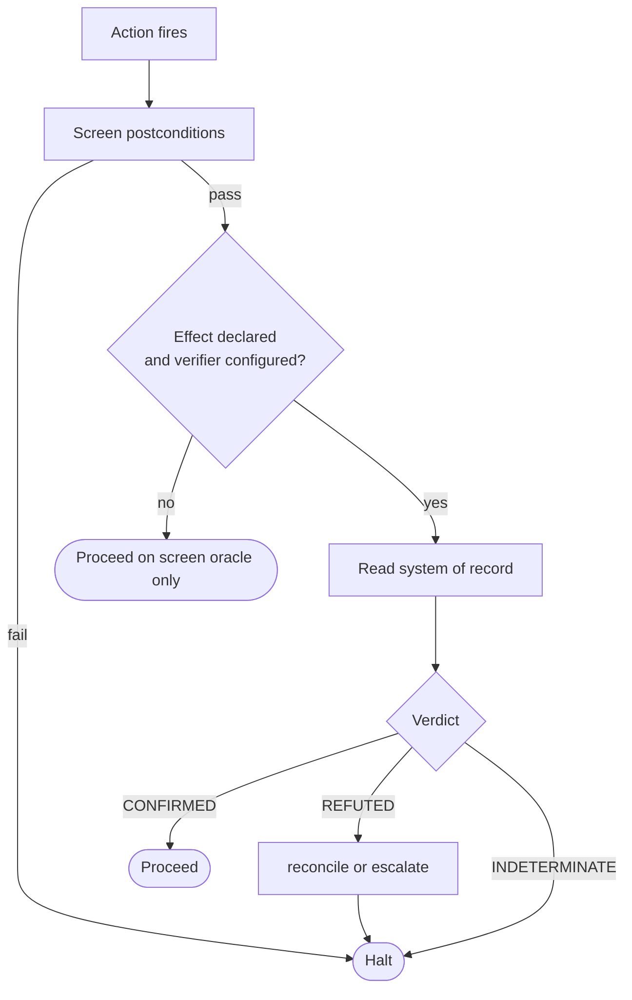

# Effect verification

The screen is not the system of record. A "Saved" banner can paint over an empty
database. Effect verification is how OpenAdapt confirms that a write actually
landed in the real record, exactly once, with the right values, by reading the
system of record instead of the pixels.

## The problem: five silent write faults

A vision postcondition answers a weak question: "do the pixels look like a save
happened?" A fault-model study drove 90 replays through a real persistence
boundary and found that screen verification silently mishandles **5 of 7
transactional fault classes**. In each of these, the recorded pixels match
perfectly, so self-healing cannot help, and the screen shows success, so the
screen oracle cannot help either:

| Fault class | Screen says | Reality |
|---|---|---|
| Duplicate submission | Saved | Two records written |
| Optimistic UI, backend rejects | Saved | Zero records (phantom success) |
| Partial save | Saved | A field was dropped |
| Stale / concurrent overwrite | Saved | Another user's change was lost |
| Double-click extra record | Saved | Two records written |

None of these is render drift. The screen genuinely showed success. Only the
record knows the truth.

## The mechanism: read the record, not the screen

A step can declare typed **effects** against the system of record. When the run
is given an `EffectVerifier`, the replayer snapshots the real record before the
action, and after the screen postconditions pass, rules each declared effect
against that record with a three-valued verdict:

- **CONFIRMED**: the effect is present and correct. Proceed.
- **REFUTED**: the record affirmatively contradicts the effect (missing,
  duplicated, wrong value, collateral loss). **Halt.**
- **INDETERMINATE**: the record is unreachable or unreadable (transport error,
  non-2xx, expired token, unparseable body). **Halt.** An expired token is never
  mistaken for "record absent."

There is no "probably fine." Both non-confirmed verdicts halt the run, mirroring
the [identity gate](identity-gate.md)'s refuse-rather-than-guess posture. The
verifier reads an API or a database, never the pixels, and the path makes **zero
model calls**, so the $0 runtime guarantee holds.

## Effect kinds and idempotency

Two effect kinds cover the common cases:

- `record_written`: a record matching a selector exists **exactly**
  `expected_count` times (at-most-once).
- `field_equals`: a read-back of one field equals an expected value.

An at-most-once key (`idempotency_key`) plumbs through a consequential write, so
a double-submit that the server de-duplicates collapses to one row (CONFIRMED),
while a non-idempotent double-submit lands two rows (REFUTED).

## Reconcile or escalate

A REFUTED consequential effect never silently proceeds:

- A **duplicate** on an irreversible effect can be reconciled by a compensator
  that removes the extra records, after which the effect is re-verified. Only a
  CONFIRMED re-verification lets the run continue.
- **Missing, partial, collateral loss**, reversible effects, and every
  **INDETERMINATE** result **escalate**: a durable halt for a human.
  Reconciliation never invents or overwrites state.

## Verified against real systems of record

The same typed `Effect` is checked by substrate-specific verifiers, so the
approach is not tied to one backend:

| Substrate | System of record | Status |
|---|---|---|
| OpenEMR FHIR R4 | FHIR `Bundle` search over the API | Verified live against a real local OpenEMR, plus CI against a byte-faithful fake |
| REST / JSON | an app's REST endpoint | Live in CI, drives the fault matrix |
| Filesystem document store | a directory verified by SHA-256 | Live in CI, proves the protocol is substrate-agnostic |

For the five classes the screen silently mishandles, effect verification
REFUTES and halts. That is the thesis.

## The honest preconditions

Two conditions are required, and they are real:

1. The step must **declare** the effect. The compiler does not yet mine effects
   from a demonstration; they are authored per deployment against the app's
   system of record.
2. A verifier must be **configured** for the deployment.

A bundle with no declared effects, or a run with no verifier, still has only the
screen oracle for the write and is exactly as silent as before. The one
automatic fail-safe: a step that declares effects while no verifier is
configured is a configuration error and halts, so an unverifiable consequential
write is never silently accepted.
