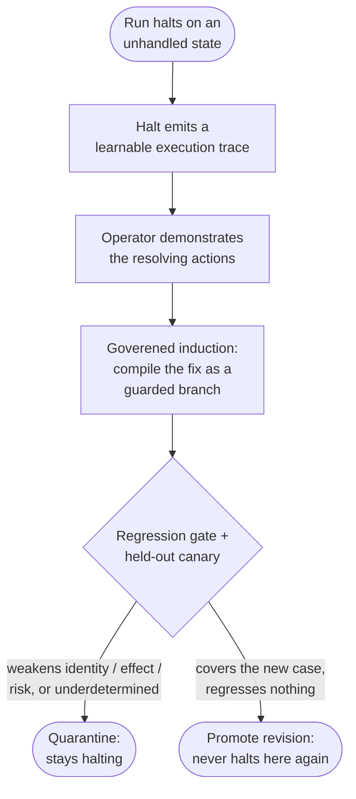

# The halt-learn loop

A [halt](identity-gate.md) is honest, but a halt that teaches the system nothing
means the same unhandled state halts forever. The halt-learn loop closes that
gap: an operator demonstrates the fix once, the correction is folded into the
workflow *through the governed induction path*, a regression gate proves the
revision weakens nothing, and that state never halts again.

Crucially, it does this **without ever handing control to a free-form agent**
and **without any model call on the runtime path**. Learning is governed, and a
revision is adopted only if it provably does not regress safety.

## The loop

1. **A halt emits a learnable trace.** The run report records the halt point,
   the unexpected on-screen text, and the completed pre-context — lifted into
   the same `ExecutionTrace` type the learning loop already consumes.
2. **The correction is a demonstration.** The operator's resolving actions
   (dismiss the modal, then continue) extend the halt's pre-context, exactly the
   shape a normal recording produces.
3. **Induce through the governed path.** The demonstration feeds the same
   multi-trace [induction](multi-trace-induction.md) machinery, which compiles
   the resolution as a **guarded conditional branch** on the workflow-program
   graph — not a special case bolted on.
4. **Gate, then canary.** A candidate revision must pass a deterministic
   **regression gate** and a held-out **canary** before it is promoted.
5. **Promote or quarantine.** Only a revision that covers the new case *and*
   regresses nothing becomes active. If the single correction underdetermines
   the generalization, the loop **refuses to promote** and the workflow stays
   halting — the same discipline as induction.

## The regression gate: what a revision may not weaken

The gate is the heart of "governed." A learned revision may change *how* a step
is performed (its locator, its rung) but must never silently weaken *what the
workflow means*. It traverses **both** programs (subflows included), matches
consequential actions by structural role rather than raw step id, and
quarantines a candidate that would:

- drop or weaken a **reachable consequential/irreversible action**, or make one
  reachable under *more* conditions than before;
- shrink the set of **identity checks** that must pass before a write;
- lose a system-of-record **effect contract**, or add a new consequential action
  **without** effects;
- **downgrade a risk label** (irreversible → reversible);
- drop an **approval requirement** on an action that needed operator
  confirmation.

Any of these quarantines the revision with a reason. A revision that merely
"covers more traces" does not pass if it costs any of the above.

## Versioned, provenance-tracked skills

Promoted revisions live in a versioned skill library that keeps every revision's
provenance and status, and never silently adopts an unverified one. A quarantined
candidate is retained with its rejection reason; the active version is unchanged.

!!! note "Honest status: a governed library capability, not a one-command flow"
    The halt-learn loop ships as a **tested library capability** —
    `openadapt_flow.learning` (the clustering, the interpreter that replays a
    program for `$0` coverage, the regression gate, the skill library, and the
    halt→demonstration bridge). It is deterministic and makes no model calls.
    What it is **not** yet: a single polished CLI verb that runs the whole
    demonstrate-and-promote flow for you. The multi-trace **inducer** it depends
    on is injected behind a `Protocol` (a deterministic reference inducer
    exercises the loop in tests), so the loop's *governance* is proven
    independently of any particular induction implementation. Treat this page as
    the shipping mechanism and the near-term roadmap for how a halt becomes a
    permanent, governed improvement — not as a finished end-user command.

## Why this shape

Every other safety mechanism in OpenAdapt refuses rather than guesses. The
halt-learn loop is how the system *improves* without abandoning that posture: the
only thing trusted to generalize a fix is a demonstration plus a gate, and the
gate is biased exactly the way the runtime is — a revision that might weaken
safety is quarantined, not shipped. It is the counterpart to
[multi-trace induction](multi-trace-induction.md) (recover the program from
several traces) and [policy and certify](policy-and-certify.md) (refuse a bundle
whose gaps were not closed): learn only what you can prove safe.
