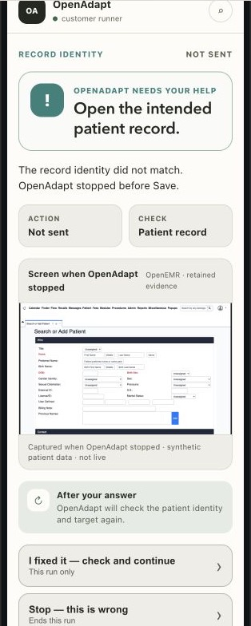
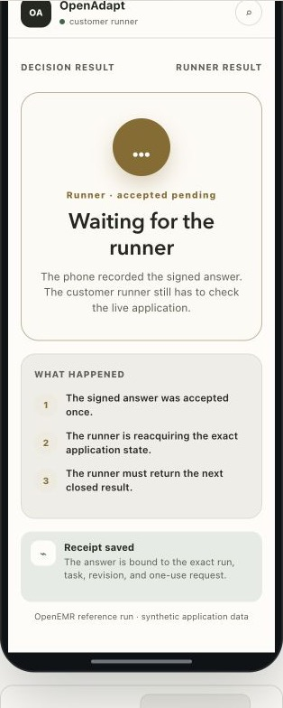
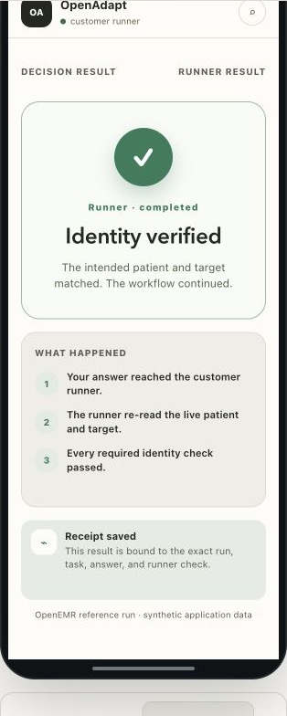
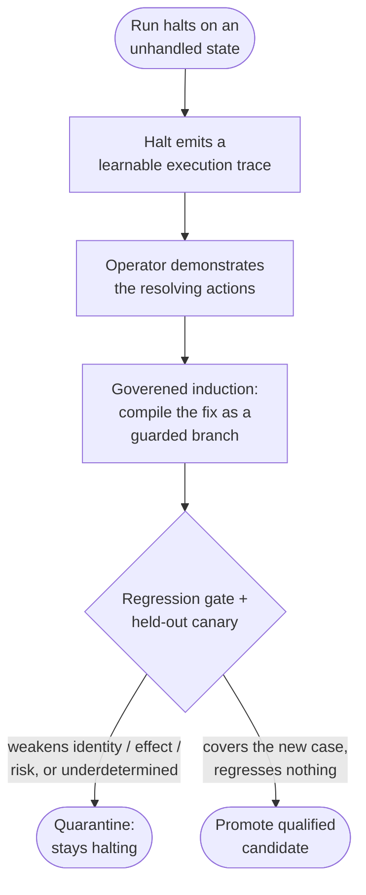

# Attended decisions and the halt-learn loop

A [halt](identity-gate.md) is honest, but a halt nobody hears is just a stopped
run, and a halt that teaches the system nothing means the same unhandled state
halts forever. This page covers both halves of the answer: **where a halt goes**
— the bounded question OpenAdapt puts in front of a person — and **what happens
when that person teaches the fix**, which is the halt-learn loop proper.

Both halves refuse rather than guess. Neither hands control to a free-form
agent, and neither puts a model call on the runtime path.

## Terms used here

- **BYOC** means bring your own cloud: a customer-owned cloud runner and
  storage boundary. It is one form of customer-controlled execution.
- An **effect verifier** independently reads the system of record to confirm a
  declared write. It does not treat a screen message as proof.
- **Qualification** is the versioned evidence that one exact workflow behaves
  correctly in its named application, environment, and execution surface.
- An **identity gate** checks the intended record before a consequential action
  and halts if it cannot verify that record.
- **Reconciliation** rechecks a possible or conflicting effect without
  re-dispatching the action.

See the [full glossary](../reference/glossary.md) for the shared terms and
their contract boundaries.

## Where a halt goes: the attended decision

When a run cannot confirm something, it stops and projects the paused step into
a **bounded request**. A member of staff can answer it at the runner, from the
Cloud dashboard on a phone, or through a phone portal that the customer hosts.

The request states one of six reasons for attention: record identity, target
ambiguity, a human-only step, saved-result verification, uncertain delivery, or
a required halt. The runner offers only the actions that are safe for that
request.

### Operational decisions are bounded; business judgment stays human

An attended decision manages an **operational halt**. It can ask an authorized
operator to prepare the live state, stop, skip an explicitly permitted step,
escalate, teach a correction, or reconcile a possible effect. The signed task
binds the exact run, pause, permitted actions, and revalidation requirements.

It does not ask OpenAdapt to make arbitrary business judgment. A workflow that
needs a business choice must either express that choice as a reviewed typed
decision contract with permitted actions and a verifiable outcome, or stop for
a human to complete the action. After either path, the runner rechecks the live
identity, state, and configured effect before it reports `VERIFIED` or resumes.

The question is closed by construction. `openadapt-flow` projects the pause into
a signed task carrying typed categories, bounded counts, and digests; the client
owns every sentence a person reads. The runner never sends prose and the phone
never renders a runner string, so protected content has no field on the wire to
travel in. What the operator sees is composed locally: which step could not
start, what kind of target it was looking for, what the
[resolution ladder](capability-ladder.md) tried on each rung, and what the
engine will re-prove if they continue.

The decision client is a **responsive web app** — deliberately not a native iOS
or Android application, so there is no app store or separate update channel.
The customer-controlled runner serves the full local portal. The hosted queue
receives only a closed, PHI-free decision context.

<div class="grid" markdown>

<figure markdown="span">
  { width="314" }
  <figcaption>Request: this synthetic example shows the retained frame and only the actions that the exact pause permits.</figcaption>
</figure>

<figure markdown="span">
  { width="314" }
  <figcaption>Answer accepted: the signed answer is bound to the run. It is not a successful result. The runner must check the live application.</figcaption>
</figure>

<figure markdown="span">
  { width="314" }
  <figcaption>Result: the runner, not the phone, rechecks state and records the receipt before it reports a verified continuation.</figcaption>
</figure>

</div>

### The operator returns a decision, not an execution result

This is the property everything else rests on. Answering does not perform the
step, and it does not mark the run verified.

When an answer arrives, the engine:

1. validates the signed task digest, the exact pause capability, and the
   engine-derived allowed-action list;
2. takes a single-flight lease, so two people cannot both decide one task;
3. **re-reads the live application** and re-runs its identity, postcondition,
   and effect checks against a fresh observation;
4. continues only if that fresh check passes — and **refuses** when the
   application is not actually in the state the step needs.

So "I fixed it" means *I prepared the live state; now go and check it*. It never
means "repeat the paused write". A run reaches `VERIFIED` only when the complete
configured contract proves the intended effect, exactly as on an unattended run.
An operator's answer is an input to a verification, never a substitute for one —
which is why an operator who is mistaken produces a second halt rather than a
silent wrong write.

!!! note "The operator's own work is verified, not replayed"
    When the person completed the step themselves, OpenAdapt advances the resume
    point on the strength of **outcome verification** and records the step as a
    human-attended actuation. It does not actuate the application a second time.
    A step whose postconditions or independent effect check do not pass is
    refused, not banked.

The reply is also honest about delivery. Three states stay distinct: not sent,
sent, and **may have been sent**. For uncertain delivery, use **Reconcile**.
The runner reads the required postcondition and independent effect again. It
does not send the action again. It reports a reconciled result only when that
check proves the effect; otherwise it stays halted for safe review.

### Full evidence stays on the runner

The retained screen, the observed values, the OCR, and the failing target never
leave the customer-controlled runner. Only a typed, PHI-free envelope crosses to
a hosted control plane: opaque identifiers, digests, closed enums, bounded
counts, and expiry. There is no free-text field anywhere in that envelope, so
raw values and prose are **structurally unable** to travel rather than being
stripped in transit.

The direct consequence is that a hosted surface shows **less** than the runner —
it can say the *shape* of a failure but not its content. That is the design
working, not a gap:

- "0 of 2 required identity signals confirmed the record on screen" is a bounded
  integer and crosses the boundary safely.
- "the OCR rung was tried and did not resolve a unique target" is a pair of
  closed enums and crosses safely too.
- "could not find the button labelled *Open*" names on-screen content, so it
  stays local.

A hosted surface that says less is a surface that cannot leak more. An operator
who needs the full picture opens the run on the runner, where the evidence
already is — and the hosted surface says so, rather than letting absent detail
read as "OpenAdapt does not know".

Sending a decision *back* through a hosted control plane requires an explicit
deployment opt-in bound to one tenant and one runner. It also requires the
stronger authentication policy for remote issuance. The outbound runner lane,
hosted mobile projection, and encrypted Web Push are deployed; an unconfigured
runner keeps decisions on its local surface.

### Reaching it from a phone

There are two ways, and they trade fidelity against what your network has to do.
Neither of them asks OpenAdapt to open a hole in it.

#### The hosted lane — nothing to configure

**This is the default answer for a practice without an IT department.** The
runner makes **outbound HTTPS requests only** to the control plane: no inbound
port, no port forward, no certificate, no reverse proxy, no static address. It
works behind NAT on an ordinary broadband line.

1. Connect the desktop app to OpenAdapt Cloud once. It registers this computer
   and stores its credential in the operating-system keychain.
2. Turn on remote decisions in your deployment configuration, bound to the exact
   tenant and runner the control plane issued.
3. In **Needs attention**, scan the dashboard QR code. It opens the same-origin
   Cloud phone page, with no session or decision authority in the code. Sign in
   there, then select **Notify this browser** if you want Web Push alerts.

The hosted queue can send an encrypted Web Push notification when a signed task
needs attention. The notification contains no application content. The opened
queue shows only the closed halt context described below.

That is the whole list. **You do not terminate TLS.** The only TLS involved is
the runner's outbound connection to a public host with an ordinary public
certificate.

What the phone shows on this lane is the *closed halt context*: which category
of check failed, which resolution rungs were tried and what each one returned,
which contracts a "Continue" will re-prove, and bounded counts. Every value is a
closed enum, a bounded integer, or a boolean — **there is no string field and no
image**, so the hosted service is structurally unable to hold a name, an MRN, an
observed value, or a workflow label. It is not scrubbed; it has nowhere to put
them.

The one thing it gives up is the target control's own accessible name. The phone
says *"OpenAdapt could not find the button"* rather than *"the button labelled
`Open`"*, and it tells you a name exists that it is not showing you.

#### The runner-local portal — full fidelity, on your own terms

The portal on the runner serves everything, including the protected screenshot
crops. That is why it is the path with a network requirement.

!!! warning "The portal is loopback-only until you publish it"
    Out of the box the decision portal binds `127.0.0.1` and advertises a
    loopback URL. **A phone cannot reach it, and a fresh install will not serve
    one.** Publishing it to a phone requires *you* to terminate trusted TLS in
    front of the runner — an enterprise reverse proxy, a VPN, or a ZTNA
    hostname — and to record that decision in configuration.

    Use the hosted lane above if you do not operate one. See
    [the portal settings](../reference/configuration.md#the-self-hosted-phone-portal)
    for the exact variables and
    [Deploy on-prem](../guides/deploy-on-prem.md#reaching-the-decision-portal-from-a-phone)
    for where it sits in a deployment.

We did not punch a hole in your network for our convenience, and there is no
"bind everything" switch to make a demo easier. The boundary in front of a
runner that can see protected records is yours to open, deliberately, under your
own certificate and access policy — so this path inherits the authentication,
device posture, and logging you already run, instead of asking you to trust a
second one.

Every widening step is explicit and **fails closed**. A wildcard bind address is
refused in every mode. So is a plaintext origin, an origin carrying a path or
credentials, a hostname where a literal address is required, and a published
mode missing either its public origin or its operator acknowledgement. Any
invalid combination raises and the portal does not start; it never quietly
widens its own exposure to become reachable. There is no self-signed-certificate
bypass and no test-only wide bind.

### Pairing a phone

Pairing runs the opposite way round from the obvious design, and the reversal is
the point.

For the self-hosted portal, the runner shows a QR code. Scan it from the phone.
The phone then shows a short, one-use pairing code. Type that code on the
runner to approve that phone. This binds the phone to the local portal; it does
not give the phone an engine or console capability.

Do it the intuitive way — derive the code from the pairing and show it on the
runner — and an attacker who photographed the QR from across the room and
claimed it first would be shown the very code the runner's screen was already
displaying. The "matching code" would then confirm the attacker. Minting per
claim means a remote attacker's phone shows a code the operator cannot see, and
the mismatch is visible immediately.

The rest of the shape follows from the same posture:

- The QR link carries **only a pairing secret** — no console capability, no
  pause capability, no tenant, run, or pause identifier.
- The secret rides in the URL **fragment**, which browsers never transmit, so it
  cannot land in a reverse-proxy access log or a referrer header.
- It is **claimable exactly once**, atomically. A second phone scanning the same
  code is refused.
- It expires shortly after it is shown, enforced server-side and re-checked at
  approval, against both a monotonic and a wall clock so neither a suspended
  machine nor a clock change can extend the window.
- A claimed session is **unusable until approved**, attempts are bounded, and
  showing a new QR retires every earlier unapproved pairing so a stolen code
  cannot sit latent.
- Secrets and session tokens are stored only as digests and compared in constant
  time. Paired devices are listed and revocable, and sessions expire.

The phone never receives the engine's console capability. It holds a session
token bound to that runner and that approved pairing, and nothing else.

### One decision cannot become a second authority

The signed task makes the presented question tamper-evident. It does not itself
grant execution authority. Before a remote answer can change a run, the runner
binds it again to the exact tenant, runner, task revision, pause capability,
allowed operation, expected transition, expiry, and idempotency scope. It then
takes a single-flight lease and repeats the live checks. A replayed, expired,
or mismatched answer is refused. The control plane can request a decision; the
customer-controlled runner remains the final authority for execution.

### What an operator can request

The runner selects from these actions for the current request. A phone cannot
add an action that the signed task did not permit.

| Request | Result |
|---|---|
| Check and continue | The runner takes a fresh observation and resumes only when its checks pass. |
| Skip | The runner resumes only when the workflow explicitly permits a skip. |
| Stop this run | Ends this run without a further application action. |
| Teach the correction | Leaves this run paused and opens the local correction path. |
| Ask for help | Keeps the durable pause for an authorized colleague. |
| Reconcile | For a sent or uncertain action, proves the saved effect without re-dispatch. |

The receipt then reports one distinct outcome: verified and resumed, skipped and
resumed, refused after revalidation, halted again, expired, demonstration
requested, escalated, stopped by the operator, or reconciled and resumed. A
recorded request is not a verified result.

Operating-system notifications for these are generic by construction: the runner
reads a single count from a PHI-free endpoint and renders a fixed template. No
upstream string is ever forwarded to a notification, on any channel.

**"Teach the correction" is the front door to the rest of this page.**

## The learn loop

Answering a halt keeps one run moving. Teach starts from the latest saved,
eligible HALTED run. Desktop records the correction, compiles a candidate, and
reruns qualification. Only a promoted candidate affects future runs. Each future
run still requires its own runtime evidence and can halt. A candidate is adopted
only if it passes the qualification and safety gates.



1. **A halt emits a learnable trace.** The run report records the halt point,
   the unexpected on-screen text, and the completed pre-context as the same
   `ExecutionTrace` type the learning loop already consumes.
2. **The correction is a demonstration.** The operator's resolving actions
   (dismiss the modal, then continue) extend the halt's pre-context, the shape a
   normal recording produces.
3. **Induce through the governed path.** The demonstration feeds the same
   multi-trace [induction](multi-trace-induction.md) machinery, which compiles
   the resolution as a **guarded conditional branch** on the workflow-program
   graph, not a special case bolted on.
4. **Gate, then canary.** A candidate must pass a deterministic **regression
   gate** and a held-out **canary** before promotion.
5. **Promote or quarantine.** Only a candidate that passes qualification and
   does not regress safety becomes active for future runs. If the correction
   underdetermines the generalization, the loop **refuses to promote**.

## The regression gate: what a revision may not weaken

A learned revision may change *how* a step is performed (its locator, its rung)
but never silently weaken *what the workflow means*. The gate traverses **both**
programs (subflows included), matches consequential actions by structural role
rather than raw step id, and quarantines any candidate that would:

- drop or weaken a **reachable consequential/irreversible action**, or make one
  reachable under *more* conditions than before;
- shrink the set of **identity checks** that must pass before a write;
- lose a system-of-record **effect contract**, or add a new consequential action
  **without** effects;
- **downgrade a risk label** (irreversible → reversible);
- drop an **approval requirement** on an action that needed operator
  confirmation.

Each quarantines the revision with a reason. Merely "covering more traces" does
not pass if it costs any of the above.

## Versioned, provenance-tracked skills

Promoted revisions live in a versioned skill library that keeps every revision's
provenance and status, and never silently adopts an unverified one. A quarantined
candidate is retained with its rejection reason; the active version is unchanged.

## Driving it: `openadapt flow teach`

The whole demonstrate-and-promote flow runs from one command. Point `teach` at
the halted run directory (holding `report.json` with a `halt`), give it the fix
demonstration and the base bundle that halted, and name where a promoted bundle
should be written:

```bash
openadapt flow teach runs/replay-20260712-140233 \
    --fix recordings/dismiss-the-dialog \
    --bundle bundles/patient-intake \
    --out bundles/patient-intake-v2
```

| Flag | Description |
|---|---|
| `run_dir` (positional) | The HALTED run directory (holds `report.json` with a `halt`) |
| `--fix` (required) | The fix demonstration: a **recording directory** of just the corrective actions (e.g. dismiss the dialog), or a `.json` correction spec (scripted / CI: `resolution_steps`, optional `tail_intents` / `facts` / `params`) |
| `--bundle` (required) | The base bundle that halted (seeds the skill's active version) |
| `--out` (required) | Output directory for the UPDATED bundle, **written only when the correction is promoted** |
| `--skill-id` | Skill id in the versioned library (default: the run's workflow name) |
| `--library` | Directory for the versioned skill library that keeps the promotion lineage (default: `<out>.skills`) |

`teach` runs the governed loop end to end (load the halt, turn the fix into the
operator-correction trace, induce, regression-gate, held-out canary) and writes
`--out` **only** if the revision is promoted. On the shipped path it is
deterministic and makes **no model calls** ($0): the resolution is induced by
the model-free reference inducer (the structural-diff inducer that handles the
"an unexpected optional dialog intercepted the workflow" class the loop was
built for). A model-backed inducer wires in behind the same `Inducer` seam
without touching this flow.

**The refusal path is a normal outcome, not an error.** If the single correction
underdetermines the generalization, or the induced revision would weaken a
safety invariant, the loop **refuses to promote**: nothing is written to `--out`,
the base bundle stays halting, and the command exits nonzero (`1`) with the
reason. Unusable inputs (no halt in the report, no base bundle, a malformed fix)
are a distinct failure and exit `2`. A successful promotion exits `0` and prints
the re-run command.

!!! note "What is proven, and what depends on the inducer"
    The loop's **governance** (the regression gate, the held-out canary, the
    versioned skill library, the halt→demonstration bridge) is proven
    independently of any induction implementation: the inducer is injected
    behind an `Inducer` seam and a deterministic reference inducer exercises the
    loop in tests. The reference inducer covers the optional-dialog resolution
    class; generalizing to arbitrary corrections is the job of a richer inducer
    behind that same seam, which inherits the same gate.

## Why this shape

Every other safety mechanism in OpenAdapt refuses rather than guesses. The
halt-learn loop is how the system *improves* without abandoning that posture: the
only thing trusted to generalize a fix is a demonstration plus a gate, biased
the way the runtime is, so a revision that might weaken safety is quarantined,
not shipped. It is the counterpart to
[multi-trace induction](multi-trace-induction.md) (recover the program from
several traces) and [policy and certify](policy-and-certify.md) (refuse a bundle
whose gaps were not closed): learn only what you can prove safe.

The attended decision is the same posture pointed at people. It would be easier
to treat a tap as an answer, publish the portal on every interface so a phone
just works, and forward the failing screen to a dashboard where support can see
it. Each of those would move a decision, a network boundary, or a protected
record somewhere it does not belong. Instead the person supplies the one thing a
machine cannot — an observation about the world — and the engine keeps
everything it is actually good at: re-reading live state, checking identity and
effects, and refusing. A halt reaches a phone in seconds, and it still cannot
turn into a wrong write because somebody was in a hurry.
