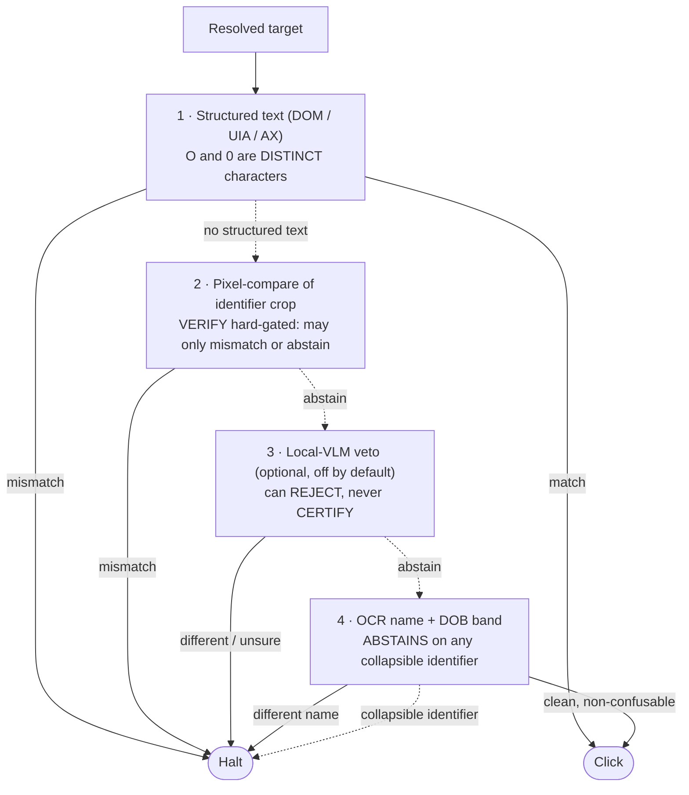

# The identity gate

The most dangerous failure in desktop automation is not a crash. It is clicking
the **right-looking wrong thing**: opening the wrong patient, editing the wrong
account, in a repeated structure where the target still looks plausible. The
identity gate is a pre-action check that refuses to act when it cannot tell two
records apart.

## The threat: right position, wrong entity

When data shifts between runs (a row added above the target, the target's row
deleted, a look-alike sibling, a re-sorted table), the resolver can still find a
pixel-identical target at a plausible position. Resolving is not enough. Before
an armed click, OpenAdapt re-reads the resolved row's text and compares it to
the recorded row; on a mismatch, it halts before clicking.

## An impossibility result, and an honest response

Identity has a proven ceiling on pixels alone. Two **different** records with
the same name and same date of birth, whose only distinguishing field is an
identifier differing by a single glyph (`MG4408` vs `MG44O8`, `100512` vs
`1OO512`), render to a **byte-identical OCR band**. That band is identical to
what a re-read of the true row produces, so nothing downstream of OCR can
separate them. This is not a tuning gap but the limit of OCR-based identity, and
the honest response is to **refuse rather than guess**.

## The identity ladder

Identity is an ordered ladder of verifier tiers, highest-fidelity first: the
first that can judge the substrate wins, and its verdict is final. Every tier is
fail-safe: unsure abstains to the next, and if nothing verifies, the run halts.

1. **Structured text (DOM / UIA / AX).** When the backend exposes the element
   under the point, recorded and live identity strings are compared by exact
   match: `0` and `O`, `1` and `l` are distinct characters, so glyph-collapse
   cannot occur (the two rows are different strings in the tree). On a real
   dense sibling surface this **closes the glyph-collapse class at zero false
   accept and near-zero added over-halt**, including the exact attack that
   produces a high false-accept rate on the OCR path. Most native apps expose
   `Name` / `Value` text even without a stable automation id, so this tier is
   viable on desktop, not just the browser.
2. **Pixel-compare of the identifier crop.** For substrates with no structured
   text (Citrix, RDP, VDI), pixels distinguish `O` from `0` where OCR cannot.
   The VERIFY path is **hard-gated off** today: adversarial review showed no
   threshold makes a pixel VERIFY safe against sub-pixel render jitter, so the
   tier may only MISMATCH (a safe halt) or ABSTAIN, never grant a pass.
3. **Local-VLM veto** (optional, off by default). A local open model can
   **reject** a wrong record with high reliability but is not trusted to
   **certify** a right one, so a "same" answer abstains rather than passes. It
   pulls no model on the default install and makes zero cloud calls.
4. **OCR name + DOB band.** The fallback matcher. It verifies same-identity only
   when there is provably no collapsible glyph in any identifier-position token,
   and **abstains** on any identifier bearing an `O`/`0` or `l`/`1`/`I`. A
   different-name sibling is still an affirmative mismatch; a clean name and DOB
   with a non-confusable identifier still verifies.

## What it measures

Driven through the real replayer, the integrated ladder measures **zero
false-accept across every substrate configuration**, including the
same-name/same-DOB homonym. On browser and desktop the structured tier closes
the class at no availability cost. On pure pixels a collapsible identifier is
not safely verifiable and **halts** today, the honest cost of "OCR alone cannot
verify a collapsible identifier."

!!! warning "Coverage is a first-class, auditable metric"
    Identity verification covers only **armed** steps, and real bundles arm a
    minority of clicks (recent live bundles armed 4 to 7 of 12). A click with no
    readable discriminating text on its row (a login button, an icon-only
    pencil) compiles with no identity context and proceeds without an identity
    check. This is not hidden: `workflow.json` carries per-step
    `identity_armed` and `identity_unarmed_reason` (auditable before running),
    and every run report states "N of M click steps identity-armed" and lists
    the unarmed steps with the reason. Disclosure does not close the gap; a
    wrong-entity click on an unarmed step is still silent. This is what
    [policy and certify](policy-and-certify.md) exists to gate.

## Why this posture

The identity gate costs availability: on noisy pure-pixel rows it sometimes
halts a correct run rather than gamble. That is the cheap direction to be wrong.
Clicking by position is what caused wrong-record writes, so OpenAdapt takes the
halt. Deployments that cannot tolerate it can escalate each halt to a fallback
rather than proceed blindly.
