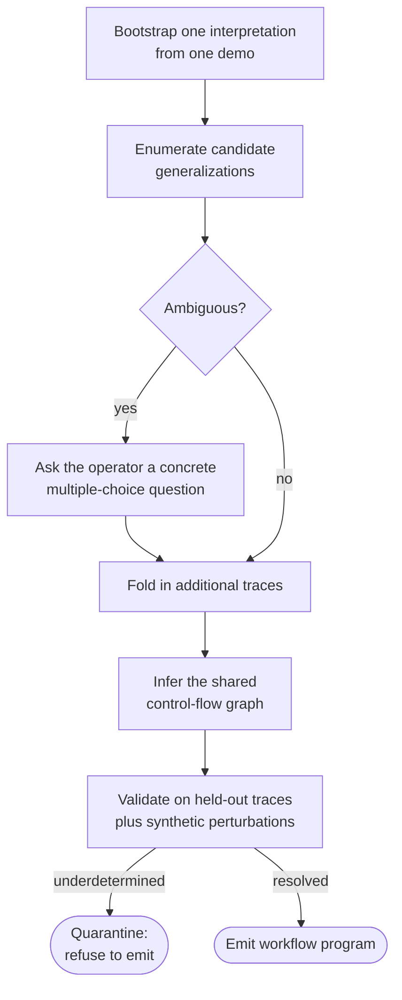

# Multi-trace induction

One demonstration is **evidence**, not a **specification**. It shows what did
happen once, not what should happen every time. Multi-trace induction is how
OpenAdapt recovers the intended program from more than one demonstration, and,
crucially, how it refuses to emit a workflow while intent stays ambiguous.

!!! note "Status"
    This is the induction design that accompanies the
    [workflow-program IR](workflow-ir.md). It builds on the shipping compiler,
    which already treats a demonstration as evidence when it decides which
    values are parameters and which screen text is incidental.

## Why one trace under-determines intent

The compiler already knows a single trace is ambiguous, because most of its work
is resolving that ambiguity:

- **Which literal values are parameters.** The demo shows a note of
  "Follow-up in 2 weeks." Nothing in one trace says whether the *patient*, the
  *encounter type*, or the *priority filter* were meant to be fixed or free.
- **Which screen text is incidental.** Clocks and counters versus a date of
  birth. One frame cannot tell you which is invariant.
- **The absent branch.** A single successful trace never shows the failure path.
- **The loop.** One pass over a worklist does not reveal that the operator meant
  to repeat it.

## The induction loop

Induction turns several demonstrations into a program by proposing, questioning,
and validating, rather than guessing:



1. **Bootstrap** one interpretation from one demonstration.
2. **Enumerate** candidate generalizations (is this value a parameter, is this
   step a loop body).
3. **Resolve ambiguity by asking**, not guessing: surface concrete
   multiple-choice questions to the operator.
4. **Fold in additional traces** and infer the shared control-flow graph.
5. **Validate** on held-out traces and synthetic perturbations.
6. **Quarantine** when intent stays underdetermined: refuse to emit rather than
   ship a workflow that might do the wrong thing.

## Ask, don't guess

The disambiguation step is available today as a CLI verb. It surfaces the
compile-time questions an ambiguous demonstration raises and applies the answers
as guards or parameters, so a consequential ambiguity must be answered before
the bundle is certified:

```bash
openadapt flow disambiguate bundle --interactive --write
```

A consequential (must-answer) ambiguity exits nonzero until it is resolved. This
is the same posture as the rest of the system: when the right action is not
determined, stop and ask, rather than proceed and hope.

## The through-line

OpenAdapt spent enormous effort making a *single trace* safe: the
[identity ladder](identity-gate.md), volatility mining, postconditions,
[effect verification](effect-verification.md). That work is necessary but
insufficient, because the trace itself under-specifies intent. Induction is how
the intended program is recovered, and quarantine is how the system stays honest
when it cannot be.
