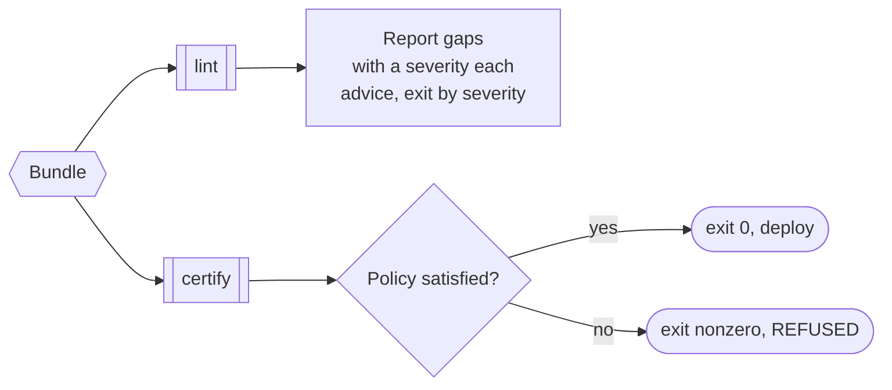

# Policy and certify

Compiled is not the same as certified safe. A bundle can be perfectly runnable
and still have gaps: a write with no identity check, a step that asserts
nothing. Policy and certify make "runnable" distinct from "certified safe", and
they fail closed.

## Two commands, two jobs



- **`lint`** reports a bundle's coverage gaps: clicks that act with no identity
  check, steps that assert nothing, writes left under-classified. Each finding
  carries a severity. It exits nonzero once a finding reaches `error` (an
  unarmed or vacuous *irreversible* step), and `--strict` also fails on
  warnings. `lint` is advice.
- **`certify`** enforces a policy and **refuses** the bundle (exits nonzero) when
  it fails. It is the gate: put it in CI or a deploy step and an unsafe bundle
  never ships.

```bash
openadapt flow lint    bundle
openadapt flow certify bundle --policy clinical-write
```

## What a policy asserts

A policy is a YAML document of requirements. Two examples ship: a permissive
default and a strict `clinical-write`. The strict policy asserts, for example:

- no unarmed clicks,
- identity required on every write and every entity-navigation step,
- effect verification required on every write.

`certify` evaluates the bundle against the policy and reports each requirement it
violates before the bundle is deployed.

## Risk is auto-classified, then enforceable

At compile time, write-shaped clicks (create, update, delete, submit, save,
confirm, add, and siblings, matched on word boundaries) are auto-classified as
`irreversible`. That arms the low-confidence refusal by default for
consequential writes, instead of only when a human marks the step. A
`risk_overrides` map wins in either direction.

!!! warning "The classifier is a heuristic, not understanding"
    Risk classification reads the label and the intent, never the app's true
    effect. It is deliberately biased toward irreversible (a false irreversible
    costs availability; a false reversible costs safety), but it misses writes
    with non-write labels (an icon-only "commit", a bare "OK" that saves) and
    writes committed by a submitting ++enter++ key. It also over-flags benign
    write words ("Apply filter", "Add to favourites"). A write behind a
    non-write label is still reachable with a green report unless a human adds
    `risk_overrides`, which is exactly why `certify` with a strict policy is the
    gate that refuses a bundle whose gaps were not closed.

## Fail-closed, everywhere

Policy and certify are the compile-time and pre-deploy face of the same posture
the runtime takes: [halt rather than guess](identity-gate.md),
[refuse rather than accept an unverifiable write](effect-verification.md),
[quarantine rather than emit an ambiguous program](multi-trace-induction.md).
The gate turns disclosure into enforcement: the residual gaps OpenAdapt is
honest about become a policy that refuses the bundle until they are closed.

This is a compile-time and pre-deploy layer only. The replayer, identity ladder,
and healer are unchanged by it. See the
[Write and enforce a policy](../guides/policy-and-certification.md) guide for a
worked example.
