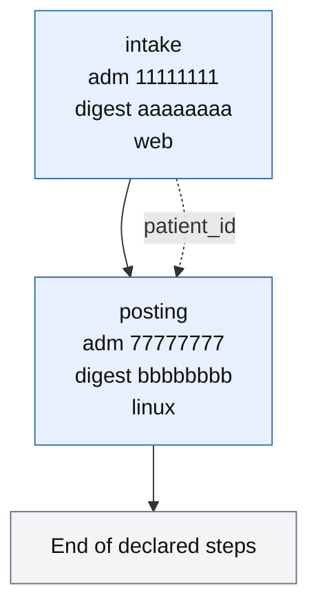

# Process contracts

A ProcessContract is a parent receipt over independently admitted capabilities.
Schema `openadapt.process-contract/v0`. Each child already carries a live
`openadapt.qualification-admission/v1` envelope: one workflow version, one
bundle digest, a counted campaign, identity and effect contract digests, a
30-day lifetime, signed Ed25519. The parent names those admissions by
`admission_id`. It doesn't copy recordings.

`admission_id` is a UUID on the child's envelope, distinct from
`runtime_validation_id`. Sitting next to another child doesn't extend anyone's
validity interval or digest binding. A child whose admission is expired,
revoked, or bound to a different digest is refused before Execute is called.

## Handoffs are effect facts

A handoff copies a parameter from child A into child B only when A's run ended
`VERIFIED` and A's Effect CONFIRMed that parameter. Window titles and URLs are
not evidence. A missing, empty, or unbound fact stops the parent before B
starts.

The parent receipt records, for each child, the `admission_id`, workflow
version, bundle digest, terminal outcome, and model-call count. For each
handoff it records the source, the target, and that the source was `VERIFIED`.
Parent `VERIFIED` requires every child `VERIFIED` and zero model calls.

## The recording parent and the admission parent

`openadapt flow compose` writes `composition.json`
(`openadapt.composition/v1`) and copies compiled child bundles. Use it after
you recorded each surface, before those children are admitted. `certify` and
`run` execute that directory. `replay` refuses it.

`openadapt flow process` writes `process-contract.json` and points at
admissions. It copies nothing. Pointing it at a `composition.json` directory
is refused, because those children aren't admitted. Each child runs through
[OpenAdapt Execute](../commercial/execute-api.md) with that child's envelope.
`replay` of the process parent is refused.

A compiled bundle still has its own ProgramGraph. `visualize` on a process
parent shows admitted children, handoff edges, and a terminal labeled End of
declared steps. Open the child bundle for its steps.

```bash
openadapt flow visualize process-parent -o process.html
openadapt flow visualize process-parent --format mermaid
```



<figure markdown="span">
  { width="900" }
  <figcaption>A process parent of two admitted capabilities. Representative synthetic process contract. The <code>admission_id</code> and digest values are fixtures, not a live tenant.</figcaption>
</figure>

See [Read a compiled program](program-visualizer.md) and
[Sequence work across two applications](../guides/compose-multi-application.md).

RFC-0001 is the name of this contract. Qualify each child first:
[Qualify a workflow](../guides/qualify-a-workflow.md).
