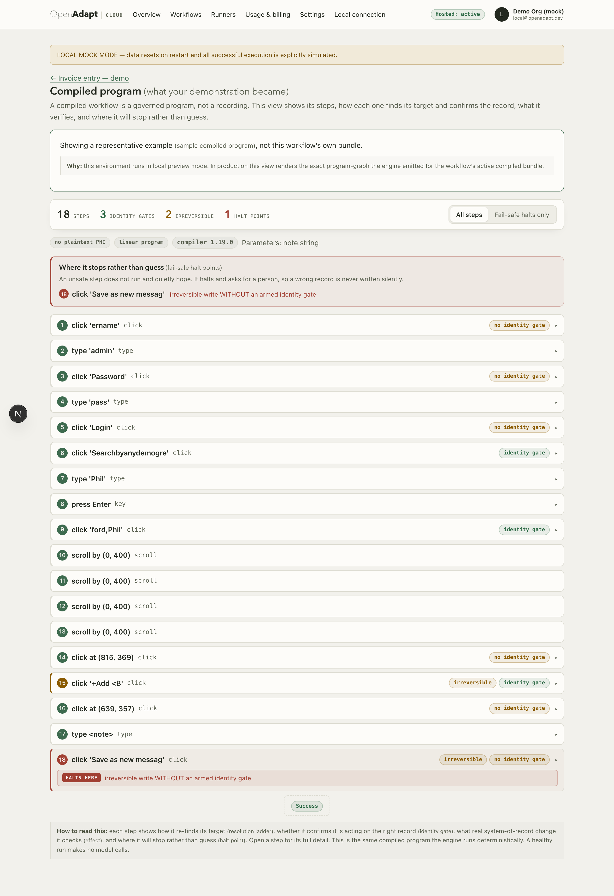
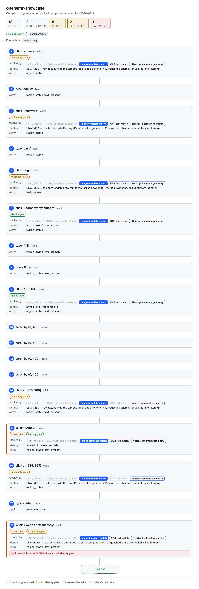

# The program visualizer

A compiled bundle is a program, not a recording. Before you trust it in a
deployment, you want to read it: what steps it will take, how it will find each
target, where it will refuse, and where it can stop. The visualizer renders that
program graph from the bundle itself, so what you review is the artifact that
will actually run.

<figure markdown="span">
  { width="900" }
  <figcaption>The same program graph in the Cloud workspace. The summary line counts the steps, armed identity gates, irreversible steps, and halt points, and the fail-safe panel calls out where the run will stop rather than guess.</figcaption>
</figure>

## What the graph shows

For each step the visualizer surfaces the parts that decide whether a run is safe:

- **Steps, in order.** The action at each step and the target it acts on.
- **The resolution ladder.** The ordered rungs a step will try to re-find its
  target at replay time (structural element match, template, OCR, landmark
  geometry, and optionally a grounding model). Reading the ladder tells you how
  much drift a step can absorb before it halts. See
  [the capability ladder](capability-ladder.md).
- **Armed identity gates.** Which steps re-verify identity before acting, and
  which do not. An unarmed step has no identity check at all, and the graph
  makes that visible rather than implied. See
  [the identity gate](identity-gate.md).
- **Effect checks.** Which writes carry a typed effect verified against the
  system of record. See [effect verification](effect-verification.md).
- **Halt points.** Every place the run is allowed to stop: a low-confidence
  match on an irreversible step, a failed postcondition, a refuted write, an
  ambiguous target. This is the run's stop map.

For a program bundle it also shows the structure the linear case hides: loops
and their bounds, guarded transitions, and exception paths.

## One graph, three renderings

The CLI reads the bundle and emits one of three formats from the same underlying
[graph spec](../reference/bundle-format.md):

```bash
openadapt flow visualize bundle -o graph.html     # self-contained page
openadapt flow visualize bundle --format mermaid  # flowchart source
openadapt flow visualize bundle --format json      # the shared graph spec
```

- **HTML** is a self-contained page you can open offline and hand to a reviewer.
- **Mermaid** is flowchart source you can paste into a Markdown file or a
  design doc.
- **JSON** is the shared program-graph spec. The Cloud and desktop surfaces
  render the same spec, so a reviewer in Cloud and an engineer at the CLI are
  looking at the same graph.

<figure markdown="span">
  { width="720" }
  <figcaption>The HTML rendering of the same bundle. Each step shows its resolution ladder in order, whether its identity gate is armed, what it verifies, and the fail-safe halt on the irreversible write at the end.</figcaption>
</figure>

The summary line reports the counts that matter at a glance: how many steps, how
many identity gates are armed, how many steps are irreversible, and how many
halt points the program has.

## Reading is safe

`visualize` never runs the workflow. It reads the bundle and describes it, with
no side effects, so you can point it at any bundle, including one that would
refuse to certify. That is the intended order: visualize and read the program,
[lint](policy-and-certify.md) its coverage gaps, certify it against a policy,
and only then run it.

## In Cloud

The same graph is available in the Cloud workspace on a workflow's page, so a
reviewer who never touches the CLI can still read the compiled program, its
gates, and its halt points before approving a version for a deployment.
