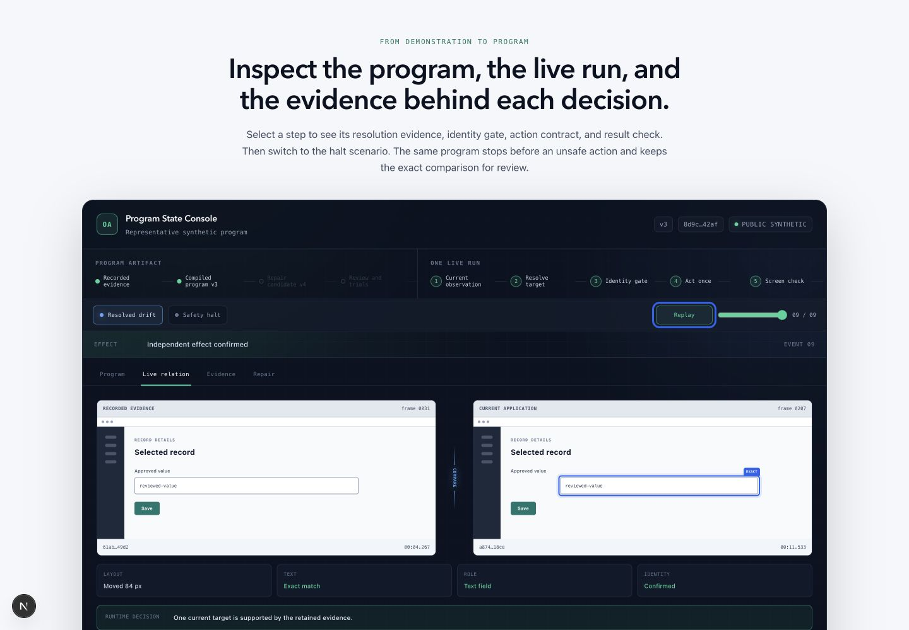
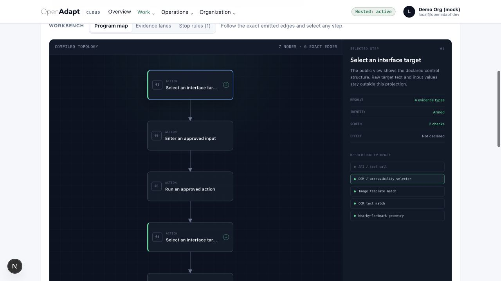
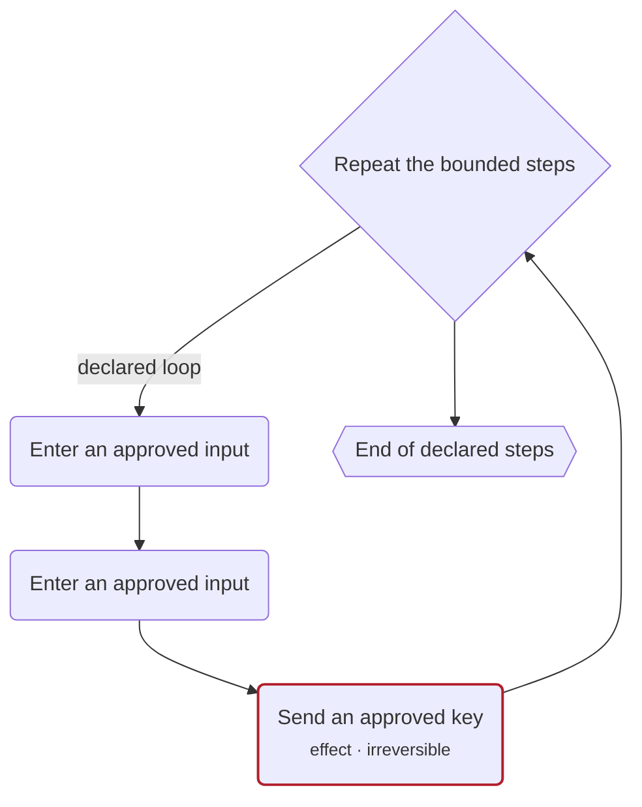
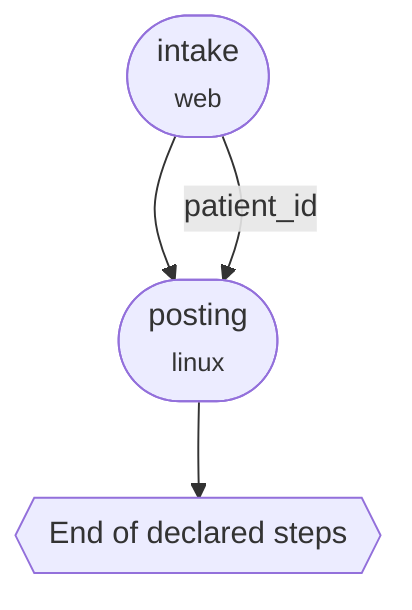
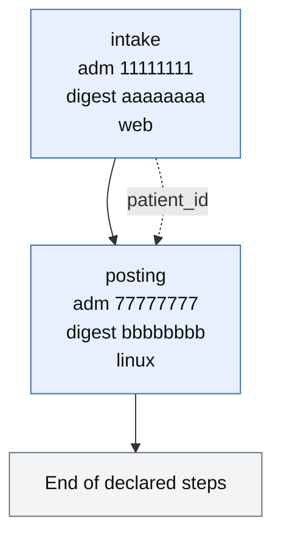
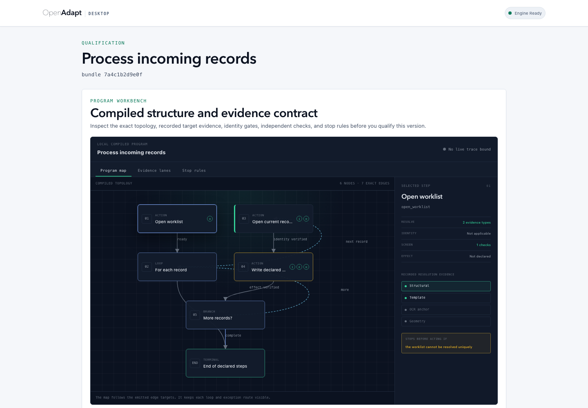
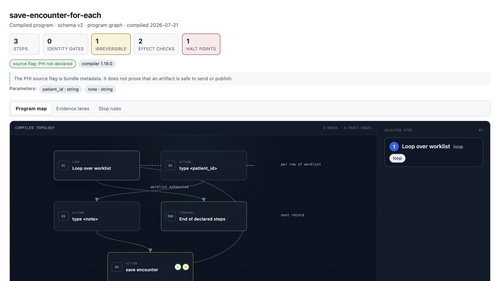

# Read a compiled program and its live evidence

A compiled bundle is a program, not a video. Before you approve it, inspect the
steps it can take, the evidence each action needs, and the paths that stop the
run. During a run, inspect a second object: the exact program occurrence and the
current evidence that the runtime bound to it.

<figure markdown="span">
  { width="1180" }
  <figcaption>The public synthetic console plays one retained event trace. The program stays fixed while the current observation, target resolution, identity check, action, screen check, and effect check advance.</figcaption>
</figure>

## Two timelines, four views

The workbench keeps two timelines separate.

1. The **program artifact** moves from recorded evidence to a compiled version.
   A repair creates a new candidate version. It doesn't change the version that
   is running.
2. **One live run** moves through current observation, target resolution,
   identity, action, and verification. Each event has an exact sequence number.

The four views answer different questions:

| View | Question | Source |
|---|---|---|
| Program map | What can this version do? | Compiled nodes and exact edges |
| Live relation | How does the current observation relate to the retained evidence? | One frame-bound runtime occurrence |
| Evidence lanes | Which target, identity, screen, and effect controls exist or passed? | Declared contract or exact run verdict |
| Repair | What would change in a new version? | A separate candidate and its review state |

Do not combine a declared control with a live verdict. A compiled node can say
that an identity gate is armed. Only a bound run event can say that the current
identity passed.

## Read the program map

The program map follows the emitted edge targets. It does not arrange the nodes
as if the bundle were a linear list. Branches, loop returns, exception paths,
and terminal states remain visible.

For each node, inspect these lanes:

- **Target evidence.** The retained structural locator, template, OCR anchor,
  relational landmarks, or geometry that the resolver may use.
- **Identity.** The pre-action identity contract and whether it is armed.
- **Screen check.** The postcondition that the runtime checks after the action.
- **Effect check.** The independent system-of-record check for a declared
  business effect.
- **Stop rules.** The conditions that make the runtime halt before or after a
  delivery boundary.

<figure markdown="span">
  { width="1180" }
  <figcaption>Cloud shows the shared graph projection. Select a node to inspect its declared resolution, identity, screen, and effect lanes.</figcaption>
</figure>

A terminal node named `End of declared steps` means that graph traversal ended.
It does not prove `VERIFIED`. The run outcome still depends on the exact
authorization, identity, postcondition, and effect evidence required by the
execution profile.

`--format mermaid` writes the same map as a flowchart you can paste into a
review note. This one is the public-safe projection of a bounded loop:



`n0` owns the loop. The edge from `n3` back to `n0` is the next item. The edge
from `n0` to `n4` is the exit. Open the HTML export to inspect each node's
resolution, identity, screen, and effect lanes.

## Parents of children stay parents

`visualize` on a compiled bundle emits that bundle's ProgramGraph: steps,
ladders, gates, halt points.

`visualize` on a compose directory (`composition.json`, schema
`openadapt.composition/v1`) draws each compiled child as one node. Handoff
edges are labeled with the effect-bound parameter names they copy, never a
window title or a URL. Sequence edges follow `--after`, or `--child` order.

`visualize` on a process-contract directory (`process-contract.json`, schema
`openadapt.process-contract/v0`) draws each independently admitted child
(name, `admission_id`) and the same kind of handoff edge.

This is the HTML `visualize` writes for a two-child compose directory. Each
child is one node. The handoff is the effect-bound parameter `patient_id`.
Intake's own steps stay inside `intake-bundle`.

<figure markdown="span">
  { width="1180" }
  <figcaption>A compose parent. Two child bundles, one handoff, one terminal. Representative synthetic composition from the visualize emission for <code>composition.json</code>.</figcaption>
</figure>



A process parent uses the same two children after each one is admitted. Each
node carries a short `admission_id` and digest. Handoff edges are dashed.

<figure markdown="span">
  { width="900" }
  <figcaption>A process parent of two admitted capabilities. Representative synthetic process contract. The <code>admission_id</code> and digest values are fixtures, not a live tenant.</figcaption>
</figure>



Both parents end at a terminal titled End of declared steps, not Success.
Traversal ended. The parent is `VERIFIED` only when every child's receipt says
so.

The parent view doesn't inline a child's steps. Open the child bundle for its
program map. See
[Sequence work across two applications](../guides/compose-multi-application.md)
and [Process contracts](process-contract.md).

## Follow one live occurrence

The same program node can run more than once inside a loop. A useful live view
must identify one occurrence. It should retain the graph id, state id, program
scope, incoming edge, and event sequence when the runtime provides them. The UI
must not identify an occurrence from a row number or animation time.

The current marker advances only when the runtime emits an event. Controlled
playback is useful for review, but it must replay the retained sequence. It must
not infer a missing phase.

The comparison view can show:

- the retained recorded frame and its asset reference;
- the exact current frame and decoded frame index;
- typed facts such as role, text, layout delta, candidate count, and identity;
- the resolver decision and the evidence rung that supported it;
- the exact target rectangle when the runtime bound it to the displayed frame;
- the post-action screen check and independent effect verdict.

If the runtime did not retain a frame binding, show the status without a target
rectangle. Do not carry a rectangle forward, interpolate it, or rebuild it from
a selector in the viewer.

## Show disagreement without hiding it

A single similarity score is not enough. It can hide a disagreement that
matters. Show the typed facts that drove the decision.

| Difference | Useful display | Safe runtime meaning |
|---|---|---|
| Layout moved | Recorded and current rectangles, plus the measured delta | The target can still resolve if retained evidence supports one current candidate |
| Text changed | Recorded text, current text, and match verdict | Continue only if the declared text rule passes |
| Role changed | Recorded and current structural role | Treat a required role mismatch as refuted evidence |
| Multiple candidates | Candidate count and ambiguity reason | Halt before action |
| Identity conflict | Bound identity signals and their verdicts | Halt before action |
| Fresh frame changed | Pre-action observation and revalidation verdict | Halt or reconcile according to the delivery state |
| Effect is uncertain | Independent effect evidence and transaction outcome | Return `RECONCILIATION_REQUIRED`; never retry blindly |

The viewer can use a neutral difference overlay for review. It cannot turn a
pixel difference into target resolution, identity proof, or effect proof.

## Keep repair separate from execution

A halted run can retain useful repair evidence. A repair view should show the
source version, the proposed locator or contract change, the changed nodes and
edges, the reason for the proposal, and the trials required before promotion.

The proposal is a new artifact. It does not edit the running version. Review,
qualification, and admission remain separate steps. If a repair candidate is
not bound to the exact halt evidence, the UI should not present it as the fix
for that run.

## Use the right projection

OpenAdapt uses the same graph contract across its surfaces, but each surface
has a different data boundary.

<figure markdown="span">
  { width="1180" }
  <figcaption>Desktop can show local operator detail. It says when no exact live trace is bound, so a static qualification contract cannot look like runtime evidence.</figcaption>
</figure>

| Surface | Projection | Intended use |
|---|---|---|
| Desktop | `operator-local` | Local qualification and private evidence review |
| Cloud | `remote-safe` | Tenant-bound topology and reviewed remote-safe labels |
| Website | `public-synthetic` | Interactive product explanation with synthetic evidence |
| Exported report | `sanitized-derivative` | Hash-bound review artifact with an explicit egress decision |

A projection removes fields from a view. It does not sanitize the source bundle.
Keep the original inside its trusted boundary.

## Render the graph offline

The CLI reads the bundle and writes HTML, Mermaid, or JSON from the same graph
specification. HTML is self-contained. It uses a deterministic edge layout and
does not load a graph library or a network asset.

```bash
openadapt flow visualize bundle -o graph.html
openadapt flow visualize bundle --profile remote-safe -o review.html
openadapt flow visualize bundle --profile public-synthetic -o public.html
openadapt flow visualize bundle --format mermaid
openadapt flow visualize bundle --format json
openadapt flow visualize composed -o composed.html
openadapt flow visualize composed --format mermaid
openadapt flow visualize process-parent -o process.html
openadapt flow visualize process-parent --format mermaid
```

<figure markdown="span">
  { width="1180" }
  <figcaption>The offline view keeps the topology and declared controls. A non-local profile removes recorded values, target text, selectors, URLs, guard text, and local provenance.</figcaption>
</figure>

`visualize` never runs the workflow. It reads the bundle and describes it with
no side effects. You can inspect a bundle that will later refuse certification.
The normal order is to visualize the program, lint its contract, qualify the
exact version, and then run it.

## Rendering choices

The current renderer uses semantic HTML for nodes, SVG for exact edges, and a
small deterministic layout function. The website uses controlled CSS motion for
its retained event playback. This keeps the offline export self-contained and
keeps every node available to a screen reader.

| Option | Strength | Cost or limit | Decision |
|---|---|---|---|
| HTML, SVG, and local layout | Small payload, offline output, accessible nodes, exact edge control | The layout code must handle each supported graph form | Use now |
| React Flow | Strong pan, zoom, selection, and future editing tools | Adds a client dependency and editor concepts that a read-only review does not need | Consider for a future repair editor |
| ELK or Dagre | Better automatic layout for large nested graphs | Adds bundle weight and can move nodes between releases when layout settings change | Add when real graphs exceed the local layout limits |
| Mermaid | Easy export into documents | Limited evidence inspector and live-state interaction | Keep as an export format |
| Canvas or WebGL | Handles very large graphs | Weaker native accessibility and more work for text selection and printing | Do not use for the normal review surface |
| A pixel-difference library | Useful local review overlay | A difference score is not resolution, identity, or effect evidence | Permit only as a local review aid |
| A motion library | Useful for complex transitions | More runtime code; animation time can be mistaken for event time | Use controlled CSS motion until a real need appears |

The layout switch point should come from measured graph size and interaction
latency. It should not come from the wish to make the graph look more animated.

## Visual review checklist

Before you approve a program or a run view, check these items:

- Every displayed connection comes from an emitted edge.
- Every live state comes from an exact runtime event.
- A loop occurrence has enough scope data to distinguish it from another pass.
- Recorded and current media have explicit asset and frame references.
- The target rectangle is bound to the displayed frame or is absent.
- A declared gate does not appear as a passed gate.
- A halted run shows whether delivery was attempted or remains unknown.
- A repair appears as a candidate version with a review path.
- A terminal graph state does not appear as a verified business outcome.
- A remote or public view contains only fields allowed by its projection.
