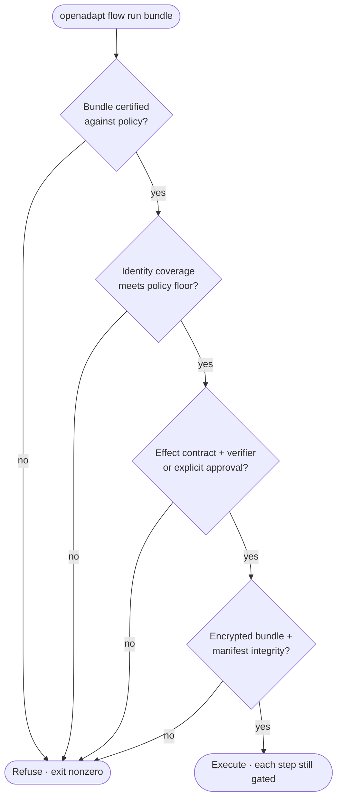

# Regulated execution: `run` vs `replay`

Iterating on a bundle at your desk and executing a consequential write in
production are different acts. **`replay`** is the local, $0,
developer-and-pilot path. **`run`** is the regulated path that refuses to
execute unless its admission-gate requirements are satisfied.

## What `replay` and `run` do

| | `replay` | `run` |
|---|---|---|
| **Purpose** | Develop, drift-test, pilot | Execute in a regulated / production deployment |
| **Missing safety preconditions** | Continues; it just replays | **Refuses to start** |
| **Model calls on healthy path** | 0 | 0 |

`replay` is what every guide uses: it runs the bundle locally, deterministically,
for free, and is where drift-testing and pilots happen. `run` adds a
**pre-flight gate** to the identical runtime (same ladder, identity gate, and
effect verification). *How* a step executes is unchanged; `run` just **refuses
to begin** if required coverage, encryption, or integrity evidence is missing.

!!! note "Governed admission is workflow-specific"
    The `run` verb and its admission-gate tests ship in the canonical engine.
    That makes configured controls mandatory by default; it does not make every
    backend or workflow production-ready. Use `run --dry-run` to inspect the
    gate report before execution, and review
    [Qualification evidence](../get-started/what-works-today.md).

## What `run` checks before it executes a step

`run` refuses to start unless **all** of the following hold. Each is an existing
safety mechanism; `run` makes them jointly mandatory, not individually
optional.

1. **Certification.** The bundle must pass [`certify`](policy-and-certify.md)
   against the deployment's policy (e.g. the shipped `clinical-write` policy: no
   unarmed clicks, identity required on every write and entity-navigation step,
   effect verification required on every write). An uncertified bundle never
   runs.
2. **Identity coverage.** The policy sets a floor on
   [identity](identity-gate.md)-armed coverage, and `run` refuses a bundle below
   it. Identity verification covers only armed steps: `run` will not execute a
   bundle whose consequential clicks are unarmed when the policy forbids it.
3. **Verified effects or explicit approval.** Every consequential write must
   declare a system-of-record effect, and the deployment must configure a
   matching verifier, unless an operator deliberately supplies the
   `--approve-unverified-writes` fallback. Approval is an explicit availability
   exception, not independent verification.
4. **Encrypted, integrity-sealed bundles.** By default the workflow must be
   AES-GCM encrypted and the manifest digest must re-verify. Optional
   `--pin-digest` and `--pin-version` values are enforced when supplied.

`--allow-unencrypted` disables the encryption gate, and unsealed template assets
are warnings unless `--strict-templates` is set. Those escape hatches exist for
development and migration; using them weakens the regulated posture and shows in
the gate report.

**If any precondition fails, `run` refuses; it doesn't degrade to best-effort
execution.**

## During the run

The pre-flight gate is the entry check. Each step still applies the same
controls:

- An unresolvable target [halts](identity-gate.md) instead of clicking by
  position.
- A [REFUTED or INDETERMINATE effect](effect-verification.md) halts instead of
  proceeding on a "Saved" banner.
- An ambiguous identity abstains up the ladder and halts if nothing verifies.
- A missing scrubbing capability, under `OPENADAPT_FLOW_SCRUB=on`, aborts
  instead of writing PHI/PII at all.

A halt is not a dead end. It feeds the [halt-learn loop](halt-learn-loop.md),
where an operator demonstrates the fix, a regression gate proves it weakens
nothing, and only a verified revision is promoted.

## What `run` still cannot know

`run` makes safety mechanisms mandatory; it doesn't make them omniscient. The
[LIMITS](https://github.com/OpenAdaptAI/openadapt-flow/blob/main/docs/LIMITS.md)
still apply:

- **Identity coverage is a floor.** `run` can require N of M clicks armed, but
  an armed step's guarantee is only as strong as the substrate allows: on
  pure-pixel Citrix a collapsible identifier halts instead of verifying.
- **On-screen read-back is not independent verification.** On a no-API desktop
  where the only oracle is the screen, effect "verification" reads the same
  surface the action wrote to: **same-surface** confirmation, not an independent
  system-of-record check. A REST/FHIR/document-hash verifier reads the *record*;
  a screen read-back reads the *pixels*.
- **Encryption is opt-in at authoring time.** `openadapt flow seal SOURCE --out
  DESTINATION` seals workflow JSON and template crops, but normal compilation
  writes plaintext. `run` refuses plaintext by default; keep full-disk
  encryption as defense in depth and use `--strict-templates` to refuse any
  unsealed image asset.
- **A green certification is scoped to what the policy asserts.** `certify`
  enforces the policy you wrote; a gap the policy does not name is not caught by
  `run`.

A deployment that has not closed these gaps cannot start a regulated run.
