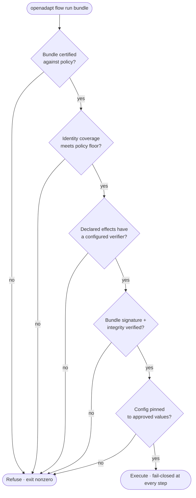

<!--
TARGET-STATE SPEC — HELD, NOT YET SHIPPED.
`run` as a distinct fail-closed verb is designed, not shipped. Today the engine
exposes `replay` (local, $0, dev/pilot). This page describes the `run` gate as it
will work once it lands. Do not publish until true.
-->

# Fail-closed regulated execution: `run` vs `replay`

Not every execution should be held to the same bar. Iterating on a bundle at your
desk and executing a consequential clinical write in production are different
acts, and OpenAdapt draws a hard line between them: **`replay`** is the local,
$0, developer-and-pilot path, and **`run`** is the fail-closed regulated path
that refuses to execute unless every safety precondition is provably satisfied.

## Two verbs, two postures

| | `replay` | `run` |
|---|---|---|
| **Purpose** | Develop, drift-test, pilot | Execute in a regulated / production deployment |
| **Posture** | Permissive | **Fail-closed** |
| **Model calls on healthy path** | 0 | 0 |
| **Refuses on missing safety preconditions** | No — it just replays | **Yes — refuses to start** |

`replay` is what every guide uses. It runs the bundle locally, deterministically,
for free, and it is where drift-testing and pilots happen. `run` layers a
**pre-flight gate** on top of the identical runtime: same ladder, same identity
gate, same effect verification. Nothing about *how* a step executes changes —
what changes is that `run` **refuses to begin** if the deployment is not provably
safe.

!!! note "Status: `run` is target-state"
    Today the engine exposes `replay`. The fail-closed `run` gate described here
    is designed and in flight, not yet a shipped verb. Everything it composes —
    [`certify`](policy-and-certify.md), the [identity gate](identity-gate.md),
    [effect verification](effect-verification.md), bundle signing, config
    pinning — either exists or is in flight; `run` is the verb that composes them
    into a single fail-closed entry point.

## What `run` checks before it executes a step

`run` refuses to start unless **all** of the following hold. Each is an existing
safety mechanism; `run` is the gate that makes them jointly mandatory rather than
individually optional.

1. **Certification.** The bundle must pass [`certify`](policy-and-certify.md)
   against the deployment's policy (e.g. the shipped `clinical-write` policy: no
   unarmed clicks, identity required on every write and entity-navigation step,
   effect verification required on every write). An uncertified bundle never
   runs.
2. **Identity coverage.** The policy sets a floor on
   [identity](identity-gate.md)-armed coverage, and `run` refuses a bundle that
   falls below it. This directly confronts the honest limit that **identity
   verification covers only armed steps** — `run` will not execute a bundle whose
   consequential clicks are unarmed when the policy forbids it.
3. **Verified effects.** Every step that declares an [effect](effect-verification.md)
   must have a verifier configured. A step declaring effects with no verifier is
   a configuration error and halts — `run` promotes that from a runtime halt to a
   pre-flight refusal.
4. **Encrypted, signed bundles.** The bundle's integrity and signature are
   verified before execution, and its at-rest form is encrypted. `run` refuses an
   unsigned or tampered bundle.
5. **Pinned config.** Model tiers, verifier endpoints, egress allow-list, and
   policy are pinned to approved values. `run` refuses to execute against
   unpinned or drifted configuration, so a production run cannot silently pick up
   a different verifier or a looser allow-list.

**If any precondition fails, `run` refuses — it does not degrade to a
best-effort execution.** Refusing is the cheap direction to be wrong.

## Fail-closed at every step, not just at the door

The pre-flight gate is the entry check; the same posture governs every step of
the run:

- An unresolvable target [halts](identity-gate.md) rather than clicking by
  position.
- A [REFUTED or INDETERMINATE effect](effect-verification.md) halts rather than
  proceeding on a "Saved" banner.
- An ambiguous identity abstains up the ladder and halts if nothing verifies.
- A missing scrubbing capability, under `OPENADAPT_FLOW_SCRUB=on`, aborts rather
  than writing PHI at all.

A halt is not a dead end — it feeds the [halt-learn loop](halt-learn-loop.md),
where an operator demonstrates the fix, a regression gate proves it weakens
nothing, and only a verified revision is promoted.

## Honest limits `run` does not repeal

`run` makes safety mechanisms mandatory; it does not make them omniscient. The
[LIMITS](https://github.com/OpenAdaptAI/openadapt-flow/blob/main/docs/LIMITS.md)
still apply, and `run` is honest about them rather than papering over them:

- **Identity coverage is a floor, not omniscience.** `run` can require that N of
  M clicks are armed, but an armed step's guarantee is still only as strong as
  the substrate allows — on pure-pixel Citrix a collapsible identifier halts
  rather than verifies.
- **On-screen read-back is not independent verification.** For a no-API desktop
  where the only oracle is the screen, effect "verification" reads the same
  surface the action wrote to — it is honestly labeled **same-surface**
  confirmation, not an independent system-of-record check. A REST/FHIR/document-hash
  verifier reads the *record*; a screen read-back reads the *pixels*. `run` does
  not pretend the latter is the former.
- **Template crops are not yet AEAD-sealed.** Bundle signing covers integrity;
  per-crop authenticated encryption of template assets is future work, disclosed.
- **A green certification is scoped to what the policy asserts.** `certify`
  enforces the policy you wrote; a gap the policy does not name is not caught by
  `run`.

The value of `run` is not that it removes these limits. It is that it turns them
into **enforced preconditions**: a deployment that has not closed them cannot
start a regulated run.
