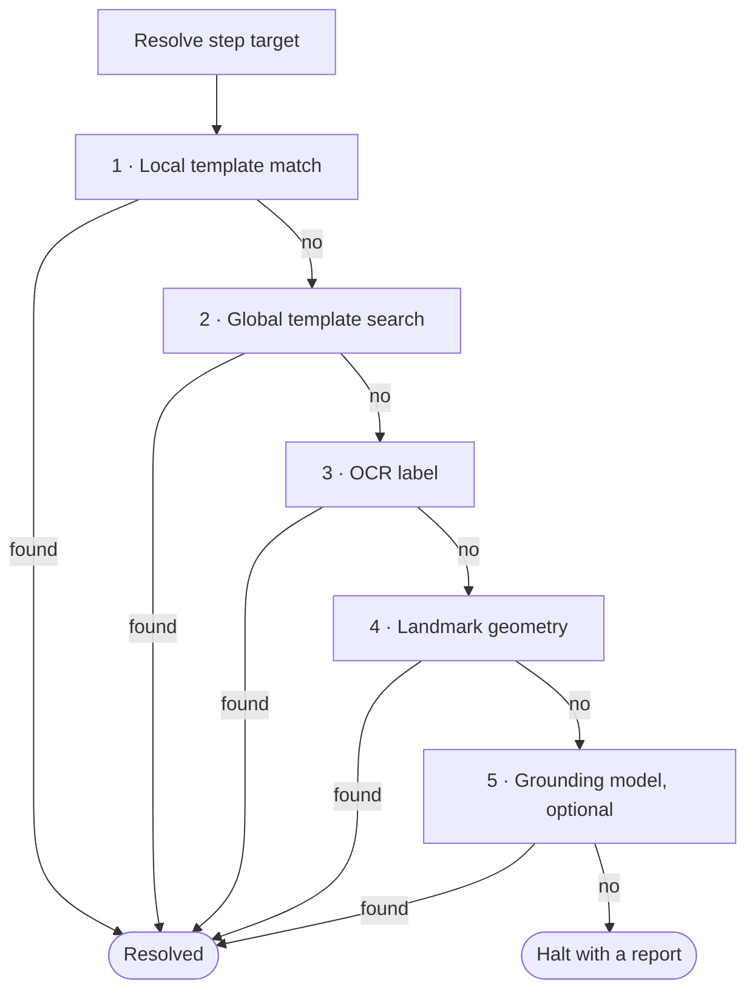

# Governed self-healing

UIs drift. Themes change, buttons move, labels get renamed. Self-healing is how
a compiled workflow survives that drift without a model in the loop, and
**governed** self-healing means every repair is evidence in a report or an
explicitly saved, reviewable candidate bundle, not an opaque adaptation.

## Four different outcomes

"Self-healing" is not one unlimited mechanism. The current product distinguishes
four outcomes:

| Outcome | Trigger | Model use | Promotion behavior |
|---|---|---|---|
| **Deterministic re-resolution** | A template moved or changed but OCR, geometry, or structure still identifies it. | None. | The run records the rung and heal. Save a candidate with `--save-healed-to`; the base bundle is not silently promoted. |
| **Model-assisted proposal** | Deterministic rungs fail and an operator explicitly enables a grounding appliance. | Yes, counted in the report. | The proposal still faces identity and postcondition gates. It may halt and never bypasses policy. |
| **Human teaching** | A run halts and an operator demonstrates a correction. | None for the reference inducer. | `teach` promotes only after regression and canary gates; today it covers the optional-dialog correction class, not arbitrary drift. |
| **Unsupported drift** | Evidence is insufficient, scale/reflow invalidates anchors, or verification fails. | None unless configured. | Halt with a report. No candidate is promoted. |

## The resolution ladder

Each compiled step carries several kinds of evidence about its target. At replay
the resolver tries them in order and stops at the first that resolves:



A **healthy** script never leaves the first rung. Every step resolves by local
template match in milliseconds, with no model calls and no per-run cost. The
lower rungs exist for the runs where something changed.

## What heals, and what does not

Self-healing covers the drift that a lower rung can still resolve:

- **Palette and theme changes**: a template match at a lower threshold or an
  OCR read still finds the target.
- **Moved controls**: global template search relocates the target.
- **Renamed labels**: landmark geometry finds it by its stable neighbours.

It does **not** cover changes that invalidate the evidence itself:

- **Scale or reflow** (browser zoom, display scale factor, a font-size bump)
  aborts at the first step. A purely cosmetic 125% zoom currently means 0%
  replayability.
- **Instance-specific state** (a different tenant's module menu or dashboard
  content) halts. Per-tenant re-recording is the working assumption.

When the screen stops matching expectations entirely, the run **halts with a
report** naming the violated postcondition, rather than guessing. Steps marked
irreversible will not act on a low-confidence match at all.

## Repairs are diffs you can review

When a lower rung resolves a step under drift, the run can write a separate
candidate bundle as a **reviewable diff**. A theme-drift run that heals eight
anchors produces a candidate you can inspect and replay clean, not a black-box
adaptation you have to trust. Without `--save-healed-to`, the base bundle is not
mutated. Promotion remains an operator/deployment decision.

```bash
openadapt flow replay bundle --drift theme --save-healed-to bundle-healed
```

## Zero model calls on the healthy path

The deterministic rungs (template, OCR, geometry) make no model calls. The
grounding rung is optional and only engages when the deterministic rungs cannot
resolve the target and a grounder is configured. Every model call that does
happen is recorded and counted in the run report, so the $0-per-run property is
observable, not assumed. See [The on-prem VLM appliance](vlm-appliance.md) for
the optional grounding and state-verification tiers.

The model tier can be wrong. A proposed target still faces the deterministic
identity gate, and the optional state verifier can false-rescue an ambiguous
in-progress screen. Model assistance trades availability against measured risk;
it is not a general adaptation guarantee.

## Healing versus verification

Self-healing recovers a target whose **appearance** drifted. It deliberately
does **not** try to rescue a step whose **effect** is wrong: a duplicate write
or a partial save shows unchanged pixels, so there is nothing to heal. That is
the job of [effect verification](effect-verification.md), and clicking the wrong
record is the job of [the identity gate](identity-gate.md). The three are
separate on purpose.
