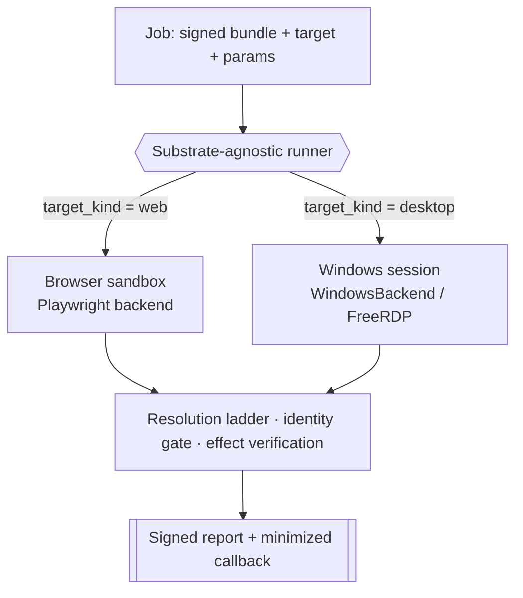

# The substrate model: one runner, many surfaces

Work lives on different surfaces. A referral moves through a browser app; a
clinical chart lives in a native Windows EMR; a legacy line-of-business tool is
reachable only as pixels over Citrix. OpenAdapt compiles and replays the same
[workflow program](workflow-ir.md) on all three, because the runtime sits behind
one small [backend protocol](backends.md) and one **substrate-agnostic runner**.

The runner does not know which surface it is driving. It routes on a single
field, `workflow.target_kind`. Everything above it is identical across surfaces:
the resolution ladder, the [identity gate](identity-gate.md),
[effect verification](effect-verification.md), and the
[halt-learn loop](halt-learn-loop.md).

## Two axes, one contract

Two orthogonal questions about any run, kept separate:

- **Substrate**: *what surface is being driven?* Web (browser) or
  Windows-desktop / Citrix-RDP.
- **Deployment**: *where does the run execute and who owns the data?* See
  [the deployment matrix](deployment-matrix.md).

A single runner contract spans both. It speaks the same `enqueue` /
`run-callback` shapes regardless of substrate or deployment: a job is a signed
bundle to fetch, a signed report to write back, a target, an allowed-host list,
parameters, and a secrets reference. The control plane routes; it never sees
pixels or resolved field values.

## The web substrate

A headless Chromium driven by Playwright exposes a full DOM, so the ladder's
structural rung re-finds a recorded target as an *element* and the identity gate
compares **structured text** where `0` and `O` are distinct characters. The
whole record → compile → replay loop runs in CI with no OS permissions. See
[Backends](backends.md#web-playwright).

## The Windows-desktop / Citrix substrate: the wedge

The differentiated work has no web UI and no usable API: a native Windows EMR, a
WinForms line-of-business app, a clinical tool published through Citrix. This is
where a computer-use agent is otherwise the only option and where a wrong write
is expensive.

Two backends cover it behind the same protocol:

- **`WindowsBackend`** drives a native Windows desktop through an in-session
  agent. Its shipped typed RPC exposes bounded screenshot, input, and UIA
  operations while the legacy arbitrary-execution route stays disabled by
  default. It reads the **UI Automation** tree for identity. Crucially, most
  native controls expose `Name` / `Value` text **even without a stable
  `AutomationId`**, so structured identity is viable on desktop, not just the
  browser.
- **`FreeRDPBackend`** drives a legacy app over RDP as **pure pixels**: no
  accessibility tree, no DOM, no structured layer. This is the floor the
  vision-first runtime was built for, the lowest-fidelity surface a Citrix/VDI
  deployment may expose.

!!! info "Citrix / RDP is pixel-first: the identity gate adapts to it"
    On a pure-pixel substrate the ladder runs on its visual floor and the
    identity gate uses its pixel/OCR tiers. When an identifier is genuinely
    ambiguous at that fidelity (a same-name/same-DOB record whose MRN differs by
    a single `O`/`0` glyph), the gate
    **[halts rather than guesses](identity-gate.md)** by design. That is the same
    never-click-the-wrong-record guarantee every substrate enforces. Each surface
    verifies with the highest-fidelity signal it exposes, and structured layers
    (a browser DOM, Windows UIA) resolve that class outright. Per-substrate
    behavior is detailed in
    [LIMITS](https://github.com/OpenAdaptAI/openadapt-flow/blob/main/docs/LIMITS.md).

## Where the desktop substrate runs today

Today the desktop and Citrix substrates run **inside the customer boundary**:
self-hosted or on-prem on a machine the customer controls (see
[Deploy on-prem](../guides/deploy-on-prem.md)), and, as that lane opens,
control-plane-managed in the customer's own cloud (BYOC). The public managed
subscription runs the browser substrate only. The desktop mechanism, backends,
and safety gates are the same wherever they run; what differs is who owns the
machine and the data.

OpenAdapt also runs the desktop substrate in its own infrastructure as an
**internal, licensing-gated lane** rather than a public offer. There the Windows
surface is a **QEMU/KVM guest on a Linux host**, streamed for
monitoring/recording over **RDP through Apache Guacamole**. RDP is Windows-native,
so nothing streaming-related runs inside the guest and the VM stays clean for
snapshot-revert between runs. The deterministic replay path itself drives the
guest through the in-session agent contract, not the stream.

Desktop execution is provisioned per qualified workflow, so Windows licensing,
warm-state policy, isolation, recovery, and cost are explicit deployment inputs
rather than hidden properties of the runner. The same job and report contract
drives a customer-owned Windows session unchanged. Multi-tenant hosting of the
desktop substrate in OpenAdapt's cloud is deferred; it is not part of any public
offer.

## Qualification record

- The **web substrate** (Playwright) is the substrate used by the public managed
  subscription.
- Windows UIA is qualified for the counted
  `20260717-candidate-56759c8-v2` exact in-tree WinForms matrix:
  3/3 completed trials, 3/3 independent SQLite effects, 3/3 stale-target
  refusals, 3/3 ambiguity refusals, 0 silent incorrect successes, 0 over-halts,
  and 0 model calls. Earlier rejected diagnostic matrices remain in the report
  and are not counted acceptance trials.
- Native macOS is qualified for one-host TextEdit evidence: 3/3 exact-byte effects
  and a two-window ambiguity refusal, with 0 silent incorrect successes and 0
  over-halts. The original batch remains failed due to cleanup-warning
  classification; a hash-bound adjudication verified actual cleanup and accepts
  those effects/refusal.
- RDP is qualified for candidate `82a658a` on one Parallels Windows 11
  VM at 1280x800 with Aardwolf 0.2.14: 3/3 Windows Run-dialog unique-file
  trials, exact independent guest-tools readback, latencies of 51.845s, 10.467s,
  and 7.477s, 0 failures, 0 silent incorrect successes, 0 over-halts, and 0 model
  calls.
  Exact snapshot cleanup passed. Review the
  [immutable sanitized report](https://github.com/OpenAdaptAI/openadapt-flow/blob/6610d24cebba27918b8ea507b2f05a094057ac85/benchmark/rdp/results_82a658a_20260718.sanitized.json).
- Citrix/VDI is driven pixel-first through the same identity gate and effect
  verification as every substrate. No real ICA/HDX environment has been qualified
  yet (status: Exploratory); each workflow must be qualified in its real ICA/HDX
  environment before consequential use.
- The public hosted subscription currently entitles approved browser workflows.
  Desktop and virtual-desktop deployments are scoped and qualified separately.

These results qualify the substrate mechanisms for their named tasks. The
[complete evidence appendix](../get-started/what-works-today.md) carries exact
commits, environments, oracles, refusal checks, and failure taxonomies. Backend
expansion does not require a different bundle or safety model: the same ladder
and gates apply while each workflow is qualified in its real environment.
