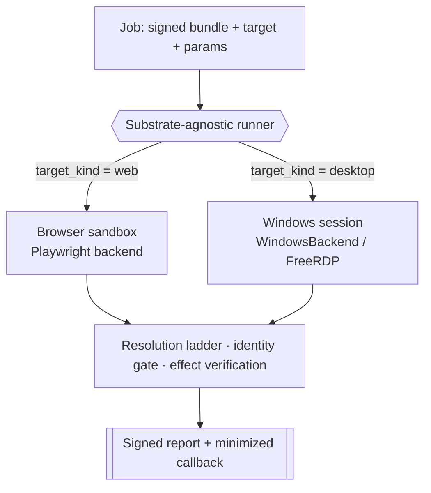

<!--
TARGET-STATE SPEC — HELD, NOT YET SHIPPED.
This page describes the substrate model as it will work once the in-flight
Windows-in-QEMU substrate and the substrate-agnostic runner are wired to the
control plane. Today only the pieces described in "What is real today" below
have a live caller. Do not publish until true.
-->

# The substrate model: one runner, many surfaces

!!! warning "Target-state routing model"
    The shared backend protocol and individual adapters exist, but the single
    control-plane runner described here is not fully wired. Playwright is the
    reference path, Windows is experimental, and RDP/Citrix are research
    spikes. See [What works today](../get-started/what-works-today.md).

Work lives on different surfaces. A referral moves through a browser app; a
clinical chart lives in a native Windows EMR; a legacy line-of-business tool is
reachable only as pixels over Citrix. OpenAdapt compiles and replays the same
[workflow program](workflow-ir.md) on all three, because the runtime sits behind
one small [backend protocol](backends.md) and one **substrate-agnostic runner**.

The runner does not know or care which surface it is driving. It routes on a
single field — `workflow.target_kind` — and everything above it (the resolution
ladder, the [identity gate](identity-gate.md), [effect verification](effect-verification.md),
the [halt-learn loop](halt-learn-loop.md)) is identical across surfaces.

## Two axes, one contract

There are two orthogonal questions about any run, and the runner keeps them
separate:

- **Substrate** — *what surface is being driven?* Web (browser) or
  Windows-desktop / Citrix-RDP.
- **Deployment** — *where does the run execute and who owns the data?* See
  [the deployment matrix](deployment-matrix.md).

A single runner contract spans both. It speaks the same `enqueue` /
`run-callback` shapes regardless of substrate or deployment: a job is a signed
bundle to fetch, a signed report to write back, a target, an allowed-host list,
parameters, and a secrets reference. The control plane routes; it never sees
pixels or resolved field values.

## The web substrate

The browser is the reference and most mature surface. A headless Chromium driven
by Playwright exposes a full DOM, so the ladder's structural rung re-finds a
recorded target as an *element* and the identity gate compares **structured
text** where `0` and `O` are distinct characters. The whole record → compile →
replay loop runs in CI with no OS permissions. See [Backends](backends.md#web-playwright-reference).

## The Windows-desktop / Citrix substrate — the wedge

The differentiated work has no web UI and no usable API: a native Windows EMR, a
WinForms line-of-business app, a clinical tool published through Citrix. This is
where a computer-use agent is otherwise the only option and where a wrong write
is expensive.

Two backends cover it behind the same protocol:

- **`WindowsBackend`** drives a native Windows desktop through an in-session
  agent (`/screenshot`, `/execute_windows`, `/health`). It reads the **UI
  Automation** tree for identity — and crucially, most native controls expose
  `Name` / `Value` text **even without a stable `AutomationId`**, so structured
  identity is viable on desktop, not just the browser.
- **`FreeRDPBackend`** drives a legacy app over RDP as **pure pixels** — no
  accessibility tree, no DOM, no structured layer of any kind. This is the floor
  the vision-first runtime was built for, and it represents the lowest-fidelity
  surface a Citrix/VDI deployment may expose.

!!! warning "Citrix / RDP is pixel-only — and that has consequences"
    On a pure-pixel substrate the ladder runs on its visual floor and the
    identity gate falls back to its pixel/OCR tiers. A collapsible identifier — a
    same-name/same-DOB record whose MRN differs by a single `O`/`0` glyph — is
    **not safely verifiable there and forces a [halt](identity-gate.md)**, by
    design. Structured desktop text (UIA) closes that class at no availability
    cost; pure Citrix pixels do not. This is the honest cost of the wedge, not a
    bug. Full detail in
    [LIMITS](https://github.com/OpenAdaptAI/openadapt-flow/blob/main/docs/LIMITS.md).

## How the desktop substrate is hosted

When the desktop runner executes in our infrastructure (rather than inside a
customer's perimeter), the Windows surface is a **QEMU/KVM guest on a Linux
host**, provisioned by the existing `oa-vm` tooling and streamed for
monitoring/recording over **RDP through Apache Guacamole**. RDP is Windows-native,
so nothing streaming-related runs inside the guest and the VM stays clean for
snapshot-revert between runs. The deterministic replay path itself drives the
guest through the in-session agent contract, not the stream.

!!! note "Honest blockers on the hosted desktop substrate"
    Real Windows carries real costs the browser runner does not:

    - **Windows licensing** (BYOL / possibly SPLA) is the gating issue for a
      hosted multi-tenant desktop lane, and needs legal sign-off before GA.
    - **No true scale-to-zero with warm state** — a paused VM still pays for its
      disk; only delete-and-recreate reaches $0 idle, at a cold-start cost.
    - **Per-run cost is ~2–5× the browser runner** and cold start is ~30–60 s.
      That is the acceptable price of driving surfaces the browser cannot touch.

    Until the desktop runner is wired to the control plane, the hosted-desktop
    lane is designed, not shipped. See [the deployment matrix](deployment-matrix.md).

## What is real today

- The **web substrate** (Playwright) is the reference backend, heavily tested,
  and the one every guide uses.
- The **`WindowsBackend`** and **`FreeRDPBackend`** are real and exercised in CI
  against mocked servers; the desktop path has a live end-to-end existence proof
  on a WinForms app in a Windows-11-ARM VM, at small N (see
  [Backends](backends.md#desktop-windows-uia)). It is not yet a big-N study.
- The substrate-agnostic runner routes `web` to the browser launch-candidate path.
  Desktop routing is experimental and remains outside the candidate browser subscription
  evidence boundary.

The point of the model is that backend expansion does not require a different
bundle or safety model: the same ladder and gates apply, while each substrate
must earn its own maturity evidence.
