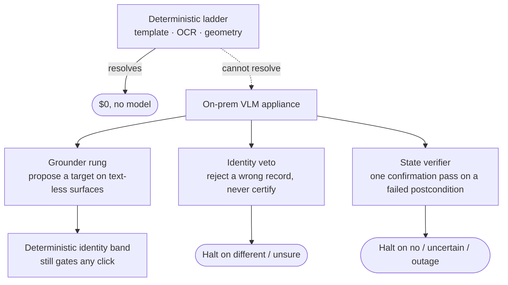

# The on-prem VLM appliance

Everything on the healthy replay path is deterministic and model-free. When the
deterministic rungs cannot resolve a target, an **optional, on-prem VLM
appliance** provides grounding, identity veto, and state verification. It is off
by default; when on, the model and the data stay in the building.

## Off by default, local when on

Enable the appliance by pointing the runtime at a local URL
(`OPENADAPT_FLOW_VLM_URL`). Unset, no model tiers exist and the ladder has no
grounder rung. Configured, three fail-safe tiers come online, each biased toward
halting instead of mis-acting:

- **Grounder**: proposes a target on surfaces with no text anchor. It still
  faces the deterministic identity band before any click, so a bad proposal
  fails safe.
- **Identity veto**: the veto tier of [the identity gate](identity-gate.md). It
  can reject a wrong record but never certify a right one; a "same" answer
  abstains.
- **State verifier**: one confirmation pass on a postcondition that
  deterministically failed, the same heal-under-drift the ladder does for click
  targets.

Every appliance path is fail-safe to halt: an outage or unsure answer keeps the
halt, never a mis-click. Every rescue is recorded in the run report and counted
as a model call, so the appliance never silently breaks the $0 story.

## What the measurements showed

The appliance was measured end-to-end against a real served local model. The
state verifier correctly refused 7 of 8 should-halt screens and false-rescued 1
of 8 (an in-progress "Saving..." screen read as saved), which is why the rescue
is opt-in and audited. Two more caveats: the served 4-bit model needs full
frames downscaled before it reads them, and the grounder does **not** yet
resolve dense lists reliably at this model scale (it fails safe, but is not yet
dependable for list-dense UIs). A stronger grounding model is the open item.

The state verifier does **not** address the transactional write class: that
screen already showed success, so a screen-reading model would too. That is the
job of [effect verification](effect-verification.md), which reads the system of
record instead of the screen.

## Why on-prem matters

Identity crops and full frames can carry PHI/PII. The control is not redaction (the
identity check needs the literal identifier), it is deployment. The appliance is
designed to run on your infrastructure with no external model calls or payload
persistence. Enforce and test its network and retention policy for the actual
deployment; architecture alone does not prove either property. See
[Deploy on-prem](../guides/deploy-on-prem.md).
