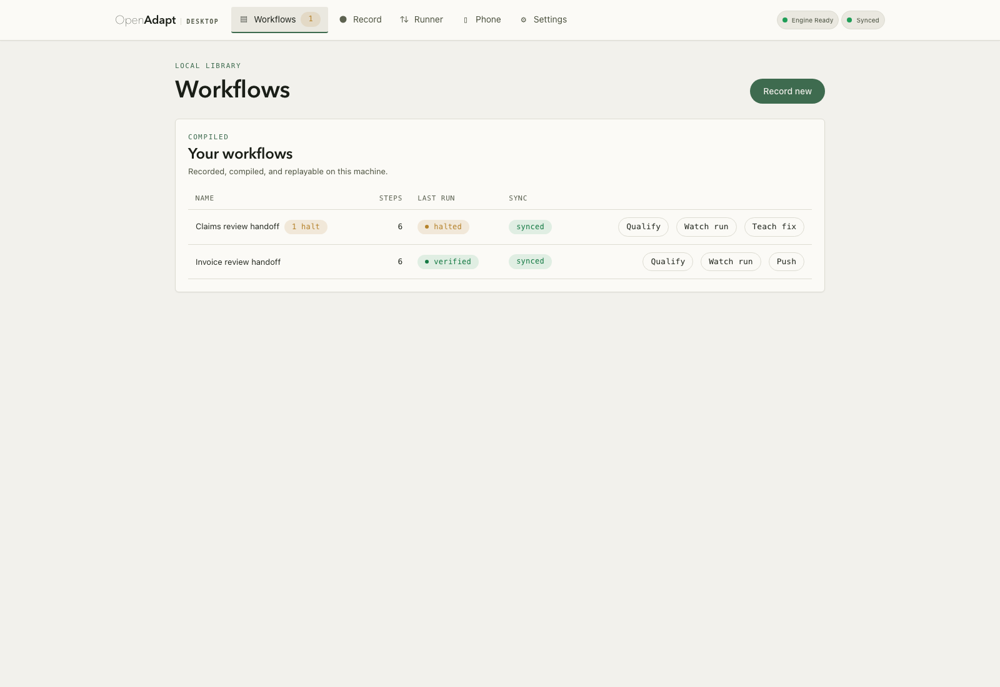
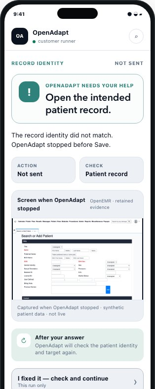
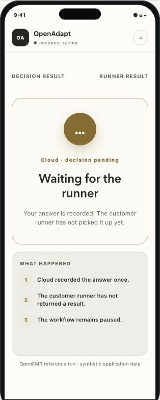
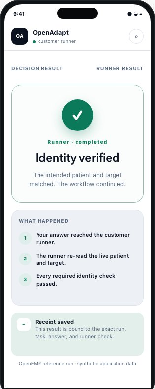

# Desktop app: install and first run

The app is the local cockpit for the record →
compile → replay → teach loop: record on your own machine, compile into a
deterministic bundle with [`openadapt flow`](../reference/cli.md), then replay,
review, and teach corrections, all locally. Nothing leaves your machine unless
you explicitly push it to a [cloud workspace](connect-to-cloud.md).

!!! note "Prefer the command line?"
    The desktop app and the [`openadapt flow` CLI](../reference/cli.md) drive the
    same engine; the app is a graphical front end over the same compiler and
    governed runtime. To stay in a terminal, start with the
    [five-minute tour](../get-started/index.md) and skip this page.

## 1. Download and install

Get the installer from
[openadapt.ai/download](https://openadapt.ai/download). The page detects your OS
and architecture and offers the right build. Release `desktop-v0.15.0` ships
the complete Windows, macOS, and Linux installer set with
`SHA256SUMS`, a CycloneDX SBOM, per-platform metadata, and build-provenance
attestations.

| OS | Installer |
|---|---|
| Windows | `.msi` or `.exe` |
| macOS (Apple Silicon / Intel) | `.dmg` |
| Linux | `.AppImage` or `.deb` |

The desktop app and `openadapt flow` use the same released engine. Browser
workflows can use the managed OpenAdapt Cloud runner; native desktop, RDP, and
Citrix workflows execute locally or in a self-hosted/customer-controlled runtime
and can connect to Cloud for signed task delivery and governed reports. Cloud
does not execute those local, native, RDP, or Citrix workflows: the configured
runner executes them inside its own boundary.

!!! note "Verify the release if your OS asks"
    Check the release `SHA256SUMS` and provenance before you override a first
    launch warning. Windows/Linux installers are unsigned and macOS installers
    are ad-hoc signed. For platform-specific steps, see
    [troubleshooting](../guides/troubleshooting.md).

## 2. Grant OS permissions

!!! danger "This is the #1 silent-failure mode"
    Until you grant the permissions below, screen capture returns a **blank or
    black frame** and input may go nowhere: the app looks like it is recording
    but captures nothing. The OS shows no error dialog; recordings just come out
    empty. Grant these **before** your first recording.

=== "macOS"

    OpenAdapt needs two permissions to record: **Screen Recording** (to capture
    the screen) and **Accessibility** (to observe and replay mouse and keyboard
    input).

    1. Open **System Settings** (on macOS 12 Monterey and earlier this is
       **System Preferences → Security & Privacy → Privacy**).
    2. Go to **Privacy & Security → Screen Recording**. Toggle **OpenAdapt on**.
    3. Go to **Privacy & Security → Accessibility**. Toggle **OpenAdapt on**.
    4. **Quit and reopen OpenAdapt.** macOS applies a newly granted Screen
       Recording permission only after the app restarts. This is a macOS
       requirement, not an app bug.

    If OpenAdapt is not listed, click **+**, then add it from `/Applications`.
    If a recording still comes out blank, confirm **both** toggles are on and
    that you restarted the app after granting Screen Recording.

=== "Windows"

    On Windows, capture and UI Automation work out of the box for ordinary
    windows; no permission prompt is needed for a first recording.

    The one exception is **elevated (administrator) windows**. Windows blocks a
    normally-privileged app from seeing or driving a window running
    **as administrator** (UAC elevation). If the target app runs elevated, run
    **OpenAdapt as administrator too** (right-click → *Run as administrator*) so
    both processes share an integrity level. Otherwise capture of that window
    comes back blank and input is ignored.

    For remote-session substrates (Citrix / RDP), see the
    [troubleshooting guide](../guides/troubleshooting.md#session-0) for the
    session-0 / interactive-session caveat.

## 3. Verify with a test recording

Record a few seconds of any app, then stop (the same capture is available from
[`openadapt flow record`](../reference/cli.md#record) on the CLI). If the frames
show your screen (not a blank or black image), permissions are correct and you
are ready to record a real workflow.

- **Blank / black frames on macOS** → Screen Recording is not granted, or you
  did not restart the app after granting it. Redo step 3.
- **Clicks not captured on macOS** → Accessibility is not granted.
- **One specific window is blank on Windows** → that window is elevated; see the
  UAC note in step 3.

The [troubleshooting guide](../guides/troubleshooting.md) covers these and other
first-week failures.

<figure markdown="span">
  { width="900" }
  <figcaption>The workflow library shows two local workflows, their step counts, last-run and sync labels, and available action buttons.</figcaption>
</figure>

## During a governed run

Desktop 0.15.0 can show a separate always-on-top status surface without adding
anything to the target application. While OpenAdapt is observing or executing,
the surface is non-focusable, ignores pointer input, exposes no controls, and is
excluded from capture before it becomes visible. Controls become interactive
only after the run reaches a safe paused or terminal state. The overlay reports
runtime state; OpenAdapt never uses it as resolution or verification evidence.

For published footage, OpenAdapt post-composes the status surface onto a
derivative as **Guided view**; **Raw footage** shows the immutable media. Guided
target tracking appears only when the media digest, exact decoded frame,
viewport mapping, and runtime-bound rectangle agree. The compact status capsule
uses a bottom corner that does not cover the target or another protected region,
and disappears if neither corner is safe. These presentation elements are not
verification evidence and do not weaken the pointer, focus, or capture-exclusion
boundary. [Watch the public demo](https://app.openadapt.ai/demo#footage) or
review the exact released
[control-overlay contract](https://github.com/OpenAdaptAI/openadapt-desktop/blob/desktop-v0.15.0/docs/CONTROL_OVERLAY.md).

## Answer a pause from a phone

Desktop can connect the customer runner to the hosted decision queue. It can
also serve the same closed-schema decision contract through a customer-hosted
portal. The hosted queue omits screenshots and protected fields. The
runner-local portal can show the retained evidence while it stays inside the
customer boundary. In both lanes, the phone returns one signed answer from the
actions that the exact pause permits. The customer runner then checks the live
application again before it continues.

The three images below show the runner-local, full-evidence portal with
synthetic OpenEMR data. They do not show the hosted no-image lane.

<figure markdown="span">
  { width="314" }
  <figcaption>Request: one question, the retained screen, and the permitted actions.</figcaption>
</figure>

<figure markdown="span">
  { width="314" }
  <figcaption>Answer accepted: the phone saved the signed answer. This is not a successful result. The customer runner must retrieve it and check the live application.</figcaption>
</figure>

<figure markdown="span">
  { width="314" }
  <figcaption>Runner result: the live checks passed and the runner saved a bound receipt.</figcaption>
</figure>

The hosted path uses outbound HTTPS and needs no inbound port. The self-hosted
path stays loopback-only until the customer publishes it through trusted HTTPS
or a VPN and explicitly enables that ingress. See
[Attended decisions and the halt-learn loop](../concepts/halt-learn-loop.md)
for the six request types, action effects, pairing sequence, authentication,
expiry, and fresh-state checks.

## Where to go next

-   [__Connect to a cloud workspace__](connect-to-cloud.md)

    Sign in, mint an ingest token, and push a recording to your dashboard.

-   [__Record your own app__](../guides/record-your-app.md)

    The full record → compile → replay loop on your own application.

-   [__Troubleshooting__](../guides/troubleshooting.md)

    Blank capture, over-halting, a stuck offline queue, and the session-0 case.

