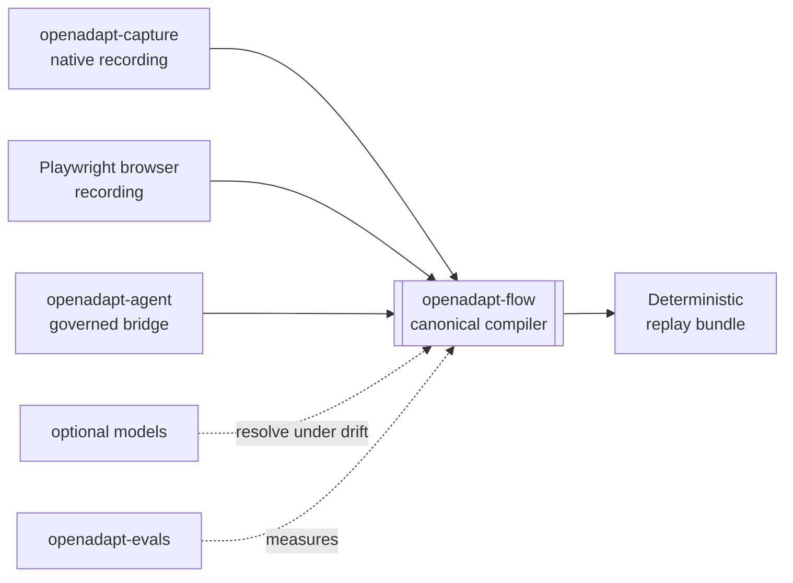

# Product components and release admission

OpenAdapt is one product. Install `openadapt` and use `openadapt flow …`. The
public repositories below supply the product's launcher, compiler, recorder,
desktop cockpit, agent bridge, and trust surfaces.

The Production path starts with one exact Flow release admission. Once Flow
clears that gate, the next exact target enters qualification. Teams can prepare
one workflow in parallel.

A release appears as **Production** only while the current canonical record
contains a live, non-revoked admission for that exact release. The browser
checks the record hash and each live artifact authority. It does not use an
older admission when the newest one expires, is revoked, or loses an artifact.

Product release admission and workflow qualification are separate contracts.
Workflow qualification binds one exact bundle to the application and
environment where it will run, including its identity, effect, and policy
contracts.

[Follow the Production admission sequence](../reference/production-lifecycle.md)
or [prepare one workflow](../guides/qualify-a-workflow.md).

## Product components

| Component | Production sequence | Public role |
|---|---|---|
| [OpenAdapt](https://github.com/OpenAdaptAI/OpenAdapt) | After Flow: admit the exact launcher release. | Installer, meta-package, and unified `openadapt flow` command. |
| [OpenAdapt Flow](https://github.com/OpenAdaptAI/openadapt-flow) | Now: complete the exact Flow Production admission. | Canonical demonstration compiler and governed runtime for Browser, native Windows, native macOS, native Linux, RDP, and Citrix/VDI. |
| [OpenAdapt Cloud](https://app.openadapt.ai/) | After Flow: admit the exact Cloud deployment. | Managed control plane for organizations, exact-hash admission, browser runners, reports, billing, and usage. |
| [OpenAdapt Desktop](https://github.com/OpenAdaptAI/openadapt-desktop) | After Flow: admit the exact Desktop release. | Windows, macOS, and Linux cockpit for recording, compilation, qualification, replay, and local review. |
| [OpenAdapt Agent](https://github.com/OpenAdaptAI/openadapt-agent) | After Flow: admit the exact Agent release. | Governed bridge from MCP clients and Agent Skills to exact Flow bundles. |
| [OpenAdapt Capture](https://github.com/OpenAdaptAI/openadapt-capture) | After Flow: admit the exact Capture release. | Canonical native recorder for screen, mouse, keyboard, timing, window scope, and media. Windows UIA evidence is emitted with the captured action. The shared observer protocol defines the macOS Accessibility and Linux AT-SPI integration boundary. RDP and Citrix remain pixel-observed at the remote boundary. |
| OpenAdapt documentation | After Flow: admit the exact docs deployment. | Version-bound product, operation, security, and qualification documentation at this site. |

Browser recording stays in Flow because DOM identity, field geometry,
source-time secret masking, and Playwright execution use one browser session
contract. Flow can launch Chromium or attach to one selected local tab. The
Chrome extension code in the Capture repository does not define a second
compiler or direct replay path. An extension acquisition path must satisfy the
same authenticated event, evidence, masking, and frame-binding contract before
Flow accepts its recording.

## Trust and interoperability libraries

| Repository | Lifecycle | Public role |
|---|---|---|
| [openadapt-privacy](https://github.com/OpenAdaptAI/openadapt-privacy) | **Experimental** | Optional PII/PHI sanitization for configured persistence, logs, and artifact egress. |
| [openadapt-types](https://github.com/OpenAdaptAI/openadapt-types) | **Experimental** | Shared interoperability schemas for contributors and integrators. |

## Evaluation and model development

| Repository | Lifecycle | Public role |
|---|---|---|
| [openadapt-ml](https://github.com/OpenAdaptAI/openadapt-ml) | **Research** | Optional model-training research. Recording, compiling, and replaying a workflow does not use it. |
| [openadapt-evals](https://github.com/OpenAdaptAI/openadapt-evals) | **Research** | GUI workflow evaluation research. The compiler path does not depend on it. |
| [openadapt-grounding](https://github.com/OpenAdaptAI/openadapt-grounding) | **Research** | UI grounding mechanisms and model adapters. |
| [openadapt-retrieval](https://github.com/OpenAdaptAI/openadapt-retrieval) | **Research** | Demonstration retrieval mechanisms. |

## How the pieces fit

See [Qualification evidence](../get-started/what-works-today.md) for bounded
feature and backend results. Evidence for one task and environment does not
extend to another workflow.
