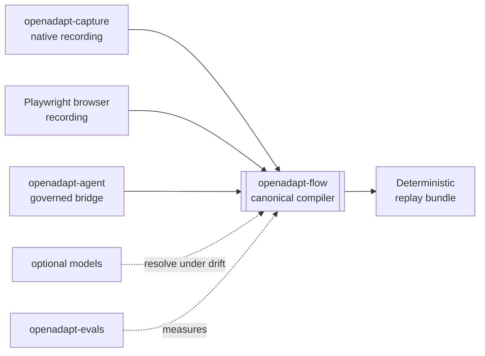

# Product components and release admission

OpenAdapt is one product. Install `openadapt` and use `openadapt flow …`. The
public repositories below supply the product's launcher, compiler, recorder,
desktop cockpit, agent bridge, and trust surfaces.

Each release has its own evidence state. The state cells below state the
Production requirement. In the browser, a cell changes to **Production** only
when the current canonical admission record contains a live, non-revoked
admission for that exact release. The browser validates the live record against
the hash in this documentation deployment. It does not use an older admission
when the newest admission expires or is revoked. The site-wide product label
also checks current PyPI metadata for
`openadapt`, `openadapt-flow`, `openadapt-capture`, `openadapt-desktop`, and
`openadapt-agent`. Each default version must equal its active admitted release,
and that version must retain unyanked wheel and source artifacts.

[Read the Production admission contract](../reference/production-lifecycle.md)

## Product components

| Component | Current release admission | Public role |
|---|---|---|
| [OpenAdapt](https://github.com/OpenAdaptAI/OpenAdapt) | Production requires an active signed admission for this exact release or deployment. | Installer, meta-package, and unified `openadapt flow` command. |
| [OpenAdapt Flow](https://github.com/OpenAdaptAI/openadapt-flow) | Production requires an active signed admission for this exact release or deployment. | Canonical demonstration compiler and governed runtime for Browser, native Windows, native macOS, native Linux, RDP, and Citrix/VDI. |
| [OpenAdapt Cloud](https://app.openadapt.ai/) | Production requires an active signed admission for this exact release or deployment. | Managed control plane for organizations, exact-hash admission, browser runners, reports, billing, and usage. |
| [OpenAdapt Desktop](https://github.com/OpenAdaptAI/openadapt-desktop) | Production requires an active signed admission for this exact release or deployment. | Windows, macOS, and Linux cockpit for recording, compilation, qualification, replay, and local review. |
| [OpenAdapt Agent](https://github.com/OpenAdaptAI/openadapt-agent) | Production requires an active signed admission for this exact release or deployment. | Governed bridge from MCP clients and Agent Skills to exact Flow bundles. |
| [OpenAdapt Capture](https://github.com/OpenAdaptAI/openadapt-capture) | Production requires an active signed admission for this exact release or deployment. | Canonical native recorder for screen, mouse, keyboard, timing, window scope, and media. Windows UIA evidence is emitted with the captured action. The shared observer protocol defines the macOS Accessibility and Linux AT-SPI integration boundary. RDP and Citrix remain pixel-observed at the remote boundary. |
| OpenAdapt documentation | Production requires an active signed admission for this exact release or deployment. | Version-bound product, operation, security, and qualification documentation at this site. |

Browser recording stays in Flow because DOM identity, field geometry,
source-time secret masking, and Playwright execution use one browser session
contract. Flow can launch Chromium or attach to one selected local tab. The
Chrome extension code in the Capture repository does not define a second
compiler or direct replay path. An extension acquisition path must satisfy the
same authenticated event, evidence, masking, and frame-binding contract before
Flow accepts its recording.

## Trust and interoperability libraries

| Repository | Public role |
|---|---|
| [openadapt-privacy](https://github.com/OpenAdaptAI/openadapt-privacy) | Optional PII/PHI sanitization for configured persistence, logs, and artifact egress. |
| [openadapt-types](https://github.com/OpenAdaptAI/openadapt-types) | Shared interoperability schemas for contributors and integrators. |

## Evaluation and model development

| Repository | Public role |
|---|---|
| [openadapt-ml](https://github.com/OpenAdaptAI/openadapt-ml) | Optional VLM training, inference, and demonstration-conditioning work. The healthy compiler path does not require it. |
| [openadapt-evals](https://github.com/OpenAdaptAI/openadapt-evals) | GUI workflow and demonstration-conditioning evaluation infrastructure. |
| [openadapt-grounding](https://github.com/OpenAdaptAI/openadapt-grounding) | UI grounding mechanisms and model adapters. |
| [openadapt-retrieval](https://github.com/OpenAdaptAI/openadapt-retrieval) | Demonstration retrieval mechanisms. |

## How the pieces fit

See [Qualification evidence](../get-started/what-works-today.md) for bounded
feature and backend results. Evidence for one task and environment does not
extend to another workflow.
