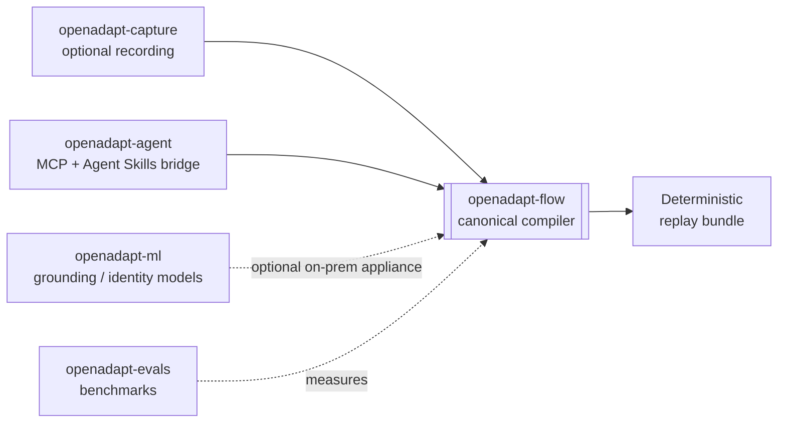

# Package and repository lifecycle

OpenAdapt the product (the [demonstration compiler](../concepts/demonstration-compiler.md))
is what most people need. Underneath it sits a set of open-source libraries and
infrastructure the compiler and its research build on. This section is for
contributors and integrators who use those pieces directly.

!!! note "Product first"
    If you want to compile and run a workflow, start with
    [Get started](../get-started/index.md). The libraries below are the building
    blocks behind OpenAdapt, not the way most users interact with it. Each links
    to its source repository, where its own README is the source of truth.

The end-user identity is deliberately singular: install `openadapt` and run
`openadapt flow …`. The `openadapt-flow` repository is where contributors
inspect and change the engine. See [Versions and compatibility](../reference/compatibility.md)
for the tested package ranges.

## Lifecycle labels

These labels describe the public role of a repository, not the quality of every
module inside it:

- **Beta**: an active product or component on the supported product path.
- **Experimental**: an active integration whose contract is still being proven.
- **Research**: evidence or model work, not required by deterministic replay.
- **Deprecated**: retained for history or migration; no new integrations.

## Product and optional components

| Repository | Lifecycle | Public role |
|---|---|---|
| [OpenAdapt](https://github.com/OpenAdaptAI/OpenAdapt) | **Beta** | Installer/meta-package and unified `openadapt flow` dispatcher. |
| [openadapt-flow](https://github.com/OpenAdaptAI/openadapt-flow) | **Beta** | Canonical compiler and governed runtime. Drives web, native Windows, native macOS, native Linux, RDP, and Citrix/VDI as first-class substrates behind one backend protocol. |
| [OpenAdapt Cloud](https://app.openadapt.ai/) | **Beta** | Proprietary live control plane for the managed subscription: organizations, exact-hash admission, runner orchestration, reports, billing, and usage. |
| [openadapt-desktop](https://github.com/OpenAdaptAI/openadapt-desktop) | **Beta** | Public `desktop-v0.15.0` provides Windows MSI/NSIS, macOS arm64/x64 DMG, and Linux AppImage/DEB installers. Every installer path is installed, launched, and uninstalled in the native release workflow; the release includes exact checksums, a CycloneDX SBOM, platform metadata, and build-provenance attestations. |
| [openadapt-agent](https://github.com/OpenAdaptAI/openadapt-agent) | **Experimental** | Active v2 bridge that exposes governed Flow bundles to MCP clients and Agent Skills. The pre-v2 model-driven execution wrapper is the deprecated line; the repository itself is active. |
| [openadapt-capture](https://github.com/OpenAdaptAI/openadapt-capture) | **Beta** | Canonical native screen, mouse, keyboard, timing, and window-scoped recorder behind Flow's Windows, macOS, Linux, RDP, and Citrix recording paths. Capture 1.1 retains Windows UIA evidence at action time; remote sessions remain externally black-box. Browser recording remains inside Flow's Playwright listener. |
| [openadapt-privacy](https://github.com/OpenAdaptAI/openadapt-privacy) | **Experimental** | Optional PII/PHI scrubbing used on configured persist, log, and upload paths. |
| [openadapt-types](https://github.com/OpenAdaptAI/openadapt-types) | **Experimental** | Shared interoperability schemas; contributor-facing, not an end-user product. |

## Research components

| Repository | Lifecycle | Public role |
|---|---|---|
| [openadapt-ml](https://github.com/OpenAdaptAI/openadapt-ml) | **Research** | VLM training, inference, and demonstration-conditioning work. Not required by the healthy compiler path. |
| [openadapt-evals](https://github.com/OpenAdaptAI/openadapt-evals) | **Research** | GUI-agent and demonstration-conditioning evaluation infrastructure. |
| [openadapt-grounding](https://github.com/OpenAdaptAI/openadapt-grounding) | **Research** | UI grounding experiments and model adapters. |
| [openadapt-retrieval](https://github.com/OpenAdaptAI/openadapt-retrieval) | **Research** | Demonstration retrieval experiments. |

## How the pieces fit

The compiler is the product. Capture feeds it native and remote demonstrations, the ML layer
can supply optional on-prem models, Agent gives MCP clients and Agent Skills a
governed route into Flow bundles, and evals measures adjacent research. This page
intentionally does not expose internal developer tools as product components.
See [Qualification evidence](../get-started/what-works-today.md) for integrated
feature and backend coverage.
