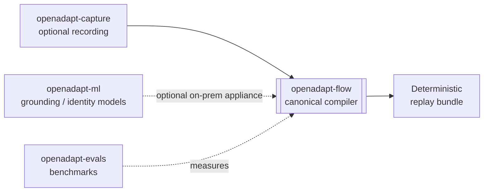

# Package and repository lifecycle

OpenAdapt the product (the [demonstration compiler](../concepts/demonstration-compiler.md))
is what most people need. Underneath it sits a set of open-source libraries and
infrastructure that the compiler and its research build on. This section is for
contributors and integrators who want to use those pieces directly.

!!! note "Product first"
    If you want to compile and run a workflow, start with
    [Get started](../get-started/index.md). The libraries below are the building
    blocks behind OpenAdapt, not the way most users interact with it. Each links
    to its source repository, where its own README is the source of truth.

## Lifecycle labels

These labels describe the public role of a repository, not the quality of every
module inside it:

- **Beta**: current product surface; validate per workflow.
- **Experimental**: implemented but not a supported production contract.
- **Research**: evidence or model work, not required by deterministic replay.
- **Deprecated**: retained for history or migration; no new integrations.

## Product and optional components

| Repository | Lifecycle | Public role |
|---|---|---|
| [OpenAdapt](https://github.com/OpenAdaptAI/OpenAdapt) | **Beta** | Installer/meta-package and unified `openadapt flow` dispatcher. |
| [openadapt-flow](https://github.com/OpenAdaptAI/openadapt-flow) | **Beta** | Canonical compiler and governed runtime. Browser is the reference path; other backends have separate maturity labels. |
| [openadapt-cloud](https://github.com/OpenAdaptAI/openadapt-cloud) | **Beta launch candidate** | Control plane for managed execution of locally authored, attested browser bundles, with account, billing, structural reports, and validated replacement activation. Production provider qualification remains pending. |
| [openadapt-desktop](https://github.com/OpenAdaptAI/openadapt-desktop) | **Experimental** | Intended desktop authoring and teaching companion; the integrated installer lifecycle is not yet proven. |
| [openadapt-capture](https://github.com/OpenAdaptAI/openadapt-capture) | **Experimental / pre-alpha** | Optional cross-platform recording library. Its standalone package still documents the earlier data-collection topology. |
| [openadapt-privacy](https://github.com/OpenAdaptAI/openadapt-privacy) | **Experimental** | Optional PII/PHI scrubbing used on configured persist, log, and upload paths. |
| [openadapt-types](https://github.com/OpenAdaptAI/openadapt-types) | **Experimental** | Shared interoperability schemas; contributor-facing, not an end-user product. |

## Research components

| Repository | Lifecycle | Public role |
|---|---|---|
| [openadapt-ml](https://github.com/OpenAdaptAI/openadapt-ml) | **Research** | VLM training, inference, and demonstration-conditioning work. Not required by the healthy compiler path. |
| [openadapt-evals](https://github.com/OpenAdaptAI/openadapt-evals) | **Research** | GUI-agent and demonstration-conditioning evaluation infrastructure. |
| [openadapt-grounding](https://github.com/OpenAdaptAI/openadapt-grounding) | **Research** | UI grounding experiments and model adapters. |
| [openadapt-retrieval](https://github.com/OpenAdaptAI/openadapt-retrieval) | **Research** | Demonstration retrieval experiments. |

## Deprecated

| Repository | Lifecycle | Public role |
|---|---|---|
| [openadapt-agent](https://github.com/OpenAdaptAI/openadapt-agent) | **Deprecated** | Superseded execution direction being folded into `openadapt-flow`; do not build new integrations on it. |

## How the pieces fit

The compiler is the product. Capture can feed it demonstrations, the ML layer
can supply optional on-prem models, and evals measures adjacent research. This
page intentionally does not expose internal developer tools as product
components. See [What works today](../get-started/what-works-today.md) for
integrated feature and backend maturity.
