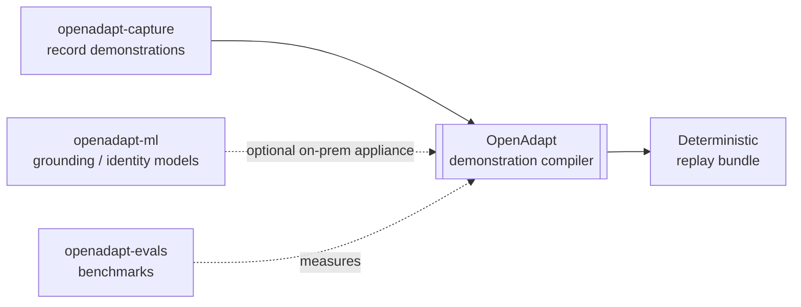

# Ecosystem

OpenAdapt the product (the [demonstration compiler](../concepts/demonstration-compiler.md))
is what most people need. Underneath it sits a set of open-source libraries and
infrastructure that the compiler and its research build on. This section is for
contributors and integrators who want to use those pieces directly.

!!! note "Product first"
    If you want to compile and run a workflow, start with
    [Get started](../get-started/index.md). The packages below are the building
    blocks behind OpenAdapt, not the way most users interact with it. Several
    pages here are synced from each library's README.

## The libraries and infra behind OpenAdapt

### Recording and data

| Package | What it is |
|---|---|
| [openadapt-capture](../packages/openadapt-capture.md) | Cross-platform desktop recording: time-aligned screenshots, mouse, keyboard, and audio, with privacy scrubbing. The demonstration capture layer. |
| [openadapt-desktop](../packages/openadapt-desktop.md) | A desktop app and CLI for continuous recording with a review-and-egress gate, so raw recordings stay local until explicitly approved. |

### Models and evaluation

| Package | What it is |
|---|---|
| [openadapt-ml](../packages/openadapt-ml.md) | The VLM layer: trajectory schemas, model adapters, supervised fine-tuning, grounding, and a runtime policy API. The research substrate for grounding and identity models. |
| [openadapt-evals](../packages/openadapt-evals.md) | Evaluation infrastructure for GUI-agent benchmarks (for example Windows Agent Arena), with cloud VM orchestration and a results viewer. |
| [openadapt (meta)](../packages/openadapt.md) | The meta-package and unified CLI that ties the ecosystem together. |

### Supporting tools

| Package | What it is |
|---|---|
| [openadapt-consilium](../packages/openadapt-consilium.md) | Multi-LLM council for consensus answers: query several models, have them review each other, synthesize with a chairman. |
| [openadapt-wright](../packages/openadapt-wright.md) | Dev automation: turn a task description into a tested pull request, with human-in-the-loop approval. |
| [openadapt-herald](../packages/openadapt-herald.md) | Social announcements generated from git history. |
| [openadapt-crier](../packages/openadapt-crier.md) | Event-driven approval bot that drafts and gates social posts via Telegram. |

## How the pieces fit

The compiler is the product. Capture feeds it demonstrations, the ML layer
supplies the optional on-prem grounding and identity models, and evals measures
it. The rest are independent tools the team uses to build and ship.
