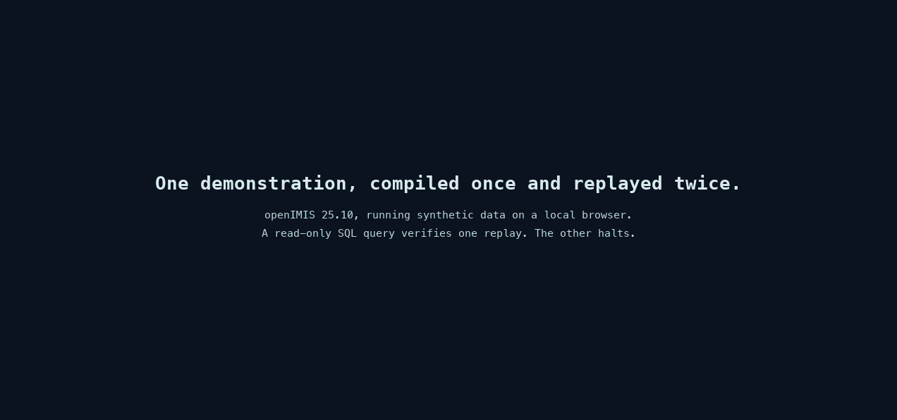

# Your first workflow

Choose one small real task that doesn't change business data. A read-only lookup
against test data works well. Open a known test record, then stop when a field
shows the expected value. Don't start with a task that saves, submits, creates,
or deletes data.

For a visual first workflow, we recommend
[OpenAdapt Desktop](../desktop/install.md). It uses the same compiler and
runtime as the commands on this page. Its install guide lists the current
release-admission, signing, checksum, and permission details. Follow the CLI
path below if you prefer a terminal.

This walkthrough uses a Playwright-driven browser. The same record, compile,
lint, and supervised replay loop works with native Windows, macOS, or Linux
applications and RDP or Citrix sessions when you choose a different
[backend](../reference/cli.md#backend).



## Install OpenAdapt

This browser walkthrough runs on each desktop platform in the tabs below. It
has no OS-specific steps. Its matching Chromium provisions automatically on the
first web action. Native, RDP, and Citrix paths don't install it.

**Recommended: install with pip in a virtual environment.** The base package
includes the browser driver used by this walkthrough. The engine requires
Python 3.10–3.12; check yours with `python --version` or
`python3 --version`.

Use the tab for your shell:

=== "macOS / Linux (bash, zsh)"

    ```bash
    python3 -m venv .venv && source .venv/bin/activate
    python -m pip install --upgrade openadapt
    ```

    A virtual environment keeps the install isolated and avoids stale-package
    problems from a shared or Conda base environment.

=== "Windows PowerShell"

    ```powershell
    py -m venv .venv; .\.venv\Scripts\Activate.ps1
    python -m pip install --upgrade openadapt
    ```

=== "Windows cmd.exe"

    ```bat
    py -m venv .venv && .venv\Scripts\activate.bat
    python -m pip install --upgrade openadapt
    ```

=== "Linux native desktop (AT-SPI)"

    The browser walkthrough on this page needs no extra system packages. To
    later record or replay **native Linux applications** (`--backend linux`),
    install the AT-SPI runtime and build prerequisites first (Debian/Ubuntu):

    ```bash
    sudo apt-get install \
      gcc pkg-config python3-dev libcairo2-dev libgirepository-2.0-dev \
      gir1.2-atspi-2.0 libatspi2.0-0
    pip install 'openadapt[capture,linux]'
    ```

    The built-in driver uses X11; Wayland requires an operator-approved XDG
    portal session.

For an isolated command-line installation, run
`curl -fsSL https://openadapt.ai/install.sh | sh`. It installs the same base
package with [uv](https://docs.astral.sh/uv/).

### Optional installation check

Run `openadapt quickstart` if you want to check the installation before you
touch your own application. It records, compiles, certifies, and verifies a
bundled synthetic workflow. A healthy run ends in `VERIFIED`. That result
applies only to the bundled task, application, and local system of record. It
doesn't qualify your workflow.

## 1. Record a read-only task

Before recording, confirm that the application contains test data and that the
task needs no write. If the task unexpectedly requires a write, stop and choose
a different first workflow.

`record --backend web --url` opens a headed browser and watches your clicks,
typing, key presses, and scrolling. It writes the recording format that
`compile` consumes.

```bash
openadapt flow record --backend web --url https://your.app --out rec
```

(Omitting `--backend` defaults to `web` with a printed notice. Production
profiles require it explicitly.)

Perform the task once with a known test record. When the expected result is
visible, press ++ctrl+c++ or close the browser window. OpenAdapt writes the
recording to `rec/`.

!!! tip "Keep the demonstration clean"
    Take one direct path and leave out exploratory clicks. The compiler treats
    the recording as evidence of intent.

## 2. Compile

```bash
openadapt flow compile rec --out bundle --name my-task
```

Compilation turns the recording into a **workflow bundle**. Each step carries
evidence that OpenAdapt can use to find the target again, such as a DOM
identity, template crop, OCR label, or geometry landmark. See the
[capability ladder](../reference/glossary.md#capability-ladder). The compiler
also derives screen postconditions from the recorded change.

OpenAdapt classifies write-shaped clicks such as save, submit, create, and
delete as irreversible. Treat that classification as a stop signal. Review the
bundle before any replay.

## 3. Lint and review

```bash
openadapt flow lint bundle --strict
```

`lint` reports missing evidence, weak risk classification, unexpected writes,
and steps that don't assert a result. It doesn't authorize replay.

!!! danger "Stop before replay when a safety contract is missing"
    Do not replay if lint or your review finds any of these conditions:

    - an action writes data or its risk is unknown;
    - an action is consequential or irreversible;
    - an identity, effect, or policy contract is missing; or
    - the recording contains an unexpected application, page, or data source.

    Move the bundle to [workflow qualification](../guides/qualify-a-workflow.md).
    Set the action risks, add the required contracts, run the qualification
    cases, and certify the exact version. Then run lint again.

Continue only after strict lint and your manual review are clean. The recorded
task must remain read-only and non-consequential.

## 4. Replay under supervision

Keep the browser in view for the entire run. Use the same test environment and
stay ready to stop if OpenAdapt opens the wrong record, leaves the expected
path, changes test data, or reaches a screen that wasn't in the demonstration.

```bash
openadapt flow replay bundle \
  --url https://your.app \
  --headed \
  --run-dir runs/first-workflow
```

Confirm that the expected value appears on screen. Don't use this first replay
for a real write. A completed replay is evidence for this supervised run; it
doesn't certify the workflow or make it safe for unattended use.

## 5. Inspect the report

Open `runs/first-workflow/REPORT.md`. The machine-readable report is beside it
at `runs/first-workflow/report.json`.

Check that the report shows:

- only the expected test application and data;
- no write or consequential action;
- the visible result you checked during replay; and
- the target evidence, postconditions, halt, or heal for every step.

If the report disagrees with what you saw, stop. Keep the report and recording,
then fix or re-record the workflow before another replay. See
[Read and audit run reports](../guides/run-reports.md) for the evidence fields
and [Run outcomes and halt reasons](../reference/run-outcomes.md) for every
terminal outcome.

## Before you automate a write

[Qualify the workflow](../guides/qualify-a-workflow.md) before a real write or
any unattended run. Bind the exact application and environment, review every
action risk, add identity and independent effect contracts, exercise the
required success and fault cases, and certify the exact workflow version under
its policy. Use the governed `run` path only after those checks pass.

## What is next

- Build the full qualification project: [Qualify a workflow](../guides/qualify-a-workflow.md)
- Enforce a workload policy: [Write and enforce a policy](../guides/policy-and-certification.md)
- Audit the evidence from a run: [Read and audit run reports](../guides/run-reports.md)
- Add governed inputs: [Parameters and secrets](../guides/parameters-and-secrets.md)
