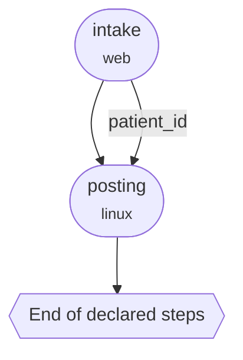

# Get started

Start with one complete local result. You do not need to understand the package
layout first. The tutorial records a demonstration, compiles it into a program,
runs the program, and verifies the saved result.

<figure markdown="span">
  { width="900" }
  <figcaption>A reference run against openIMIS 25.10 on synthetic data. It shows one
  recorded eligibility check, then the compiled program replaying that check
  twice. A read-only SQL query verifies the first replay and contradicts the
  second, so the second one halts. The tutorial below runs the same loop against
  a browser page.</figcaption>
</figure>

See it working before you install anything:

- **[Hosted demo](https://app.openadapt.ai/demo)**: recorded demonstrations,
  verified replays, and fail-safe halts on real footage.
- **[Template gallery](https://openadapt.ai/templates)**: ready-to-adapt
  workflow templates.
- **[Blog](https://blog.openadapt.ai)**: guides, updates, and automation
  recipes.

## First success: install, then run

You need no account, target application, API key, or operating-system
automation permission.

**Recommended: install with pip.** Use an active Python 3.10–3.12 virtual
environment when your system manages Python packages. The base package includes
the browser driver used by the tutorial:

```bash
python -m pip install --upgrade openadapt
openadapt quickstart
```

**Isolated CLI alternative.** The public installer creates and maintains an
isolated environment with [uv](https://docs.astral.sh/uv/):

```bash
curl -fsSL https://openadapt.ai/install.sh | sh
```

Both paths install the same `openadapt` command. You need no package extra for
the browser tutorial.

`openadapt quickstart` records the bundled synthetic MockMed task, compiles its
observed [effect contract](../reference/glossary.md#effect-contract), certifies
it with the shipped clinical-write [policy](../reference/glossary.md#policy),
and runs it under the Standard [profile](../reference/glossary.md#profile). A
separate read-only API confirms the saved record outside the screen that
performed the write. The healthy run returns
[`VERIFIED`](../reference/run-outcomes.md) with no model or Cloud call. Artifacts
go to `openadapt-quickstart/`. OpenAdapt refuses to overwrite that directory.

You now have:

- `openadapt-quickstart/recording/`: the demonstration and retained target
  evidence
- `openadapt-quickstart/bundle/`: the inspectable compiled workflow
- `openadapt-quickstart/run/REPORT.md`: the ordered actions, evidence, outcome,
  and any halt reason
- `openadapt-quickstart/run/receipt.json`: a local, privacy-safe summary of the
  synthetic verified run

Open the report, then inspect the program and its deployment gaps:

```bash
less openadapt-quickstart/run/REPORT.md
openadapt flow visualize openadapt-quickstart/bundle --out graph.html
openadapt flow lint openadapt-quickstart/bundle
```

Open `graph.html` in a browser. That page is the compiled program: the steps
it can take, the evidence each one needs, and the paths that stop the run.
See [Read a compiled program](../concepts/program-visualizer.md).

The tutorial receipt is local and unsigned. Anyone who has to believe the run
needs a Seal. On a qualified synthetic bundle with a tier-2 oracle, the
intended command is:

```bash
openadapt-flow replay bundle --seal
```

A sealed verified run prints `VERIFIED`, a seal id, and a public verify URL:

```text
VERIFIED
seal_id  receipt_12345678
verify   https://openadapt.ai/seals/receipt_12345678
```

`--seal` on replay issues that proof. `openadapt flow seal` encrypts a bundle
for deployment. Public `/seals/` pages list synthetic fixtures. They do not
list healthcare production. Oracle tiers 0 (visual) and 1 (second-session UI)
never mint a production Seal. See [The Seal](../commercial/seal.md).

When you move from the tutorial to your own work, qualification tests the
workflow against real failures in its environment before it runs.

After the first run, choose the path that matches your goal:

| Goal | Next guide |
|---|---|
| Record one real, read-only browser workflow | [Your first workflow](first-workflow.md) |
| See what the compiled program looks like | [Read a compiled program](../concepts/program-visualizer.md) |
| Issue a Seal on a synthetic run | [The Seal](../commercial/seal.md) |
| Use the Desktop application | [Install Desktop](../desktop/install.md) |
| Use native desktop, RDP, or Citrix | [Install a different execution surface](#install-a-different-execution-surface) |
| Prepare a qualified production run | [Move from demo to deployment](#move-from-demo-to-deployment) |

!!! important "A tutorial result is not production certification"
    The bundled fixture proves that the local product path and its Standard
    verification gates work. It certifies only this bundled synthetic task,
    application, and local system of record. A customer workflow must bind its
    own application, execution surface, action risks, identity checks,
    independent effect verifier, fault cases, and deployment policy.

## See a fail-safe halt

Use the compiled tutorial bundle in an ordinary Demo-profile replay. This path
has no independent verifier, so OpenAdapt must not reuse the Standard
`VERIFIED` result:

```bash
openadapt flow replay openadapt-quickstart/bundle \
  --drift modal \
  --run-dir openadapt-quickstart-halt
```

!!! note "Why this command exits 1"
    The command expects a [halt](../reference/glossary.md#halt), so it exits
    `1`. The compiled program has no approved branch for the changed screen
    state and refuses to act. If you see `Replay HALTED`, open
    `openadapt-quickstart-halt/REPORT.md` to see the retained evidence. Do not
    retry a possibly dispatched write; reconcile it against an independent
    system of record first. Every outcome is defined in
    [Run outcomes and halt reasons](../reference/run-outcomes.md).

## Install a different execution surface

The base package includes the browser driver. Its matching Chromium build
downloads only when a browser action starts. Native desktop, RDP, and Citrix
workflows do not start or download Chromium.

For native or remote-only work, install the selected driver:

```bash
pip install openadapt
pip install 'openadapt[capture,windows]'  # example: native Windows
pip install 'openadapt[capture,rdp]'      # example: network RDP
```

The selected native or remote extras do not download Chromium. The public
command remains `openadapt flow <verb>` for every surface. The standalone
[`openadapt-flow`](https://github.com/OpenAdaptAI/openadapt-flow) package is for
engine contributors. It is not a second end-user path.

## When a real run halts

The bundled theme drift is a deterministic re-resolution demonstration, not a
general teaching demo. When a real, durable run halts on an unhandled state,
record only the corrective actions and feed the halted run to `teach`:

```bash
openadapt flow teach runs/<halted-run> \
  --fix recordings/<correction> \
  --bundle bundle \
  --out bundle-v2
```

`teach` writes `bundle-v2` only if the correction is promoted. The shipped
deterministic reference inducer covers the optional-dialog correction class; it
does not generalize arbitrary UI changes. An underdetermined or safety-weakening
correction is refused and the original bundle remains halting.

## Move from demo to deployment

Follow [Run a deployment](../guides/run-a-deployment.md) to seal the exact
bundle, certify it, run a dry check, and start the governed run. A failed
certification exits `2` and names each violated requirement. Close those gaps
before another attempt. Do not promote a bundle because the sample application
passed; complete the [security and deployment review](../guides/security-review.md)
for the real environment.

## Where to go next

To compile several recordings of the same task, read
[Induce a program](../guides/induce-a-program.md). A task that starts in one
application and finishes in another is two recordings. Don't record them as
one. Sequence the compiled bundles with `compose`, or after each child is
admitted, with a process parent:

```bash
openadapt flow compose \
  --child intake=./intake-bundle \
  --child posting=./posting-bundle \
  --handoff intake.patient_id=posting.patient_id \
  --out composed
```

`visualize composed` draws those two children and the `patient_id` handoff.
Each child stays its own compiled program:



See [Sequence work across two applications](../guides/compose-multi-application.md)
and [Read a compiled program](../concepts/program-visualizer.md).
[Durable runs](../concepts/durable-runtime.md) explains how an operator can
resume from the last verified checkpoint after a halt.

<div class="grid cards" markdown>

-   [__Your first workflow__](first-workflow.md)

    Record a read-only task with test data, review it, supervise its first
    replay, and inspect the report.

-   [__What you get__](what-you-get.md)

    The bundle, the run report, and what each artifact is for.

-   [__Read a compiled program__](../concepts/program-visualizer.md)

    The program map, a composed parent, and a process parent.

-   [__Qualification evidence__](what-works-today.md)

    Accepted substrate results, exact environments, and deployment boundaries.

-   [__Core concepts__](../concepts/index.md)

    Understand the compiler model before you deploy it for real work.

</div>
