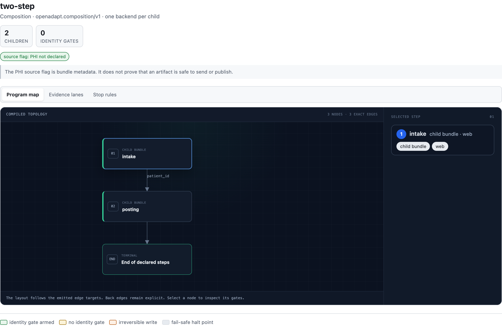
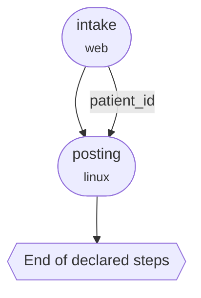
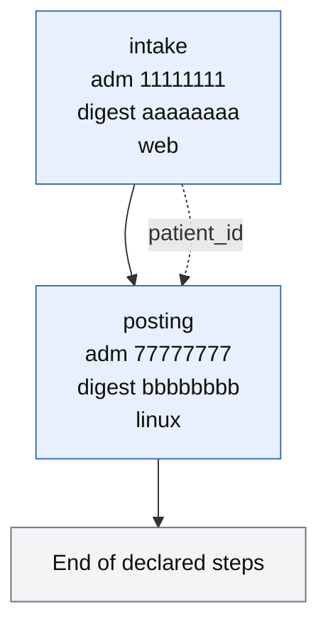
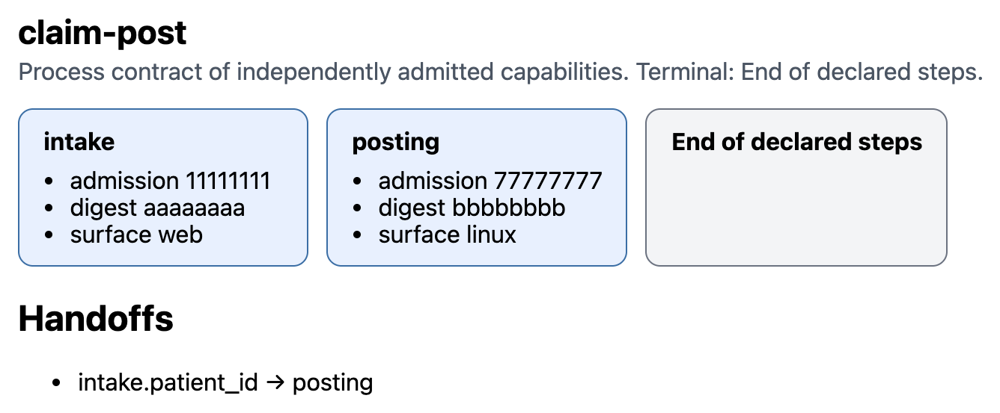

# Sequence work across two applications

One recording binds one surface. If the work starts in a browser intake form
and finishes in a native posting app, record both.

`for-each` loops one bundle over a worklist. `induce` recovers a program from
several traces of the same task on the same backend. The two parents that
sequence work *across* surfaces are `compose` (compiled recordings) and
`process` (independently admitted capabilities).

## Record one program per surface

Record and compile each application the way you already do:

```bash
openadapt flow record --backend web --url https://intake.example --out rec-intake
openadapt flow compile rec-intake --out intake-bundle --name intake

openadapt flow record --backend windows --out rec-posting
openadapt flow compile rec-posting --out posting-bundle --name posting
```

Decide the handoff before you sequence anything. The parent will copy
`patient_id` only if intake's effect contract already bound it. A window title
isn't that fact. Compose won't retarget the intake recording onto the
posting surface.

## Sequence the recordings with compose

`openadapt flow compose` writes a parent directory of compiled children:

```bash
openadapt flow compose \
  --child intake=./intake-bundle \
  --child posting=./posting-bundle \
  --handoff intake.patient_id=posting.patient_id \
  --out composed
openadapt flow certify composed --policy clinical-write
openadapt flow run composed --config deploy.yaml
```

Default order is `--child` order. `--after NAME=PRED` declares a DAG; a cycle
is refused at authoring. Child B starts only after child A ends `VERIFIED`, or
a halt class you named with `--allow-halt NAME=OUTCOME`.

Handoffs copy parameter values that A's confirmed effect contract already
bound. Missing evidence stops the run. The parent won't guess a URL.

The on-disk form is `composed/composition.json` (schema
`openadapt.composition/v1`) plus `composed/children/<name>/`. Subflows and
worklists stay inside each child. `replay` refuses this directory:

```text
replay refuses a composition artifact; use `openadapt-flow run`
```

`visualize` on `composed` shows the child bundles, the handoff edges, and a
terminal labeled End of declared steps. Open `intake-bundle` if you need
intake's program graph.

```bash
openadapt flow visualize composed -o composed.html
openadapt flow visualize composed --format mermaid
openadapt flow visualize intake-bundle -o intake.html
```

<figure markdown="span">
  { width="1180" }
  <figcaption>The parent graph for the compose directory above. Two children, one <code>patient_id</code> handoff, terminal End of declared steps. Representative synthetic composition.</figcaption>
</figure>



Flags and the `certify` / `run` path are in the
[CLI reference](../reference/cli.md#compose). See
[Read a compiled program](../concepts/program-visualizer.md) for the child
program map.

## Qualify and admit each child

Compose sequences recordings. A ProcessContract parent will refuse those
copies. [Qualify each child](qualify-a-workflow.md) on its own surface, run
its counted campaign, and keep the signed
`openadapt.qualification-admission/v1` envelope. The envelope's
`admission_id` is a UUID. It is distinct from `runtime_validation_id`.

A recording you compiled five minutes ago and forgot to qualify is not a
process child.

## Sequence admitted capabilities with process

After both envelopes exist, author the process parent:

```bash
openadapt flow process \
  --child intake=./intake-bundle \
  --admission intake=./intake-admission.json \
  --child posting=./posting-bundle \
  --admission posting=./posting-admission.json \
  --handoff intake.patient_id=posting.patient_id \
  --out process-parent
openadapt flow visualize process-parent -o process.html
```

`--handoff`, `--after`, and `--allow-halt` have the same shape as `compose`.
`--child NAME=BUNDLE` is the admitted bundle. `--admission NAME=ENVELOPE` is
that child's signed `openadapt.qualification-admission/v1` file. A compose
child path under `composition.json` is not an envelope. The parent file is
`process-parent/process-contract.json`, schema
`openadapt.process-contract/v0`. It points at the envelopes. It doesn't copy
recordings. It doesn't become a ProgramGraph.

Pointing `process` at a `composition.json` directory is refused. That check is
what keeps unqualified recordings out of a process receipt.

Each child runs through [OpenAdapt Execute](../commercial/execute-api.md)
with that child's envelope, qualification binding, and its own idempotency
key. `replay` of the process parent is refused.

`visualize` on the process directory shows admitted children, handoff edges,
and End of declared steps. That label means the declared sequence ended. It
doesn't mean `VERIFIED`. Parent `VERIFIED` requires every child `VERIFIED`
and zero model calls.



<figure markdown="span">
  { width="900" }
  <figcaption>The process parent for the same two children after admission. Representative synthetic process contract. The <code>admission_id</code> and digest values are fixtures.</figcaption>
</figure>

Open the child bundle when you need its steps. The parent view won't inline
them.
