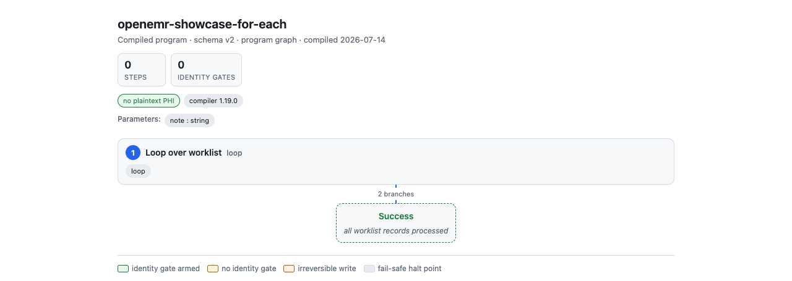

# Run a workflow for each record

Most real work is a queue: forty referrals, a batch of loan applications, a
day's claims. Demonstrate the task once, then run it once per row of a worklist
under the same governance as a single run. `for-each` authors that from one
demonstration, and [`replay --worklist`](../reference/cli.md#replay) drives it.

## Start from one demonstration

Record and compile the task once, as you would for a single run:

```bash
openadapt flow record --backend web --url https://your.app --out rec
openadapt flow compile rec --out bundle --name intake
```

This linear bundle already carries the parameters you recorded (a note, a
patient id, an amount). A data-driven loop feeds those parameters new values on
every iteration.

## Author the loop

Give `for-each` the compiled bundle and a worklist: a CSV whose header names the
columns, or a JSON list of row objects. One record is one iteration:

```bash
openadapt flow for-each bundle --records worklist.csv --out queue-bundle \
  --map mrn=patient_id --map note=note_text
```

`--map COLUMN=PARAM` binds a worklist column to a workflow parameter. When
column names already match parameter names, omit `--map` and each column maps to
the parameter of the same name.

The output `queue-bundle` is a `program: true` bundle with one bounded loop over
the records. Nothing runs yet: authoring is a compile-time step that produces an
inspectable artifact, not an execution.

<figure markdown="span">
  { width="760" }
  <figcaption>The program graph of a <code>for-each</code> bundle. Authoring turns the linear demonstration into one bounded loop over the worklist that ends when every record is processed.</figcaption>
</figure>

## It refuses a bad worklist at authoring time

The mapping is explicit and validated, so a worklist that does not fit the
workflow fails before any run starts. Each of these writes no bundle and exits
nonzero:

- a column that is not mapped to any parameter,
- a mapping onto an unknown parameter, or onto a secret (secrets are injected at
  run time from the environment, never from a worklist),
- a bound parameter that has no column and no demonstrated default,
- a ragged worklist (rows with different columns), and
- a worklist longer than `--max-iterations` (default `1000`).

Refuse-rather-than-guess applied to authoring: a queue you cannot run correctly is
caught here, not three hundred records into a batch.

## Run the queue

Drive the authored loop with a worklist at run time:

```bash
openadapt flow replay queue-bundle --url https://your.app \
  --worklist worklist.csv
```

For a real deployment, use [`run --worklist`](../reference/cli.md#run) instead,
which adds the admission gate, effect verification, and durable
runtime from your deployment config.

## Every iteration keeps its gates

A loop does not relax governance: each record runs the same demonstrated body
under the same checks.

- **Bounded.** The `--max-iterations` cap is a fail-safe: a run can never loop
  longer than the bound set at authoring time.
- **Identity-gated per record.** Where the workflow arms an
  [identity gate](../concepts/identity-gate.md), it re-verifies the record's
  identity every iteration, so record N's write cannot land against record M's
  context.
- **Effect-verified per record.** With an
  [effect verifier](../concepts/effect-verification.md) configured, each
  iteration confirms its write against the system of record before moving on.
- **Halt on ambiguity.** A refuted or unverifiable write halts the run with a
  report. The loop does not silently skip a record and keep going.

Before running a queue, [visualize the program](../concepts/program-visualizer.md)
to see the loop, its bound, and the gates each iteration will apply.
