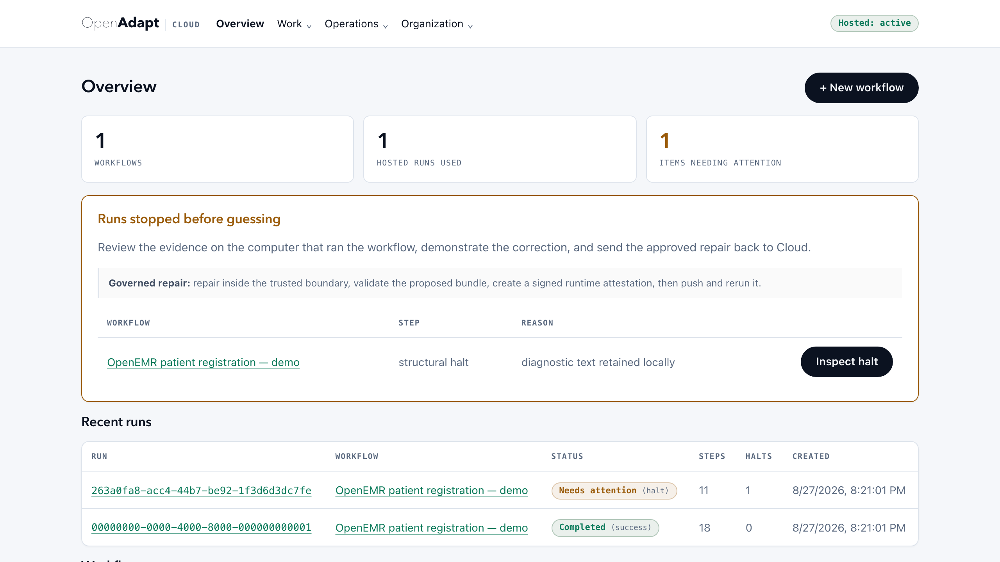

# OpenAdapt Hosted

OpenAdapt Hosted is the managed control plane for governed workflows. The
public **$500/month** subscription covers approved browser workflows and adds
account and organization management, managed execution of locally authored and
attested bundles, artifact storage, structural run history, usage metering, and
billing. The same compiler and governed runtime remain available under MIT for
local and customer-controlled deployments.

Governed authoring, validation, and repair remain local. The hosted recorder is
available for explicitly initiated public, non-regulated browser sessions; use
local recording and a reviewed sanitized derivative when source observations
cannot enter the OpenAdapt-hosted boundary.

[Start with OpenAdapt](https://openadapt.ai/pricing#cloud-preview){ .md-button .md-button--primary }
[Review the data boundary](security-review.md){ .md-button }

Payment runs through Stripe, and the price shown on the website is the exact
price you pay at Checkout.

[Manage account security and privileged access](account-security.md), including
authenticator setup, step-up verification, recovery codes, organization
switching, and sign-out.

<figure markdown="span">
  { width="900" }
  <figcaption>The managed control plane. The overview counts workflows, hosted runs, and items needing attention, surfaces runs that stopped before guessing for review, and lists recent runs and workflows.</figcaption>
</figure>

## What the subscription includes

| Surface | Launch status | Boundary |
|---|---|---|
| Local browser record -> compile -> managed execute | **Beta / public offer** | Governed authoring and validation remain local; managed execution uses the qualified browser substrate. |
| Hosted browser record -> compileable workflow | **Beta / bounded launch component** | The retained non-simulated provider qualification used `openadapt-flow` 1.8.0; the current managed-runtime manifest pins Flow <!-- version-claim:hosted-runner-managed-runtime-pin -->1.31.0<!-- /version-claim:hosted-runner-managed-runtime-pin --> artifact identity. A runtime pin does not prove live deployment or hosted workflow acceptance. This is a separate raw-observation boundary, not the reviewed-derivative upload lane. |
| Account, organization, onboarding | **Beta / public offer** | Checkout and sign-in bind the subscription to an isolated organization. |
| Structural run history and reports | **Beta / public offer** | Safety depends on the workflow's configured identity, effect, and policy checks. Repair and validation remain local. |
| Checkout, portal, entitlements, metering | **Beta / public offer** | Live Stripe Checkout, signed webhooks, entitlements, usage, and the billing portal form one managed subscription contract. |
| Self-hosted browser execution | **Beta** | No hosted account required. |
| Windows UIA | **Supported / scoped deployment** | The exact in-tree WinForms matrix passed 3/3 with an independent SQLite oracle and 3/3 stale/ambiguity refusals. Windows subscriptions and deployments are ordered separately from the public browser offer and qualified per workflow. |
| Native macOS | **Supported / scoped deployment** | One macOS 15.7.3 arm64 host produced 3/3 exact-byte TextEdit effects plus a two-window ambiguity refusal. Native macOS subscriptions and deployments are ordered separately from the public browser offer and qualified per workflow. |
| Native Linux | **Supported / scoped deployment** | The required Ubuntu 24.04 X11/AT-SPI current-main lane completed 3/3 exact-file effects and refused 3/3 ambiguous plus 3/3 stale targets, with zero silent incorrect successes, over-halts, interventions, or model calls. Native Linux deployments run locally or in a customer-controlled boundary and are qualified per workflow. |
| RDP | **Supported / scoped deployment** | Complementary accepted evidence covers 3/3 Aardwolf-over-Windows guest-file effects with independent guest-tools readback and a separate full record -> compile -> governed replay/refusal lifecycle over a real FreeRDP round trip. Consequential actions use a fresh-frame target/identity recheck and one-shot input lease that refuses changed session context. These are two bounded evidence records, not one combined Windows application claim. RDP subscriptions and deployments are ordered separately from the public browser offer and qualified per workflow. |
| Citrix / VDI | **Supported / scoped deployment** | The dedicated Citrix Workspace-window backend binds an exact owner/title, requires current-frame readiness for governed execution, and uses the shared pixel identity, effect, policy, halt, durable-resume, and two-phase remote-actuation contracts. Its retained no-DOM stand-in completed 3/3 healthy effects and 3/3 severe-drift safe-halts with zero silent incorrect successes, false completions, healthy over-halts, drift writes, or model calls. The artifact records `code_readiness_accepted: true` and `ica_hdx_accepted: false`; a counted real ICA/HDX client/codec/latency/DPI matrix remains an exact-deployment evidence boundary, not part of the public managed-browser subscription. |
| Regulated runtime data | **Customer-controlled boundary** | Use a scoped BYOC/on-prem deployment when live screens necessarily contain PHI/PII. |

The public subscription covers approved browser workflows. Windows, native
macOS, native Linux, RDP, Citrix, regulated customer-controlled execution, professional
services, support commitments, and assurance terms are scoped separately. See
[qualification evidence](../get-started/what-works-today.md) for the exact
accepted substrate results; configured commercial terms define entitlement and
support.

## Hosted recorder boundary

The hosted recorder is a real, bounded authoring path rather than a simulated
demo. A qualified hosted browser session produced PNG frames, accepted and
retained input evidence, assembled a native recording, created one compileable
workflow idempotently, enforced its resource limits, and removed the ephemeral
qualification data. That retained qualification used an `openadapt-flow` 1.8.0
worker. The managed-runtime manifest pins the Flow <!-- version-claim:hosted-runner-managed-runtime-pin -->1.31.0<!-- /version-claim:hosted-runner-managed-runtime-pin --> artifact identity. A
pin does not prove that the build is live or that a hosted workflow passed
acceptance. The public readiness endpoint separately verifies the configured
live dependencies, including authentication, storage, runner, compiler,
runtime-validation trust, runtime boundary, bundle protection, recorder,
callbacks, scheduling, human-decision Web Push, retention, security events,
secret encryption, validation policy, and billing. Readiness is dependency
evidence, not a customer workflow qualification or an SLA.

The recorder accepts only public HTTPS DNS hosts and refuses credentials in the
start URL, literal IP addresses, private or mixed DNS answers, and private
network targets. Input is bounded, idempotent, and encrypted in the provider
queue; completed recordings use private object storage and audited, short-lived
download links. One active recorder is admitted per organization, with time,
event-count, and archive-size limits.

Raw frames and events in this path are **not sanitized**. Use it only when those
observations are allowed inside the declared OpenAdapt-hosted boundary. Do not
enter PHI, PII, private-network credentials, or other regulated data. For data
that cannot enter that boundary, record locally and use the reviewed-derivative
protocol below, or keep execution inside a qualified customer-controlled
boundary.

## The hosted lifecycle

The hosted lifecycle is:

1. Complete its qualified Stripe Checkout.
2. Sign in with the checkout email and create or join an organization.
3. Record a browser workflow locally or prepare an existing local recording.
4. Sanitize, review, approve, and push the recording derivative. This registers
   the exact approved recording; it does not create a runnable workflow.
5. Compile that approved recording locally. Run strict lint, policy
   certification, and a successful governed replay in a named non-PHI
   validation environment.
6. Sanitize, review, and approve the compiled bundle. Bundle sanitation must
   preserve execution-bearing content.
7. Run `validate-hosted`. It requests an expiring, one-time organization/token
   challenge and creates an operator attestation bound to the exact approved
   recording, bundle, compiler provenance, policy, risk class, and replay report.
8. Immediately push the approved bundle with that attestation. Cloud consumes
   the challenge and admits the bundle only if policy and risk-class allowlists
   also pass.
9. Configure the vault secret-set reference and optional schedule. The target
   URL, allowed hosts, and parameter schema are immutable attested bundle
   properties; supply non-secret parameter values for each run.
10. Teach or repair a halted run locally, revalidate it, and activate the
   attested replacement on the same workflow; promote only a revision that
   passes its gates.
11. Inspect usage and manage the subscription through the billing portal.

Checkout does not relax a safety or egress refusal. A paid organization cannot
upload an unapproved artifact or execute a workflow that fails its configured
run gate.

## Exact local-to-hosted sequence

The example below uses the consequential `clinical-write` lane. Choose the
policy required by the deployment. `--risk-class` is not a free-form assertion:
the client derives `low` or `consequential` from the compiled steps and refuses
a mismatch. Cloud may further restrict both values with its exact deployment
allowlists.

```bash
# 1. Approve and register the exact recording derivative.
openadapt flow sanitize recording --kind recording --out recording.sanitized
openadapt flow review-sanitized recording.sanitized --original recording
openadapt flow approve-sanitized recording.sanitized \
  --original recording --reviewer alice@example.com
openadapt flow push recording.sanitized --kind recording --name "Triage"

# 2. Compile and validate locally from that approved derivative.
openadapt flow compile recording.sanitized --out bundle --name triage
openadapt flow lint bundle --strict
openadapt flow certify bundle --policy clinical-write
openadapt flow replay bundle --url https://validation.example/login \
  --run-dir runs/triage-validation --param patient_id=synthetic-001

# 3. Approve the exact runnable bundle derivative.
openadapt flow sanitize bundle --kind bundle --out bundle.sanitized
openadapt flow review-sanitized bundle.sanitized --original bundle
openadapt flow approve-sanitized bundle.sanitized \
  --original bundle --reviewer alice@example.com

# 4. Acquire the one-time challenge and bind the local evidence to it.
openadapt flow validate-hosted \
  --recording recording.sanitized \
  --bundle bundle.sanitized \
  --run-dir runs/triage-validation \
  --policy clinical-write \
  --risk-class consequential \
  --environment validation/mock-emr-v1 \
  --target-url https://validation.example/login \
  --out triage.runtime-validation.json

# 5. Consume the challenge by uploading the exact attested bundle once.
openadapt flow push bundle.sanitized --kind bundle --name "Triage" \
  --validation-attestation triage.runtime-validation.json
```

For a repair, generate a fresh attestation and activate the reviewed replacement
on the same workflow while binding it to the halted run:

```bash
openadapt flow push bundle.repaired.sanitized --kind bundle \
  --workflow-id <workflow-uuid> \
  --resolves-run-id <halted-run-uuid> \
  --validation-attestation triage.repaired.runtime-validation.json
```

The control plane refuses a run from another tenant or workflow, locks the
unresolved halt, activates the validated version atomically, and only then marks
that halt resolved. Reusing an already accepted archive cannot resolve a new
halt.

Do not edit either derivative after approval, rerun after generating the
attestation, or reuse the attestation for another upload. Any changed archive
hash, provenance link, parameter schema, report, policy, risk class, token, or
challenge is refused. The attestation supplies the immutable target origin,
host allowlist, and parameter schema. After bundle ingest succeeds, select the
vault secret-set reference and optional schedule; provide non-secret parameter
values only in the **Run now** dialog. Runtime values are forwarded to that run
and are not persisted in bundle metadata. The hosted run is a separate execution
and remains subject to its runtime, entitlement, and data-boundary gates.

## What “scrubbed” means

Compilation does **not** make a recording or bundle PHI/PII-free. Scrubbing is a
separate local derivation protocol:

The sanitized derivative is admitted by its manifest-bound cryptographic derivative hash.

1. **Inventory every input.** Enumerate files, metadata, and channels. A
   symlink, archive, database, image, media file, or unknown type requires an
   explicit handler.
2. **Transform a copy.** Preserve the sensitive original locally. Redact or
   parameterize supported text, structured records, screenshots, and metadata
   into a separate derivative.
3. **Rescan.** Run the detectors over the derivative, not only the source.
4. **Write a manifest.** Record policy and tool versions, transformations,
   unresolved findings, artifact inventory, and a cryptographic derivative
   hash.
5. **Review when required.** A local viewer lets an authorized operator inspect
   the sanitized result, correct missed or excessive redactions, and approve
   the exact hash.
6. **Upload the approved bytes.** Any later modification changes the hash and
   invalidates approval. Unknown or unresolved content is refused rather than
   copied through.

The original and derivative have different purposes. Keep the original inside
its trusted boundary for authoring and replay evidence; share only the approved
derivative.

Sanitation and runnability are separate gates. Redacting a selector, literal,
target label, identity field, or other execution-bearing value can make a
recording safe to transfer but unable to compile or replay correctly. Hosted
ingest labels that case `needs_parameterization`. Parameterize and compile the
approved recording locally, validate the bindings and replay, then sanitize and
approve a bundle whose execution-bearing content remains unchanged. Privacy
approval alone never promotes a recording or bundle to runnable status.

## What the runtime attestation proves

`validate-hosted` recomputes strict lint and certification and reads a
successful, non-halted `report.json`. It refuses unless the evidence forms one
chain:

- the bundle provenance names the exact approved recording archive SHA-256;
- compiler name/version and compiler-configuration SHA-256 are sealed;
- the run report matches the workflow name, bundle content digest, source
  recording SHA-256, and parameter-schema SHA-256;
- hashes bind the strict-lint result, certification result, report bytes, and
  non-PHI validation-environment identifier;
- the supplied `low` or `consequential` risk class matches the compiled steps;
- the approved bundle archive SHA-256 is the archive uploaded with the
  attestation.

The client signs this envelope with the ingest token. Cloud verifies the HMAC,
fresh timestamp, exact bundle hash, configured policy, risk-class, and deployed
compiler-version allowlists, and the challenge's organization, token, nonce,
expiry, and unused state. The challenge expires after 15 minutes and is consumed
transactionally by the accepted bundle upload.

This is **operator self-attestation**, not independent certification. It proves
that the token holder produced a tamper-evident envelope over the named local
evidence; Cloud did not observe the local replay and the HMAC is not an auditor
signature. `certify` means only that the bundle passed the selected policy.
Independent certification would require a separately controlled evaluator,
test environment, evidence custody, and signing identity. Neither mechanism is
a blanket safety, compliance, or correctness guarantee.

## Review policy options

| Policy | Appropriate use | Tradeoff |
|---|---|---|
| Automatic after scrub | Narrow, schema-minimized diagnostics with complete type coverage. | Lowest friction; detector false negatives remain possible. |
| Human review required | Recordings, screenshots, free text, and consequential bundles. | Adds context but costs operator time; approval is not proof. |
| Risk-based hybrid | Automatic diagnostics, reviewed artifacts, administrator exception for measured pipelines. | Recommended default; requires explicit policy and audit configuration. |

Human review is local. The viewer must not send originals to a remote renderer,
load remote resources, or cache the sensitive source outside the execution
boundary. Approval records the reviewer, time, policy, manifest, and derivative
hash.

This approval is operator attestation, not an independently witnessed review.
Cloud accounts for the archive structure and verifies exact manifest/hash
bindings, but it does not rerun OCR/NER or observe the loopback viewer. A
regulated deployment must control reviewer identity and separation of duties;
human approval reduces detector risk but is not proof of de-identification.
Managed Cloud requires human approval by default. Automatic approval is a
deployment-level capability that an operator must explicitly enable after
reviewing the sanitizer policy; an uploader cannot opt itself into that mode.
When enabled, automatic approval must carry an HMAC from a key ID in the
deployment-controlled sanitizer allowlist. The signature covers the exact
derivative and approval contract, so the ingest token alone cannot assert that
the automatic policy ran.

## Sanitized authoring data is not sanitized runtime data

A recording can replace a patient name with a parameter, while the live EMR
screen still displays that patient's name during execution. Runtime frames,
OCR, accessibility text, model inputs, reports, and effect evidence can
therefore reintroduce PHI/PII.

Use these rules:

- Sanitized authoring derivatives may cross a destination permitted by policy.
- Runtime values are injected separately and are not written back into the
  sanitized authoring derivative.
- PHI/PII-bearing runtime observations remain inside the declared trusted
  execution boundary.
- A remote model is a separate destination and must be approved explicitly;
  healthy replay does not need one.
- If sanitization changes target identity or replay semantics, expect
  `needs_parameterization`: parameterize, compile, and validate locally, then
  sanitize and approve the unchanged runnable bundle and complete
  `validate-hosted`. Otherwise keep the workflow inside the trusted boundary.
  Do not call a non-functional derivative runnable.

## Destination-aware decisions

| Transfer | Default decision |
|---|---|
| Local process -> local storage | Allow under local retention and encryption policy. |
| Approved derivative -> OpenAdapt Hosted | Allow when the manifest, review policy, destination, and hash pass. |
| Approved derivative -> verified customer endpoint | Allow under that customer's destination policy. |
| Raw or unresolved artifact -> any remote endpoint | Refuse. |
| Explicit hosted-recorder observations -> hosted recording boundary | Allow only for an entitled, public-HTTPS, non-regulated session that the user starts deliberately. |
| PHI/PII-bearing runtime observation -> shared managed boundary | Refuse unless that exact regulated service and legal boundary are configured. |
| Minimized break descriptor -> control plane | Allow after schema validation and sanitation. |
| Unknown destination | Refuse. |

BYOC is not synonymous with “deny.” A verified customer-owned endpoint may be a
valid destination for data that its policy permits. Conversely, an OpenAdapt-
managed endpoint is not valid merely because the user has a subscription.

## Production mode versus mock mode

Mock mode is a development tool that returns synthetic users, workflows, and
run results. Live mode uses real authentication, database, object
storage, runner, and billing services.

A production deployment must explicitly select live mode and pass dependency
health checks. If a runner or billing dependency is missing, the affected
operation reports unavailable; it must not return a simulated success. This is
what “production fails closed instead of silently using mock mode” means. It
protects customers from believing a fabricated development run actually
executed; it does not disable production functionality.

## Retention, deletion, and restore evidence

The hosted service applies a versioned retention policy to recordings, reports,
run metadata, and the declared recovery window. Legal holds pause eligible
deletion. Tenant erasure is scoped to one organization and produces an
append-only receipt containing resource identifiers, counts, and digests rather
than deleted payloads.

Scheduled destructive retention is separately gated on a recent complete
scratch-restore receipt. The operator path exports roles, schema, data, and
every private Storage object; reads the source twice; restores only to an
explicitly confirmed scratch project; and verifies exact hashes before recording
the receipt. Production currently has no qualifying provider recovery point or
complete scratch-restore receipt, so scheduled deletion remains gated. This does
not claim provider PITR, object-storage recovery, or a backup SLA. The live
[readiness endpoint](https://app.openadapt.ai/api/health/ready) exposes retention
configuration independently from that destructive-operation gate.

## Production control checklist

Before directing traffic to a production deployment, verify:

- authentication and organization isolation;
- database migrations and row-level access controls;
- object storage and signed artifact access;
- hosted recorder URL controls, input sealing/idempotency, resource limits,
  private recording handoff, and finalization reconciliation;
- live runner enqueue, callback authentication, timeout, retry, and recovery;
- secrets exchange without values in browser or enqueue payloads;
- sanitation, local review, destination policy, and approval-hash enforcement;
- one-time validation challenge consumption, exact attestation bindings, and
  policy/risk-class allowlist enforcement;
- exact runtime-boundary ID/hash agreement across local attestation, workflow
  activation, control-plane configuration, job payload, and runner health;
- request-bound idempotency, one active run per workflow, and a lost provider
  acknowledgement that remains single-flight until callback or operator review;
- Stripe Checkout, portal, signed idempotent webhooks, entitlements, and usage;
- logs, alerts, legal holds, tenant erasure, deletion receipts, complete
  database + object-storage scratch restore, update, and rollback;
- a clean-account sign-up -> subscribe -> record sanitize/review/approve ->
  recording push -> local compile/lint/certify/replay -> bundle
  sanitize/review/approve -> `validate-hosted` -> attested bundle push ->
  configure -> run -> report -> teach -> rerun -> bill lifecycle.

See the [security review](security-review.md) for the evidence an enterprise
reviewer should request.
