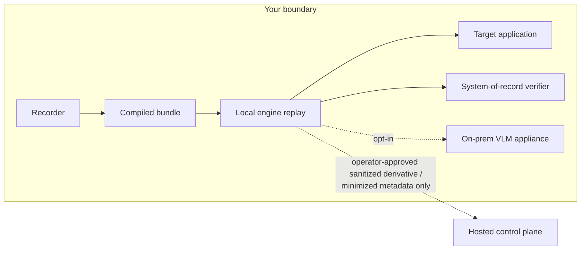

# Security &amp; data handling

OpenAdapt is built for the places other automation vendors avoid: clinics,
lenders, and back offices where the screen contains regulated data and a wrong
write is a reportable event. The architecture starts from a simple commitment,
**your data is workload data, not our telemetry**, and every control on this
page follows from it.

This page is the dossier for an IT or security reviewer evaluating a pilot. It
is assembled from the engine's own security documentation; every specific
statement links to the source that backs it. For the exhaustive
question-by-question boundary table, continue to
[Security and deployment review](security-review.md).

!!! note "What we claim, and what we don't"
    OpenAdapt is designed for regulated environments and this page describes
    the concrete controls that make that true. We do not claim SOC 2, HIPAA,
    PHIPA, or any certification here. Request current legal and compliance
    artifacts directly, and verify the controls below against your own
    deployment. The engine is open source, so your reviewers can read every
    control they are asked to trust.

## The data-flow model: local by default, egress by decision

The core design decision is that **execution is local and deterministic**. A
compiled workflow replays on your machine, against your application, with no
model in the loop and no cloud dependency:

- **Zero outbound calls on a healthy replay.** The engine is deterministic and
  model-free by default: `runtime.allow_model_grounding` defaults to `false`,
  and with no VLM endpoint configured a replay makes no outbound calls. There
  is no telemetry, analytics, license check, or update ping anywhere in the run
  path. ([ON_PREM.md](https://github.com/OpenAdaptAI/openadapt-flow/blob/main/docs/ON_PREM.md))
- **Model assistance is an explicit opt-in, and it points where you say.** When
  an operator enables model grounding, inference goes to the endpoint the
  deployment configures, designed as an
  [on-prem, LAN-only VLM appliance](../concepts/vlm-appliance.md) with
  no retention: neither client nor server writes crops or screenshots to disk
  or logs. ([PRIVACY.md](https://github.com/OpenAdaptAI/openadapt-flow/blob/main/docs/PRIVACY.md))
- **An empty deployment file is a complete deployment.** Fully local, zero
  egress is not a stripped-down mode; it is the default configuration.
  ([ON_PREM.md](https://github.com/OpenAdaptAI/openadapt-flow/blob/main/docs/ON_PREM.md))

When a deployment connects to the hosted control plane, the boundary holds.
The control plane works with **metadata, digests, and attested hashes, not
your screens or records**:

- **Uploads go through the sanitized-artifact pipeline, never raw.** The only
  artifact-upload lane accepts an operator-reviewed, approved sanitized
  derivative whose file inventory, transformations, rescan, review state, and
  exact archive SHA-256 are verified before a byte is accepted. Content the
  sanitizer cannot fully handle (databases, video, audio, nested archives,
  symlinks, unknown binaries) refuses the entire derivative rather than
  passing through.
  ([SANITIZED_ARTIFACTS.md](https://github.com/OpenAdaptAI/openadapt-flow/blob/main/docs/SANITIZED_ARTIFACTS.md))
- **Halt reports are schema-minimal.** The hosted break-report channel carries
  a hashed, coarse halt descriptor: no intent, reason, error text,
  screenshots, DOM, field values, or report body. Free text is not
  auto-uploaded even when a scrubber is available.
  ([PRIVACY.md](https://github.com/OpenAdaptAI/openadapt-flow/blob/main/docs/PRIVACY.md))
- **The contract is public and machine-checkable.** The manifest, approval, and
  ingest envelopes are published JSON Schemas
  ([`schemas/`](https://github.com/OpenAdaptAI/openadapt-flow/tree/main/schemas)),
  so what crosses the boundary is inspectable before you connect anything.
- **Unknown destinations are refused, not defaulted.** An egress destination
  must be explicitly classified (OpenAdapt-managed, customer-managed
  allowlisted host, or local loopback) before any policy applies; an unknown
  host is refused outright.
  ([SANITIZED_ARTIFACTS.md](https://github.com/OpenAdaptAI/openadapt-flow/blob/main/docs/SANITIZED_ARTIFACTS.md))

### When a halt is answered by a person

The same boundary governs the
[attended decision path](../concepts/halt-learn-loop.md#where-a-halt-goes-the-attended-decision),
where a halted run is answered by staff — including from a phone.

- **The full-evidence decision surface is served by the runner, inside your
  boundary.** It is a responsive web app on the runner itself, not a native
  mobile app and not a hosted page. It is **loopback-only until you publish it**
  through your own trusted TLS ingress; it fails closed on any partial
  configuration and offers no self-signed bypass or wildcard bind. See
  [the portal settings](../reference/configuration.md#the-self-hosted-phone-portal).
- **If you do not operate an ingress, use the hosted lane instead.** The runner
  dials **out** to the control plane, so there is no inbound port, no
  certificate, and nothing to configure on your network. That lane carries the
  signed PHI-free task and the closed halt context only: closed enums, bounded
  integers, and booleans, with **no string field and no image**. It is not
  scrubbed evidence — it is an envelope that cannot represent a record. See
  [Reaching it from a phone](../concepts/halt-learn-loop.md#reaching-it-from-a-phone).
- **Protected evidence does not leave the runner.** The retained screen, the
  observed values, the OCR, and the failing target stay local. Projections and
  evidence crops are served `no-store` and are never written to a
  service-worker cache; only raster image types are relayed, and an SVG is
  refused because it is an active document rather than a screenshot.
- **The hosted envelope cannot represent a record.** What crosses to a control
  plane is opaque identifiers, digests, closed enums, bounded counts, and
  expiry. There is no free-text field anywhere in it, so values and prose are
  *structurally* unable to travel rather than being stripped in transit. A
  hosted dashboard therefore shows **less** than the runner-local surface by
  design: it can state the shape of a failure, not its content.
- **A person's answer is not a result.** The phone returns a signed decision.
  The engine re-reads live state and re-runs its identity, postcondition, and
  effect checks before continuing, and refuses when the application is not in
  the state the step needs. An accepted tap never produces `VERIFIED`, and
  notifications on any channel carry a fixed template and a count — never an
  upstream string.
- **Sending decisions back through a hosted control plane is opt-in.** It is off
  unless remote issuance is enabled in your deployment configuration and bound
  to an exact tenant and runner, and it carries a stronger authentication
  requirement. Unconfigured, decisions are local and the hosted view is
  read-only triage.

The one deliberate exception is the separate hosted browser recorder for
public, non-regulated targets, which sees raw observations inside its own
declared hosted boundary. It is a distinct, explicitly initiated lane, not
part of the local-execution path. The
[data-boundary table](security-review.md#data-boundary-answers) states exactly
which component can see and transmit what.

## PHI/PII posture: scrubbed where shareable, fail-closed where regulated

OpenAdapt treats PHI/PII handling as an engineering surface with a published map.
[PRIVACY.md](https://github.com/OpenAdaptAI/openadapt-flow/blob/main/docs/PRIVACY.md)
enumerates every path where PHI/PII is persisted, logged, or transmitted, and names
the control on each. The posture in brief:

- **Scrubbing on the persist and log paths.** PHI/PII scrubbing is provided by
  [openadapt-privacy](https://github.com/OpenAdaptAI/openadapt-privacy)
  (Presidio-backed NER) through a single choke point. The shareable `REPORT.md`
  passes every free-text field through the scrubber, persisted step and heal
  frames are routed through image redaction, and drift-oracle console output is
  scrubbed before printing.
- **A regulated deployment pins `OPENADAPT_FLOW_SCRUB=on` and fails closed.**
  Under `on`, a missing scrubbing capability aborts the run instead of writing
  plaintext PHI/PII, and image redaction of persisted frames is implied: a
  compliance-pinned run cannot leave unredacted full-frame screenshots in the
  shareable report. The on-prem queue refuses to start unless scrub is `on`.
  ([PRIVACY.md](https://github.com/OpenAdaptAI/openadapt-flow/blob/main/docs/PRIVACY.md),
  [ON_PREM.md](https://github.com/OpenAdaptAI/openadapt-flow/blob/main/docs/ON_PREM.md))
- **No silent plaintext, ever.** In the default `auto` mode without the privacy
  extra installed, writing a report with identity-like free text emits a
  one-time `PlaintextPHIWarning`: an operator can never believe a run is
  de-identified when it is not.
  ([PRIVACY.md](https://github.com/OpenAdaptAI/openadapt-flow/blob/main/docs/PRIVACY.md))
- **Encryption at rest, applied to the artifacts that matter.** The production
  `openadapt flow seal SOURCE --out DESTINATION` path, with
  `OPENADAPT_BUNDLE_KEY` injected from the deployment's secret manager, uses
  AES-256-GCM to encrypt `workflow.json`, every template screenshot
  crop, and the same key encrypts durable run checkpoints when the runtime
  writes them. No
  cleartext PHI/PII-bearing screenshot remains on disk in an encrypted bundle, and
  keyed loads decrypt in memory only. The command preserves the source, refuses
  symlinks and an existing destination, verifies the sealed result, and expires
  inherited certification. A wrong key or a tampered ciphertext fails loudly,
  never partially. The identity band in a compiled bundle is a salted hash, not
  plaintext.
  ([phi_at_rest.md](https://github.com/OpenAdaptAI/openadapt-flow/blob/main/docs/phi_at_rest.md))
- **Encryption in transit on the desktop control channel.** The Windows agent
  channel that carries live screenshots runs HTTPS with a per-run self-signed
  certificate and SHA-256 fingerprint pinning, plus an independent bearer
  token. The client fails closed: a plaintext URL to a non-loopback host raises
  at construction, and a wrong or unpinned certificate is rejected at the
  handshake.
  ([phi_in_transit.md](https://github.com/OpenAdaptAI/openadapt-flow/blob/main/docs/phi_in_transit.md))
- **Honest boundaries where scrubbing would break safety.** The recorded
  identity evidence and the run's identity audit trail intentionally retain
  literal identifiers. Scrubbing them would defeat the wrong-record check they
  exist to power. Those artifacts are governed as PHI/PII-at-rest inside your
  boundary (filesystem controls, retention, full-disk encryption), and the map
  says so explicitly rather than pretending otherwise.
  ([PRIVACY.md](https://github.com/OpenAdaptAI/openadapt-flow/blob/main/docs/PRIVACY.md))

## Secrets: referenced, resolved at run time, never stored

- **Workflow secrets never enter an artifact.** Password fields and any field
  recorded with `--secret` are excluded from recordings, event logs, bundles,
  and frames. At replay the value is injected from
  `OPENADAPT_FLOW_SECRET_<FIELD>`; a missing secret is a clear, fail-fast
  error, not a silent skip.
  ([Parameters and secrets](parameters-and-secrets.md),
  [security review](security-review.md))
- **Deployment credentials are injected, not committed.** System-of-record
  verifier tokens and agent tokens are supplied from the operator's secret
  store or environment, never committed to deployment YAML. In the on-prem
  package, real secrets live in the OS keychain or a root-only file and are
  referenced by environment-variable *name*. The config directory holds only
  the vendor **public** key.
  ([ON_PREM.md](https://github.com/OpenAdaptAI/openadapt-flow/blob/main/docs/ON_PREM.md))
- **Hosted credentials prefer the OS keychain.** The hosted ingest token
  resolves from CLI flag, environment, then OS keychain; the CLI requires an
  explicit flag before it will use plaintext config storage.
  ([security review](security-review.md))
- **Even the audit surface is secret-free.** Effect contracts are recorded in
  run reports as one-way SHA-256 digests, enough to prove that two runs wrote
  different records (or duplicated one) without exposing the underlying value.
  ([openadapt_flow/runtime/effects](https://github.com/OpenAdaptAI/openadapt-flow/blob/main/openadapt_flow/runtime/effects/effect.py))

## Verification and audit: prove the write, keep the evidence

Most automation tools tell you what they *did on the screen*. OpenAdapt
verifies what actually *changed in the system of record*, and keeps evidence
you can hand to an auditor:

- **Effect verification against the system of record.** Consequential writes
  carry typed effect contracts checked by an independent read (API/DB/FHIR),
  not the pixels. A non-confirmed verdict halts the run.
  ([Effect verification](../concepts/effect-verification.md),
  [EFFECT_VERIFIER.md](https://github.com/OpenAdaptAI/openadapt-flow/blob/main/docs/design/EFFECT_VERIFIER.md))
- **Governed-run authorization binding.** A governed run is admitted once, and
  the approval is bound to the sealed bundle's content digest, the exact
  parameter digest, the admitting policy, the identity-required steps, and the
  exact effect-contract hashes: single-use, halt-on-mismatch. An approval for
  one workflow can never become a reusable bypass for another.
  ([GOVERNED_RUN_AUTHORIZATION.md](https://github.com/OpenAdaptAI/openadapt-flow/blob/main/docs/design/GOVERNED_RUN_AUTHORIZATION.md))
- **Every run produces an audit trail.** Human-readable `REPORT.md` (scrubbed)
  and machine-readable `report.json` expose resolution rungs, identity
  coverage, postconditions, effect verdicts, heals, and the halt reason. The
  identity check records recorded-vs-live evidence so an operator can prove a
  wrong-record halt fired.
  ([Read and audit run reports](run-reports.md),
  [PRIVACY.md](https://github.com/OpenAdaptAI/openadapt-flow/blob/main/docs/PRIVACY.md))
- **A tamper-evident index on-prem.** The on-prem package adds an append-only,
  hash-chained, PHI/PII-free audit log over runs and release changes; any silent
  edit breaks every subsequent hash and is caught by the attestation script.
  ([ON_PREM.md](https://github.com/OpenAdaptAI/openadapt-flow/blob/main/docs/ON_PREM.md))
- **You can prove the no-egress posture, repeatedly.** `verify-airgap.sh` scans
  configuration and environment for any off-LAN URL or cloud key, actively
  probes that a public canary call *fails*, and walks the audit-log hash chain,
  a repeatable pre-flight for your own attestation.
  ([ON_PREM.md](https://github.com/OpenAdaptAI/openadapt-flow/blob/main/docs/ON_PREM.md))

## Hosted retention, deletion, and recovery

The hosted service applies a versioned retention policy to recordings, reports,
run metadata, and the declared recovery window. Legal holds pause eligible
deletion. Tenant erasure is organization-scoped and produces an append-only,
PHI/PII-free receipt with identifiers, counts, and digests rather than deleted
payloads.

Destructive scheduled retention has a separate recovery gate: it refuses to run
without a recent receipt proving a complete database **and private object
storage** restore into an isolated scratch environment. The restore tooling
exports roles, schema, data, and every content-addressed object, reads the source
twice, restores only to the confirmed scratch target, and rehashes the result.
The production provider currently reports no available provider recovery point,
so scheduled deletion remains gated. That is not a claim of provider PITR or a
backup SLA. The public
[readiness endpoint](https://app.openadapt.ai/api/health/ready) reports the
configured retention component separately from this destructive-operation gate.

## Release integrity

The public Desktop `desktop-v0.15.0` release includes Windows, macOS, and Linux
installers, `SHA256SUMS`, a CycloneDX SBOM, per-platform metadata, and GitHub
build-provenance attestations. These prove source and build provenance, not
publisher identity. Windows and Linux installers remain unsigned and macOS
installers are ad-hoc signed; Apple Developer ID/notarization and Windows
Authenticode require the corresponding external identities. Verify the
[release assets](https://github.com/OpenAdaptAI/openadapt-desktop/releases/tag/desktop-v0.15.0)
before overriding an operating-system publisher warning.

## Deployment options

All three shapes run the same engine and the same safety gates. The
[deployment matrix](../concepts/deployment-matrix.md) changes where data
lives, not what is enforced.

| Shape | Where execution happens | What crosses your boundary |
|---|---|---|
| **Fully local** | Your workstation or server. An empty deployment file means zero egress. | Nothing. No account, telemetry, or update ping in the run path. |
| **On-prem appliance** | A host inside your network, with a local queue, hash-chained audit log, optional LAN-only VLM box, and operator-pulled signed updates verified against a pinned vendor public key. | Nothing at run time; updates enter on removable media, signature-verified, with blue/green install and rollback. ([Deploy on-prem](deploy-on-prem.md), [ON_PREM.md](https://github.com/OpenAdaptAI/openadapt-flow/blob/main/docs/ON_PREM.md)) |
| **Hosted control plane + local execution** | Governed authoring, validation, and repair remain local; the control plane manages accounts, workflow versions, run history, and billing. | Operator-approved sanitized derivatives, minimized halt descriptors, and hash-bound attestations, verified against published schemas. ([The hosted option](hosted.md)) |

Hosted managed *browser* execution is a separate Beta launch-candidate lane
with its own declared boundary for public, non-regulated targets. See
[Hosted browser execution](hosted.md) for its current status and scope.

## Questions we expect from IT review

**Does patient or customer data leave our network?**
Not in the local and on-prem shapes: a healthy replay makes zero outbound
calls, and the software's no-egress posture is operator-verifiable with an
active probe. If you connect the hosted control plane, the only artifact lane
is the reviewed sanitized derivative, and halt telemetry is a schema-minimal
hashed descriptor.

**What does OpenAdapt's cloud see if we use it?**
Metadata, digests, coverage and review state, and attested hashes, not raw
recordings, bundles, or screenshots. Cloud verifies the manifest/hash contract
on every accepted byte; it does not receive the source artifact. See
[the data-boundary table](security-review.md#data-boundary-answers).

**Where do models run?**
By default, nowhere: replay is deterministic. If you enable model grounding,
inference targets the endpoint you configure; the supported regulated shape is
an on-prem, LAN-only appliance with no retention.
([The on-prem VLM appliance](../concepts/vlm-appliance.md))

**How do you stop a wrong-record write?**
Identity verification against recorded evidence before consequential clicks,
typed postconditions, and effect verification against the system of record,
with halt (not guess) on any non-confirmed verdict, and durable pause/resume
for human review. ([Fail-closed regulated execution](../concepts/regulated-execution.md),
[The identity gate](../concepts/identity-gate.md))

**Where are credentials stored?**
Nowhere in the artifacts. Secret fields are excluded from recordings and
bundles and injected from the environment at replay; deployment and hosted
tokens live in your secret store or the OS keychain.

**What is encrypted?**
In transit: the PHI/PII-bearing desktop control channel is TLS with per-run
certificate pinning, fail-closed. At rest: opt-in AES-256-GCM sealing for the
bundle, its screenshot crops, and checkpoints, layered on operator full-disk
encryption. Key management (KMS, rotation, escrow) remains yours. OpenAdapt
supplies the AEAD substrate, not a KMS.
([phi_at_rest.md](https://github.com/OpenAdaptAI/openadapt-flow/blob/main/docs/phi_at_rest.md))

**What audit evidence do we get?**
Per-run scrubbed `REPORT.md` + `report.json` with identity coverage, effect
verdicts, and one-way contract hashes; on-prem, an append-only hash-chained
audit log; hosted, PHI/PII-free retention and deletion receipts; and single-use,
digest-bound authorization records for governed runs.
([Read and audit run reports](run-reports.md))

**Are you SOC 2 / HIPAA certified?**
We describe controls, not certifications, in documentation. Request current
legal and compliance artifacts directly; do not infer certification status from
architecture pages. The engine's
[SECURITY.md](https://github.com/OpenAdaptAI/openadapt-flow/blob/main/SECURITY.md)
covers coordinated vulnerability disclosure (private advisories, acknowledgment
target within 5 business days) and supply-chain posture (Actions pinned by
commit SHA, Dependabot).

**How do we go deeper?**
Work through [Security and deployment review](security-review.md), the full
reviewer checklist and boundary table, alongside the engine's
[PRIVACY.md](https://github.com/OpenAdaptAI/openadapt-flow/blob/main/docs/PRIVACY.md),
[phi_at_rest.md](https://github.com/OpenAdaptAI/openadapt-flow/blob/main/docs/phi_at_rest.md),
[phi_in_transit.md](https://github.com/OpenAdaptAI/openadapt-flow/blob/main/docs/phi_in_transit.md),
and [known limits](https://github.com/OpenAdaptAI/openadapt-flow/blob/main/docs/LIMITS.md).
Engine controls are open source and directly reviewable. Hosted controls expose
their public contracts and live readiness state; the hosted control-plane source
remains proprietary.
