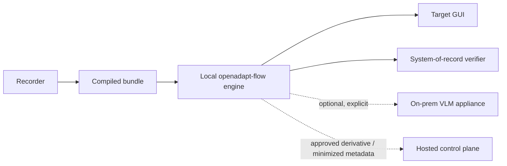

# Security and deployment review

This page answers the questions an enterprise security reviewer should ask
before a pilot. It describes the current boundaries, not a certification or a
claim that a particular deployment is compliant.

## Architecture at a glance

The default browser replay path is local and model-free. Network traffic to the
target application or a configured system-of-record verifier is workload
traffic, not OpenAdapt telemetry. Model calls exist only when the operator
enables model grounding and configures an appliance.

## Data-boundary answers

| Question | Current answer |
|---|---|
| Which components see screenshots? | The recorder and runner do. A configured model endpoint may receive a permitted crop or frame. Generic hosted upload admits only an approved sanitized derivative. The separate, explicitly initiated hosted recorder sees raw observations for public, non-regulated targets inside its declared hosted boundary. |
| Which components can transmit screenshots? | Deterministic local replay does not transmit them. The optional model client can send permitted data to its configured endpoint. Generic hosted upload sends the manifest-bound derivative, never the source by assumption. The hosted recorder transmits its raw frames inside its declared non-regulated authoring boundary. PHI/PII-bearing runtime screenshots stay inside the declared trusted execution boundary. |
| What can the sanitizer upload? | Only the exact derivative whose inventory, transformations, rescan, unresolved findings, review state, destination, and hash satisfy policy. Unknown, symlinked, unsupported, or unresolved content aborts instead of passing through unchanged. |
| What does local review establish? | It lets an authorized operator compare the sanitized derivative, correct redactions, and approve the exact hash. Review adds context but is not mathematical proof that no PHI/PII remains. Any later modification invalidates approval. |
| Does Cloud independently witness sanitation review? | No. Cloud accounts for every accepted ZIP byte and verifies the manifest/hash contract and submitting ingest token, but it does not observe the local viewer or rerun OCR/NER. Reviewer identity, separation of duties, and evidence custody remain deployment controls. |
| Can an uploader claim automatic sanitation approval? | No. Automatic approval is disabled by default. If a deployment enables it, the exact approval envelope must carry an HMAC from a deployment-allowlisted key ID; the ingest token cannot enable or forge that capability by itself. This still proves signer possession, not independent de-identification. |
| What happens for an unknown deployment or destination? | The request is refused before an egress policy is selected. It never falls back to the shared cloud lane. A verified customer endpoint can have a different policy from an OpenAdapt-managed endpoint. |
| Where are workflow secrets stored? | Password fields and fields named with `--secret` are not written to recordings, bundles, event logs, or frames. Replay resolves them from `OPENADAPT_FLOW_SECRET_<FIELD>`. Deployment credentials should be injected from the operator's secret store, not committed to YAML. |
| Where is the hosted ingest token stored? | Resolution order is the CLI flag, `OPENADAPT_INGEST_TOKEN`, OS keychain, then an existing config migration token. The current CLI requires an explicit flag before using plaintext config storage. |
| Which artifacts may contain PHI/PII? | Treat raw recordings, bundles, templates, `report.json`, checkpoints, live frames, OCR/accessibility text, model inputs, and effect evidence as PHI/PII-bearing until the applicable policy proves otherwise. The sanitized derivative is separate from the source. |
| What leaves a regulated runner? | Only destinations and artifact classes allowed by the deployment policy. Minimized control metadata and approved derivatives may cross an approved boundary; PHI/PII-bearing runtime values and frames remain inside it. Target-app and verifier traffic remains deployment-specific. |
| What happens during model-assisted repair? | The deterministic ladder runs first. If model grounding is explicitly allowed, a proposal is still subject to the identity and postcondition gates and is counted in the report. A model proposal is not an automatic safety exemption. |
| Can model inference run on-prem? | Yes. The optional VLM service is designed for a private-LAN deployment with no retention. Keep model grounding disabled if the deployment does not need it. |
| Is upload code physically absent from regulated builds? | The compiler does not currently publish a separate, verified "regulated binary" exclusion guarantee. Enforce no-egress at the host/network boundary and verify the installed artifact. The desktop recorder documents build-time exclusions for its own enterprise builds; that is not a blanket compiler guarantee. |
| What proves an uploaded bundle was tested? | `validate-hosted` checks exact recording/bundle provenance, strict lint, policy certification, risk class, and a successful matching local run report. Runtime-validation v3 signs that envelope with an organization-trusted Ed25519 runner key and uses a separate ingest-token MAC for the one-time challenge. Cloud verifies signer trust and current compiler, policy, and risk-class allowlists at ingest and dispatch. This is operator self-attestation, not independent observation or third-party certification. |
| Can a hosted workflow target a private service? | Not through the managed browser lane. Admission requires public DNS names and the runner resolves them again, refusing literal IPs, special-use names, wildcards, and any private, loopback, link-local, reserved, or otherwise non-global answer. Provider resolver behavior and DNS-rebinding resistance remain live qualification items. Private applications require a qualified customer-controlled execution boundary rather than managed public egress. |
| How is the declared runtime boundary enforced? | The qualified boundary ID is hashed into local replay evidence, persisted with the activated workflow, included in every job, installed independently in the runner, and returned by runner health. Cloud and the runner refuse a mismatch. This binds configuration; it does not independently certify that the named infrastructure satisfies a regulatory standard. |
| Can a retried run execute twice? | Live clients supply a request-bound idempotency key, and the database permits one queued/running run per workflow. Dispatch is claimed once and the provider call ID is recorded. If acknowledgement is lost, the run remains reserved and single-flight for callback or operator/provider reconciliation; timeout alone does not authorize a refund and retry. |

!!! danger "Approval applies to exact bytes"
    Compilation does not make a bundle PHI/PII-free. Upload requires a sanitized
    derivative with a passing manifest and, when policy requires it, local
    approval of the exact derivative hash. If sanitation removes identity
    evidence needed for replay, parameterize it or keep the workflow in its
    trusted boundary; do not weaken verification to make an artifact shareable.

    Approval also does not establish runnability. Register the exact approved
    recording, compile/lint/certify/replay locally, approve a semantics-preserved
    bundle derivative, then complete the challenge-bound `validate-hosted` gate
    and upload that exact attested bundle. If sanitation changed
    execution-bearing content, parameterize before compiling.

!!! note "Self-attestation is not independent certification"
    The Ed25519 signature shows that an organization-trusted runner signed the
    non-mutated envelope. The separate ingest MAC binds the submission to the
    one-time token challenge. Cloud did not witness the local test. The envelope
    binds approved artifact hashes, compiler/config and parameter-schema hashes,
    lint/certification evidence hashes, policy, derived risk class, report hash,
    environment hash, timestamp, and one-time challenge. Independent
    certification needs a separately controlled evaluator, evidence custody,
    and signing identity.

## Audit and integrity

Every run produces a human-readable `REPORT.md` and machine-readable
`report.json`. Reports expose resolution rungs, model calls, identity coverage,
postconditions, effects, heals, and the halt reason. The on-prem queue adds a
schema-minimized, append-only hash-chained audit log. Minimization reduces
exposure but does not prove that operator detail or future schema changes cannot
contain PHI/PII; review and test the emitted schema.

A hash chain is tamper-evident only while its trusted head and access controls
remain trustworthy. It is not an externally anchored signature service. The
current durable approval record is also metadata, not yet a complete signed
approval store. Design the deployment's retention, access, signing, and export
controls around those limits.

## Encryption and storage

Inject `OPENADAPT_BUNDLE_KEY` from the deployment's secret manager, then run
`openadapt flow seal SOURCE --out DESTINATION`. The command preserves the
source, refuses symlinks and an existing destination, AES-256-GCM encrypts
`workflow.json` and template crops, verifies the sealed result, and expires
inherited certification. Durable checkpoints use the same key and encrypted
loads decrypt in memory. Raw recordings and run reports remain outside this
bundle container, so keep operator-provisioned full-disk encryption for the
complete storage root. OpenAdapt does not provide KMS, key rotation, or disk
encryption.

## Hosted retention and recovery

Hosted retention is enforced through a versioned policy for recordings,
reports, run metadata, and the declared recovery window. Legal holds pause
eligible deletion. Tenant erasure is organization-scoped and leaves an
append-only, PHI/PII-free receipt containing resource identifiers, counts, and
digests rather than deleted payloads.

Scheduled destructive retention additionally requires a recent complete
scratch-restore receipt. The shipped operator path exports roles, schema, data,
and private Storage objects; performs a second exact source read; restores only
to an explicitly confirmed scratch project; rehashes the full result; and then
records the immutable receipt. Production currently has no qualifying provider
recovery point or complete scratch-restore receipt, so this destructive path
remains gated. The configured retention component being ready does **not** imply
provider PITR, object-storage recovery, or a backup SLA.

## Updates and rollback

Air-gapped deployments use operator-pulled releases rather than an outbound
auto-updater. The shipped update path verifies staged release metadata and
signatures, installs through an atomic swap, retains the previous version, and
supports rollback without network access. Each deployment still defines its
release-signing authority, recovery drill, and maintenance window.

## Hosted service and substrate qualification

Managed browser execution is a public Beta service with live Stripe Checkout,
onboarding, organization isolation, browser runner orchestration, artifacts,
reports, teaching, billing, and usage metering. Production explicitly selects
live dependencies; a missing runner, storage, or billing dependency returns an
operational failure and never substitutes mock success. Mock mode remains for
development and is visibly synthetic. The retained non-simulated hosted-recorder
qualification was run on Flow 1.8.0; the live runner and compiler report the
pinned managed-runtime Flow 1.23.0 identity. The public readiness endpoint currently verifies
live mode, authentication, database migrations, private storage, runner,
compiler, recorder, callbacks, scheduler, retention policy, secret encryption,
runtime-validation allowlists, organization-bound signer trust, legacy-artifact
migration state, and live billing configuration. Readiness proves
those dependencies and contracts are configured and reachable; it is not a
customer workflow qualification or an SLA.

Windows UIA, native macOS, native Linux, RDP, and Citrix/VDI are first-class substrates,
ordered as scoped deployments and qualified per workflow in their real
environment. The published qualification evidence to date: Windows UIA passed
one 3/3 in-tree WinForms matrix with an independent SQLite oracle; native macOS
passed one-host TextEdit action-effect and ambiguity-refusal evidence (its
preserved original batch remains failed on a cleanup-warning classification, and
a hash-bound adjudication verified the actual cleanup); native Linux's required
Ubuntu 24.04 X11/AT-SPI lane completed 3/3 exact-file effects and refused 3/3
ambiguous plus 3/3 stale targets; and RDP has two complementary bounded records:
3/3 Aardwolf-over-Windows guest-file effects with independent guest-tools
readback, plus a separate full record -> compile -> governed replay/refusal
lifecycle over a real FreeRDP round trip.

Citrix/VDI uses the dedicated Citrix Workspace-window backend: it binds an exact
owner/title, requires current-frame readiness before governed input, and carries
the closed target through durable resume. Its accepted no-DOM stand-in completed
3/3 healthy effects and 3/3 severe-drift safe-halts with zero silent incorrect
successes, false completions, healthy over-halts, drift writes, or model calls.
The retained artifact explicitly records `code_readiness_accepted: true` and
`ica_hdx_accepted: false`; it proves the shipped window/backend contract, not a
counted real ICA/HDX client/codec/latency/DPI batch. That exact environment is a
per-deployment evidence boundary. The public browser subscription is ordered
separately from these customer-controlled deployments. See
[Qualification evidence](../get-started/what-works-today.md)
for the exact reports.

For consequential RDP and Citrix actions, the runtime acquires a fresh frame,
re-resolves target and identity, and arms a one-shot actuation lease. The
backend refuses before input if the client/session, focus where applicable,
geometry, readiness, or pixels changed after that resolution. This mechanism
prevents a still-connected but changed remote session from inheriting stale
coordinates; it does not broaden the bounded qualification results above.

See [Hosted browser
execution](hosted.md) and [Qualification evidence](../get-started/what-works-today.md).

## Release and secure-development evidence

Python releases publish immutable wheel and sdist artifacts with PyPI
provenance attestations. Desktop `desktop-v0.15.0` publishes its complete
Windows, macOS, and Linux installer set with checksums, a CycloneDX SBOM,
per-platform metadata, and GitHub build-provenance attestations. The native
installers are still unsigned on Windows/Linux and ad-hoc signed on macOS;
Apple Developer ID/notarization and Windows Authenticode are distinct
credential-dependent gates.

The public repositories and hosted control plane run pinned secret scanning,
static analysis, and exact dependency audits in CI. Those engineering controls
do not create a SOC 2 report. Incident-response policies and templates are
prepared but are not an operating program until adopted and exercised. Any DPA,
HIPAA BAA, or PHIPA terms require counsel review for the qualified service and
data flow. These are the remaining external gates; they are not inferred from
code presence.

## Review checklist

- Confirm which process can capture screens and inject input.
- Restrict the desktop in-session agent to loopback or require
  `OAFLOW_AGENT_TOKEN`; its execute endpoint is remote code execution by design.
- Enumerate every allowed egress destination and test that all other egress
  fails.
- Treat bundles, crops, checkpoints, recordings, and `report.json` as sensitive;
  verify the sanitation manifest and exact approved derivative hash before any
  upload.
- Verify full-disk encryption and the complete database + object-storage
  recovery procedure for the declared boundary.
- Review identity coverage, effects, policy, and approval requirements for each
  consequential action.
- Exercise halt, resume, duplicate write, partial save, stale write, and wrong
  record scenarios repeatedly.
- Exercise double-submit, reused-key-with-different-parameters, concurrent run,
  lost dispatch acknowledgement, and delayed callback scenarios. Confirm that
  uncertain dispatch is investigated against provider history before any rerun.
- Verify release checksums and provenance; for unsigned/ad-hoc native builds,
  document the publisher-warning procedure until platform signing identities
  are provisioned.
- Request current legal/compliance artifacts directly. Do not infer SOC 2,
  HIPAA, PHIPA, or BAA status from architecture documentation.

For implementation-level boundaries, use the engine's
[`PRIVACY.md`](https://github.com/OpenAdaptAI/openadapt-flow/blob/main/docs/PRIVACY.md),
[`SECURITY.md`](https://github.com/OpenAdaptAI/openadapt-flow/blob/main/SECURITY.md),
and [known limits](https://github.com/OpenAdaptAI/openadapt-flow/blob/main/docs/LIMITS.md).
