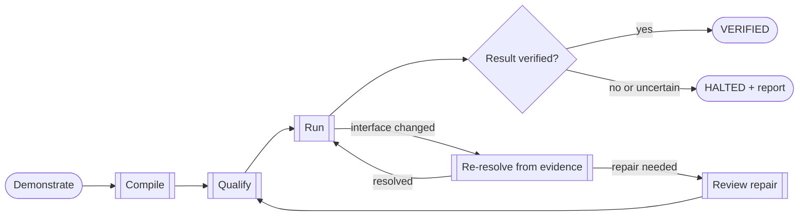

# Verified automation from demonstration

Show OpenAdapt a repeated task. It compiles the demonstration into a
deterministic program for browser, desktop, RDP, or Citrix, then checks the
declared result before it reports success. A healthy run makes no model calls.
If OpenAdapt cannot verify the result, the run stops with evidence for review.

[Run it locally](get-started/index.md){ .md-button .md-button--primary }
[See how the compiler works](concepts/demonstration-compiler.md){ .md-button }
[Review a workflow](https://openadapt.ai/qualify){ .md-button }

---

## Where OpenAdapt fits

OpenAdapt handles repeated work that still requires a person to operate an
application. Teams often use it for the final interface step after their input
and business rules already exist.

A strong first workflow has these traits:

- A person can demonstrate the task from start to finish.
- The inputs are mostly structured and the business intent stays stable.
- The application has no practical write API for the required step.
- A wrong action has an operational, financial, or compliance cost.
- Another system, account, or session can check the result.
- The work repeats often enough to justify qualification.

OpenAdapt supports automation teams, BPOs, service providers, and software
companies that operate browser, native desktop, RDP, Citrix, or other virtual
desktop applications.

---

## What the compiler produces

-   __An inspectable program__

    The compiler turns the demonstrated actions into explicit steps,
    parameters, guards, and expected state changes. You can review the program
    before it runs.

    [The demonstration compiler](concepts/demonstration-compiler.md)

-   __Evidence for each consequential step__

    A step can carry structural selectors, accessibility data, visual anchors,
    identity requirements, and a declared result check. The available evidence
    depends on the application surface.

    [The capability ladder](concepts/capability-ladder.md)

-   __A typed outcome and report__

    `VERIFIED` means the declared result check passed. A run that cannot meet
    its identity, result, policy, or state requirements stops and records the
    reason.

    [Run outcomes](reference/run-outcomes.md)

---

## How one workflow runs

The healthy path follows the approved program with no generative-model calls.
When the interface changes, OpenAdapt first uses the evidence retained from the
demonstration. A configured model can propose a repair when policy permits.
The repaired version passes the same review and qualification gates before
promotion.

OpenAdapt separates action delivery from result verification. A save message
on the acting screen does not prove that the intended record changed. A
workflow can verify the result through an API, database, document store,
read-only session, or persisted-state reacquisition.

[Read about effect verification](concepts/effect-verification.md){ .md-button }
[Read about identity checks](concepts/identity-gate.md){ .md-button }

---

## Where it runs

| Surface | Execution options | Evidence available |
|---|---|---|
| Browser | Local, customer-controlled, or managed for approved workflows | DOM, accessibility, visual, geometry, and interaction evidence |
| Windows, macOS, Linux | Local or customer-controlled | Native accessibility data plus retained visual evidence |
| RDP, Citrix, VDI | Local or customer-controlled | Window-scoped pixels, keyboard, mouse, OCR, and visual anchors |

Each workflow is qualified against its exact application, environment,
identity rules, result verifier, and deployment boundary. The
[qualification evidence](get-started/what-works-today.md) records the supported
scope and its limits.

Sensitive runtime observations stay inside the declared execution boundary.
Only an approved, sanitized derivative can cross that boundary.

[Compare deployment options](concepts/deployment-matrix.md){ .md-button }
[Review security and data handling](guides/security-and-data-handling.md){ .md-button }

---

## Inspect the evidence

The public references include the source demonstration, compiled replay,
declared verifier, run counts, failure categories, and limits for each claim.
The visual demo helps you understand a run. The result verifier and retained
report determine its outcome.

[Watch the real-application demo](https://openadapt.ai/#demo){ .md-button .md-button--primary }
[Review qualification evidence](get-started/what-works-today.md){ .md-button }
[Read the benchmark methods](https://github.com/OpenAdaptAI/openadapt-flow/tree/main/benchmark){ .md-button }

[Check the current Production status](reference/production-lifecycle.md){ .md-button }

---

## Choose your next step

-   [__Try the local tutorial__](get-started/index.md)

    Install OpenAdapt and produce a verified local result with two commands.

-   [__Record your application__](get-started/first-workflow.md)

    Capture one browser workflow, compile it, run it, and inspect the report.

-   [__Prepare a production workflow__](guides/qualify-a-workflow.md)

    Define the identities, results, failure cases, policy, and deployment
    boundary for one exact workflow.

-   [__Review the commercial offer__](commercial/qualification-sprint.md)

    See the scope, inputs, evidence, and deliverables for a paid Workflow
    Qualification Sprint.

