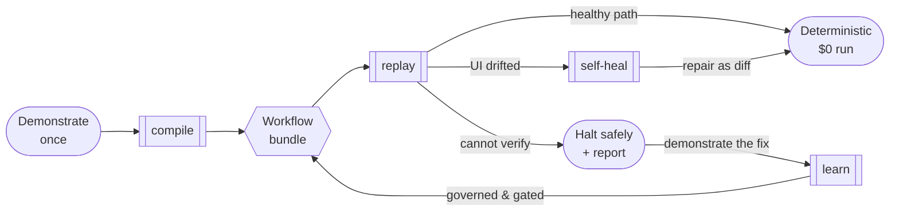

# Show it a repeated workflow. OpenAdapt compiles it into governed, deterministic replay.

OpenAdapt is a demonstration compiler for repeated GUI work in the browser,
native desktop, Citrix, and other virtual desktops. Demonstrate a task once.
OpenAdapt compiles it into a deterministic, locally executable program that
replays with no model calls on a healthy run. When interfaces drift, it
re-resolves targets deterministically or uses an explicitly configured model
tier, records the repair, and halts instead of guessing when verification
fails.

[Try it locally](get-started/index.md){ .md-button .md-button--primary }
[Read the concepts](concepts/demonstration-compiler.md){ .md-button }
[Evaluate a workflow](https://openadapt.ai/#book){ .md-button }

---

## Who it is for

OpenAdapt is built for **regulated, repetitive work in web, desktop, and
virtual-desktop interfaces**: the 500th patient referral this month, the daily
claims batch, the mortgage file that moves through six screens the same way
every time. A person has already figured out the task, it runs many times, and
a wrong action has real cost.

A computer-use agent re-reasons through the whole task with a large model on
every run. That fits a task nobody has automated before, not a workflow you run
a thousand times. OpenAdapt compiles the demonstration instead, so the model is
consulted only to repair the script, not to drive it.

One compiled workflow and one governance model run across browser, Windows,
native macOS, RDP, Citrix, and other VDI surfaces. Each substrate supplies the
strongest observations and actions available; the compiler, identity checks,
effect verification, policy, repair, and audit trail stay consistent. Teams
qualify each workflow against its real application and success oracle before
production use.

---

## Three things that make it different

-   __Deterministic, model-free replay__

    ---

    A compiled workflow replays with **zero model calls** on the healthy path.
    Local template match, OCR, and geometry resolve each step. Self-hosted
    healthy replay has no model-API charge; hosted infrastructure and service
    pricing are separate.

    [The demonstration compiler →](concepts/demonstration-compiler.md)

-   __Effect verification__

    ---

    The screen is not the system of record. A save banner can paint over an
    empty database. OpenAdapt can verify each write against the real record
    (a FHIR or REST API, a document store) and halt on a mismatch.

    [Effect verification →](concepts/effect-verification.md)

-   __Halt, don't guess__

    ---

    When the screen stops matching expectations, the run stops with a report
    instead of clicking the wrong thing. An identity gate refuses to act when
    it cannot tell two records apart.

    [The identity gate →](concepts/identity-gate.md)

---

## The shape of it

Each compiled step carries a template crop, an OCR label, geometry landmarks,
and postconditions derived from what the demonstration changed on screen. At
replay a resolution ladder tries them in order. Healthy scripts never leave the
first rung. When the UI drifts, a lower rung still finds the target, and the fix
is written back to the bundle as a reviewable diff. When nothing matches, the
run halts safely instead of guessing.

A halt is not a dead end. Demonstrate the fix once and `openadapt flow teach`
compiles the correction back into the workflow, through the same identity,
effect, and policy checks that gate everything else, so it will not halt on that
situation again. The correction becomes a guarded branch, a regression gate
proves it weakens nothing, and only a verified revision is promoted; an
underdetermined or unsafe fix is refused, not guessed at. It is deterministic
and runs at $0 with the reference inducer. See
[The halt-learn loop](concepts/halt-learn-loop.md).

---

## One runner, any surface, any deployment

The execution contract carries the same compiled bundle across surfaces and
deployment boundaries. A [substrate-agnostic runner](concepts/substrate-model.md)
routes each job to the right driver while governance stays above that boundary.
Two orthogonal axes, one contract:

| Deployment ↓ / Substrate → | **Web (browser)** | **Windows UIA** | **Native macOS** | **RDP** | **Citrix** |
|---|---|---|---|---|---|
| **OpenAdapt Cloud** | Managed runner, schedules, reports, usage, and billing | Separately ordered, workflow-qualified deployment | Separately ordered, workflow-qualified deployment | Separately ordered, workflow-qualified deployment | Separately ordered design-partner deployment |
| **Customer cloud / BYOC** | Customer runner and storage with managed governance | Customer runner and storage | Customer runner and storage | Customer runner and storage | Customer runner and storage |
| **Self-hosted / on-prem** | Local runner and audit trail | Local runner and audit trail | Local runner and audit trail | Local runner and audit trail | Local runner and audit trail |

You choose where execution and data live. For regulated data the
[`run`](concepts/regulated-execution.md) verb is **fail-closed by default**:
it gates certification, identity and effect coverage, approval fallback,
encryption, and manifest integrity before execution.

The public subscription covers approved browser workflows. Desktop and
virtual-desktop lanes require a separate order and workflow-specific
qualification; they are not entitlements of the browser subscription. The
[hosted guide](guides/hosted.md),
[qualification evidence](get-started/what-works-today.md), and commercial terms
define the accepted scope. Artifacts cross boundaries only as approved sanitized
derivatives; PHI-bearing runtime observations stay inside their declared trusted
execution boundary.

---

## Measured, not claimed

We publish the numbers and the failure modes. These two results run **both
arms**, compiled replay against a computer-use agent, under the same
arm-independent success check. **OpenEMR** is the flagship real-EMR
head-to-head; **MockMed** is the CI-reproducible control anyone can rerun:

| Task | Compiled replay | Computer-use agent |
|---|---|---|
| **OpenEMR** (real third-party EMR, add-patient-note, 18 steps) | 20/20, 39.2s p50, **$0/run**, 0 model calls | 10/10, 70.4s p50, ~$0.55/run |
| **MockMed** (CI-reproducible triage task) | 100/100, 4.9s p50, **$0/run**, 0 model calls | 20/20, 37.5s p50, ~$0.27/run |

The compiled arm made no model calls and recorded no model-API cost in these
measured runs. This excludes authoring, review, infrastructure, exception, and
service costs. Full methodology and caveats live in the [openadapt-flow benchmark
docs](https://github.com/OpenAdaptAI/openadapt-flow/tree/main/benchmark).

Detailed task definitions, environments, run counts, oracles, and failure
taxonomies live in the [qualification evidence](get-started/what-works-today.md)
and [engine benchmarks](https://github.com/OpenAdaptAI/openadapt-flow/tree/main/benchmark).

---

## Governed replay across verticals

The head-to-head above exists only where **both arms** were actually run. To
show coverage across our three ICP verticals we also publish **compiled-replay
evidence** from pinned, local, synthetic reference environments. This is not a
head-to-head: the paid computer-use-agent arm was **not run** for the lending
and insurance environments, and was intentionally omitted from the pinned-local
healthcare subset. Read these as governed-replay evidence verified by an
independent effect oracle, not as a win over an agent.

All three run through the **Browser (Playwright)** substrate, whose reference
path is **Beta**. Every figure below is copied from the [workflow reference
catalog](https://openadapt.ai/workflows) and traces to the committed
[openadapt-flow benchmark READMEs](https://github.com/OpenAdaptAI/openadapt-flow/tree/main/benchmark).

| Vertical | Application (pinned) | Independent effect oracle | Result | Honest scope |
|---|---|---|---|---|
| **Healthcare** | OpenEMR v8.0.0.3 (local) | Separate read-only REST readback + direct SQL + per-row table-delta | 12/12 model-free rows correct (compiled 6/6 + direct-API 6/6; baseline + cosmetic drift, 3/cell); 0 silent wrong writes, 0 over-halts, 0 model calls, $0 | Matched local model-free engineering subset (2026-07-16). Agent arm omitted; `publication_ready: false`. |
| **Lending** | Frappe Lending v16.2.0 (local) | Read-only REST + direct MariaDB + exact per-table row-count contract (`tabLoan Application: +1`, all others +0) | 12/12 model-free rows correct (compiled 6/6 + direct-API 6/6; baseline + cosmetic drift, 3/cell); 0 silent wrong writes, 0 over-halts, 0 model calls, $0 | Local model-free compiled-vs-API subset (2026-07-16). Paid agent arm **not run**; `publication_ready: false`. |
| **Insurance** | openIMIS 25.10 (local) | Direct SQL: exactly one non-voided claim row in status "Entered" for the demonstrated insuree and facility | 3/3 compiled replays SQL-verified (1 recorded demonstration + 3 replays; wall times 25.6s / 26.6s / 30.3s); 0 duplicate claims, 0 wrong-policyholder writes, 0 model calls | **Reference demonstration, not a benchmark**: no agent arm, no trial matrix, no publication protocol. AGPL-3.0, repository-only. |

Every vertical environment is a synthetic, pinned, loopback-only fixture on one
local macOS arm64 host, with no customer data and no customer deployment. The
healthcare row here is the pinned-local model-free subset; it is a **different
run** from the flagship OpenEMR *live-demo* head-to-head above (20/20 vs. 10/10,
2026-07-08), which is a field result on a shared public instance rather than a
CI-reproducible benchmark. Frappe Lending and openIMIS are both API-rich browser
references; a real deployment of either would prefer the API arm, and neither is
evidence for a legacy Windows/Citrix system.

Because the agent arm was not run for lending or insurance, **do not read 12/12
or 3/3 as beating an agent**. They are governed compiled-replay results. Task
definitions, exact image digests, oracles, and failure taxonomies live in the
[workflow reference catalog](https://openadapt.ai/workflows) and the
[engine benchmarks](https://github.com/OpenAdaptAI/openadapt-flow/tree/main/benchmark).

---

## Start here

-   [__Get started__](get-started/index.md)

    Install, compile, lint, certify, drift, inspect, teach, and deploy.

-   [__Qualification evidence__](get-started/what-works-today.md)

    Accepted substrate results, exact environments, and deployment boundaries.

-   [__Core concepts__](concepts/index.md)

    The compiler model, the capability ladder, effect verification, the
    identity gate, and how safety is enforced.

-   [__Guides__](guides/index.md)

    Record your own app, handle parameters and secrets, write a policy, and
    deploy on-prem.

-   [__Reference__](reference/index.md)

    Every `openadapt flow` verb, the bundle format, and configuration.

