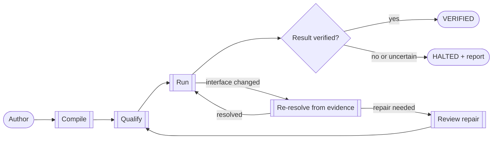

# Verified last-mile execution for agents

Compile a demonstration into a program an agent can invoke. Healthy runs make
no model calls. Uncertainty escalates. Humans audit. Computer-use agents are
the user of OpenAdapt. They are not the executor inside it.

[Install OpenAdapt](get-started/index.md){ .md-button .md-button--primary }
[See how the compiler works](concepts/demonstration-compiler.md){ .md-button }
[Author a workflow](get-started/first-workflow.md){ .md-button }

!!! info "What the calling agent may do / must not do"
    **May:** bind declared parameters, invoke a compiled program, read
    `VERIFIED` / `HALTED` / `RECONCILIATION_REQUIRED`, supply a missing
    declared parameter, retry a retryable transport failure, escalate.

    **Must not:** summarize halt as success, resolve an identity or effect
    contradiction, teach by emitting guessed clicks, or be the sole source of
    a production demonstration.

    Machine contract: [agents.txt](agents.txt). Outcome vocab:
    [Run outcomes](reference/run-outcomes.md).

---

## Where OpenAdapt fits

OpenAdapt is the governed last mile an agent calls when the next write has no
API. A named human authors the program once. The calling agent operates it.
The human returns for identity, effect, and judgment halt, then samples seals.

A strong first workflow has these traits:

- A person can demonstrate the task from start to finish.
- The inputs are mostly structured and the business intent stays stable.
- The application has no practical write API for the required step.
- A wrong action has an operational, financial, or compliance cost.
- Another system, account, or session can check the result.
- The work repeats often enough to justify qualification.

OpenAdapt supports automation teams, BPOs, service providers, and software
companies that operate browser, native desktop, RDP, Citrix, or other virtual
desktop applications. The daily user is the agent those teams already run.

---

## What the compiler produces

-   __An inspectable program__

    The compiler turns the demonstrated actions into explicit steps,
    parameters, guards, and expected state changes. You can review the program
    before it runs.

    [The demonstration compiler](concepts/demonstration-compiler.md)

-   __Evidence for each consequential step__

    A step can carry structural selectors, accessibility data, visual anchors,
    identity requirements, and a declared result check. The available evidence
    depends on the application surface.

    [The capability ladder](concepts/capability-ladder.md)

-   __A typed outcome and report__

    `VERIFIED` means the declared result check passed. A run that cannot meet
    its identity, result, policy, or state requirements stops and records the
    reason.

    [Run outcomes](reference/run-outcomes.md)

---

## How one workflow runs

The healthy path follows the approved program with no generative-model API
calls. When the interface changes, OpenAdapt first uses the evidence retained
from the demonstration. A configured model can propose a repair when policy
permits. The repaired version passes the same review and qualification gates
before promotion.

OpenAdapt separates action delivery from result verification. A save message
on the acting screen does not prove that the intended record changed. A
workflow can verify the result through an API, database, document store,
read-only session, or persisted-state reacquisition.

[Read about effect verification](concepts/effect-verification.md){ .md-button }
[Read about identity checks](concepts/identity-gate.md){ .md-button }

---

## Where it runs

| Surface | Execution options | Evidence available |
|---|---|---|
| Browser | Local, customer-controlled, or managed for approved workflows | DOM, accessibility, visual, geometry, and interaction evidence |
| Windows, macOS, Linux | Local or customer-controlled | Native accessibility data plus retained visual evidence |
| RDP, Citrix, VDI | Local or customer-controlled | Window-scoped pixels, keyboard, mouse, OCR, and visual anchors |

Each workflow is qualified against its exact application, environment,
identity rules, result verifier, and deployment boundary. The
[qualification evidence](get-started/what-works-today.md) records the supported
scope and its limits.

Sensitive runtime observations stay inside the declared execution boundary.
Only an approved, sanitized derivative can cross that boundary.

[Compare deployment options](concepts/deployment-matrix.md){ .md-button }
[Review security and data handling](guides/security-and-data-handling.md){ .md-button }

---

## Inspect the evidence

The public references include the source demonstration, compiled replay,
declared verifier, run counts, failure categories, and limits for each claim.
The visual demo helps you understand a run. The result verifier and retained
report determine its outcome.

[Watch the real-application demo](https://openadapt.ai/#demo){ .md-button .md-button--primary }
[Review qualification evidence](get-started/what-works-today.md){ .md-button }
[Read the benchmark methods](https://github.com/OpenAdaptAI/openadapt-flow/tree/main/benchmark){ .md-button }

[Check the current Production status](reference/production-lifecycle.md){ .md-button }

---

## Choose your next step

-   [__Install OpenAdapt__](get-started/index.md)

    Desktop or pip on this computer. Tutorial is optional.

-   [__Author a workflow__](get-started/first-workflow.md)

    A named human captures one browser workflow, compiles it, runs it, and
    inspects the report. Authority, not daily operator.

-   [__Prepare a production workflow__](guides/qualify-a-workflow.md)

    Define the identities, results, failure cases, policy, and deployment
    boundary for one exact workflow.

-   [__Review the commercial offer__](commercial/qualification-sprint.md)

    See the scope, inputs, evidence, and deliverables for a paid Workflow
    Qualification Sprint.

